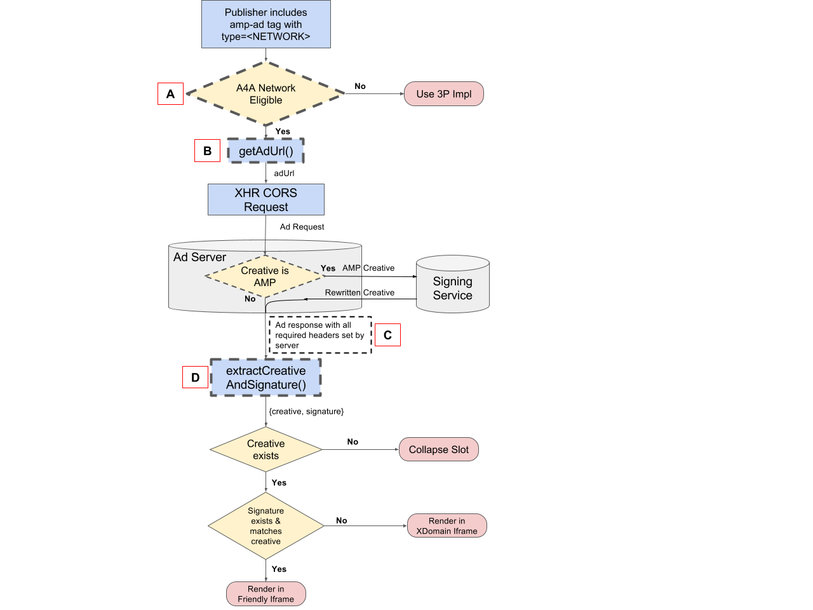
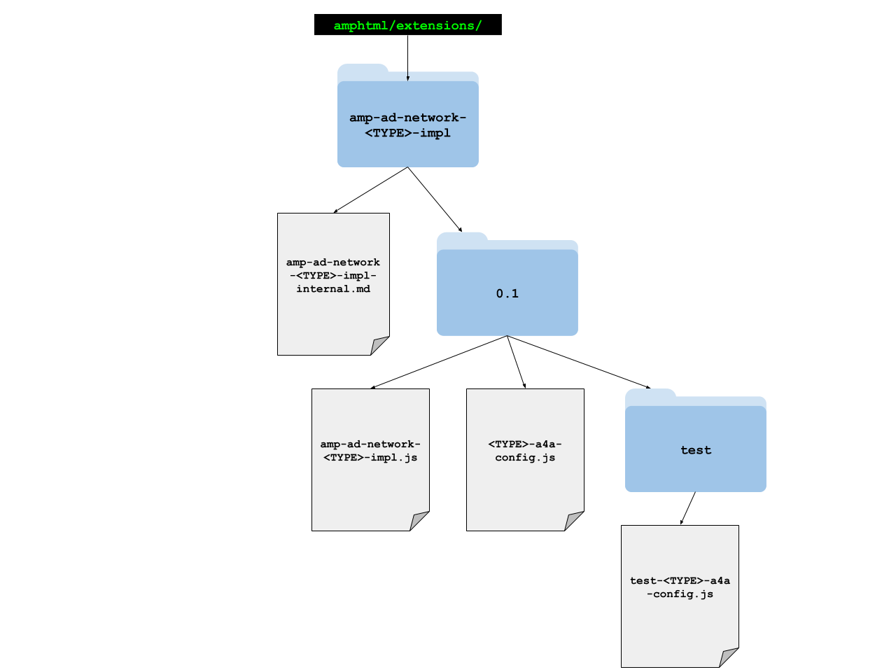

# Fast Fetch Network Implementation Guide

This guide outlines the requirements and steps for ad networks to implement Fast
Fetch for early ad request and support for AMP ads returned by the ad network to
be given preferential rendering.

* *Status: Draft*
* *Authors: [kjwright@google.com](mailto:kjwright@google.com),
[bradfrizzell@google.com](mailto:bradfrizzell@google.com)*
* *Last Updated: 1-27-2016*

## Contents

* [Background](#background)
* [Overview](#overview)
* [Detailed design](#detailed-design)
  + [Ad server requirements](#ad-server-requirements)
    - [SSL](#ssl)
    - [AMPHTML ad creative signature](#amphtml-ad-creative-signature)
    - [Ad response headers](#ad-response-headers)
  + [Creating an AMPHTML ad extension implementation](#creating-an-amphtml-ad-extension-implementation)
    - [Create the implementation script](#create-the-implementation-script)
    - [Create the configuration file](#create-the-configuration-file)
    - [Create documentation](#create-documentation)
    - [Create tests](#create-tests)
* [Checklist for ad network implementation](#checklist-for-ad-network-implementation)


## Background

If you haven’t already, please read the [AMPHTML ads readme](./a4a-readme.md) to
learn about why all networks should implement Fast Fetch.

Relevant design documents:  [AMPHTML ads readme](./a4a-readme.md),
[AMPHTML ads spec](https://github.com/ampproject/amphtml/blob/master/extensions/amp-a4a/amp-a4a-format.md)
& [intent to implement](https://github.com/ampproject/amphtml/issues/3133).

## Overview

Fast Fetch provides preferential treatment to verified AMPHTML ads over legacy
ads, unlike the current 3P rendering flow which treats AMPHTML ads  and legacy
ads the same. Within Fast Fetch, if an ad fails validation, that ad is wrapped
in a cross-domain iframe to sandbox it from the rest of the AMP document.
Conversely, an AMPHTML ad passing validation is written directly into the page.
Fast Fetch handles both AMP and non-AMP ads; no additional ad requests are
required for ads that fail validation.

To support Fast Fetch, ad networks are required to implement the following:

1. An [XHR CORS](https://www.w3.org/TR/cors/) for the ad request.
2. The JavaScript to build the ad request, which must be located within the AMP
HTML GitHub repository (example implementations:
[AdSense](https://github.com/ampproject/amphtml/tree/master/extensions/amp-ad-network-adsense-impl)
& [Google Ad Manager](https://github.com/ampproject/amphtml/tree/master/extensions/amp-ad-network-doubleclick-impl)).

## Detailed design

*Figure 1: Fast Fetch rendering flow*

<amp-img alt="Rendering Flow" layout="responsive" src="./1.png"
    width="1280" height="960">
  <noscript>
    
  </noscript>
</amp-img>

### Ad server requirements

#### SSL

All network communication via the AMP HTML runtime (resources or XHR) require SSL.

#### AMPHTML ad creative signature

For the AMP runtime to know that a creative is valid [AMP](https://github.com/ampproject/amphtml/blob/master/extensions/amp-a4a/amp-a4a-format.md),
and thus receive preferential ad rendering, it must pass a client-side,
validation check.  The creative must be sent by the ad network to a validation
service which verifies that the creative conforms to the
[AMPHTML ad specification](https://github.com/ampproject/amphtml/blob/master/extensions/amp-a4a/amp-a4a-format.md).
If the ad conforms, the creative is rewritten by the validation service and the
rewritten creative and a cryptographic signature are returned to the ad network.
The rewritten creative and signature must be included in the response to the AMP
runtime from the ad network. The AMP runtime then parses out the creative and
the signature from the ad response.  Lack of, or invalid signature causes the
runtime to treat it as a legacy ad, rendering it within a cross domain iframe
and using delayed ad rendering.

Client side verification of the signature, and thus preferential rendering,
requires a browser to have Web Crypto. However, if a browser does not have Web
Crypto, Fast Fetch is still able to be used if the ad network permits it. In
this case, the ad will simply be guaranteed to render in a cross-domain iframe.

#### Ad response headers

*See [Figure 1 above, Part C](#detailed-design)*

Fast Fetch requires that the ad request be sent via [XHR CORS](https://www.w3.org/TR/cors/)
as this allows for direct communication with the ad network without the
possibility of custom javascript execution (e.g. iframe or JSONP). XHR CORS
requires a preflight request where the response needs to indicate if the request
is allowed by including the following headers in the response:

<dl>
  <dt><code>Access-Control-Allow-Origin</code></dt>
  <dd>With the value matching the value of the request "Origin" header only if
    the origin domain is allowed. Note that requests from pages hosted on the
    Google AMP Cache will have a value matching the <code>https://cdn.ampproject.org</code>
    domain.</dd>
  <dt><code>AMP-Access-Control-Allow-Source-Origin</code></dt>
  <dd>With the value matching the value of the <code>"__amp_source_origin"</code>
    request parameter, which is <a href="https://github.com/ampproject/amphtml/blob/master/src/service/xhr-impl.js#L103">added</a>
    by the AMP Runtime and matches the origin of the request had the page not
    been served from <a href="https://amp.dev/about/how-amp-works">Google AMP Cache</a>
    (the originating source of the page).  Ad network can use this to prevent
    access by particular publisher domains where lack of response header will
    cause the response to be <a href="https://github.com/ampproject/amphtml/blob/master/src/service/xhr-impl.js#L137">dropped</a>
    by the AMP Runtime.</dd>
  <dt><code>Access-Control-Allow-Credentials</code></dt>
  <dd>With the value "true" if cookies should be included in the request.</dd>
    <dt><code>Access-Control-Expose-Headers</code></dt>
  <dd>With the value matching a comma-separated list of any non-standard
    response headers included in the response. At a minimum, this should
    include <code>"AMP-Access-Control-Allow-Source-Origin"</code>. If other
    custom headers are not included, they will be dropped by the browser.</dd>
</dl>


### Creating an AMPHTML ad extension implementation

The [`<amp-ad>`](https://amp.dev/documentation/components/amp-ad)
element differentiates between different ad network implementations via the
`type` attribute. For example, the following amp-ad tag utilizes the Google Ad Manager
ad network:

```html
<amp-ad width="320" height="50"
   type="doubleclick"
   data-slot="/43821041/mobile_ad_banner"></amp-ad>
```

To create an ad network implementation, you must perform the following:

1.  Create a new extension in the `extensions` directory of the AMP HTML Github
    [repository](https://github.com/ampproject/amphtml/tree/master/extensions)
    whose path and name match the `type` attribute given for the amp-ad element
    as follows:

    *Figure 2: File hierarchy for an AMPHTML ad implementation*

    <amp-img alt="File hierarchy" layout="responsive" src="./2.png"
        width="1280" height="960">
      <noscript>
        
      </noscript>
    </amp-img>

2. Ad networks that want to add support for Fast Fetch within AMP must add the
  file hierarchy to the AMP repository as show in Figure 2, with `<TYPE>`
  replaced by their own network. Files must implement all requirements as
  specified below. Anything not specified, i.e. helper functions etc are at the
  discretion of the ad network, but must be approved by AMP project members just
  as any other contributions.

#### Create the implementation script

*For reference, see [Figure 1 Parts B and D](#detailed-design).*

1.  Create a file named `amp-ad-network-<TYPE>-impl.js`, which implement the
    `AmpAdNetwork<TYPE>Impl` class.
2.  This class must extend [AmpA4A](https://github.com/ampproject/amphtml/blob/master/extensions/amp-a4a/0.1/amp-a4a.js).
3.  This class must overwrite the super class method **getAdUrl()**.

    ``` javascript
    getAdUrl() - must construct and return the ad url for ad request.
      // @return {string} - the ad url
    ```

Examples of network implementations can be seen for [Google Ad Manager](https://github.com/ampproject/amphtml/blob/master/extensions/amp-ad-network-doubleclick-impl/0.1/amp-ad-network-doubleclick-impl.js) and [AdSense](https://github.com/ampproject/amphtml/blob/master/extensions/amp-ad-network-adsense-impl/0.1/amp-ad-network-adsense-impl.js).
Usage of `getAdUrl` can be seen within the `this.adPromise_ promise` chain in
[amp-a4a.js](https://github.com/ampproject/amphtml/blob/master/extensions/amp-a4a/0.1/amp-a4a.js).

#### Create the configuration file

*For reference, see [Figure 1: Part A](#figure-1-fast-fetch-rendering-flow)*.

1.  Create a `<TYPE>-a4a-config.js` file that implements and exports the
    following function:

    ``` javascript
    <TYPE>IsA4AEnabled(win, element)
      // @param (Window) win Window where AMP runtime is running.
      // @param (HTML Element) element ****The amp-ad element.
      // @return (boolean) Whether or not A4A should be used in this context.
    ```

2.  Once this file is implemented, you must also update [amphtml/ads/_a4a-config.js](https://github.com/ampproject/amphtml/blob/master/ads/_a4a-config.js).
    Specifically, `<TYPE>IsA4AEnabled()` must be imported, and it must be mapped
    to the ad network type in the a4aRegistry mapping.

    ``` javascript
    /**amphtml/ads/_a4a-config.js */
    …
    import {
      <TYPE>IsA4AEnabled
    } from ‘../extensions/amp-ad-<TYPE>-impl/0.1/<TYPE>-a4a-config’;
    …
    export const a4aRegistry = map({
      …
      ‘<TYPE>’: <TYPE>IsA4AEnabled,
      …
    });
    ```

Example configs: [AdSense](https://github.com/ampproject/amphtml/blob/master/extensions/amp-ad-network-adsense-impl/0.1/adsense-a4a-config.js#L68).
Usage of Google Ad Manager and AdSense configs can be seen in [_a4a-config.js](https://github.com/ampproject/amphtml/blob/master/ads/_a4a-config.js).

#### Create documentation

Create a file named `amp-ad-network-<TYPE>-impl-internal.md`, and within this
file provide thorough documentation for the use of your implementation.

Examples: See [Google Ad Manager](https://github.com/ampproject/amphtml/blob/master/extensions/amp-ad-network-doubleclick-impl/amp-ad-network-doubleclick-impl-internal.md)
and [AdSense](https://github.com/ampproject/amphtml/blob/master/extensions/amp-ad-network-adsense-impl/amp-ad-network-adsense-impl-internal.md).

#### Create tests

Create the `test-amp-ad-network-<TYPE>-impl.js` file, and write thorough testing
for your AMP ad network implementation.

## Checklist for ad network implementation

- [ ] All Server-AMP communication done with SSL
- [ ] AMP ads sent to validation server
- [ ] Validated AMP ads sent from network to AMP with signature
- [ ] Validated AMP ads sent from network to AMP with appropriate headers
- [ ] File hierarchy created within amphtml/extensions
- [ ] Custom `amp-ad-network-<TYPE>-impl.js` overwrites `getAdUrl()`
- [ ] `<TYPE>-a4a-config.js` implements `<TYPE>IsA4AEnabled()`
- [ ] Mapping added for ad network to a4aRegistry map within `_a4a-config.js`
- [ ] Documentation written in `amp-ad-network-<TYPE>-impl-internal.md`
- [ ] Tests written in `test-amp-ad-network-<TYPE>-impl.js`
- [ ] Pull request merged to master
