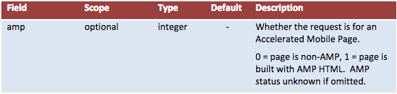
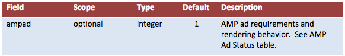
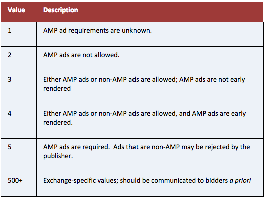
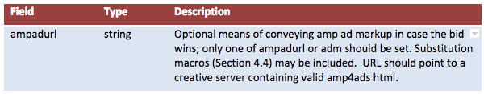

# AMP Ad Implementation Guide for RTB Ad Exchanges
---
## Objective
 
This guide is designed to provide additional information for SSPs and Ad Exchanges that want to support AMP Ads in a Real-Time Bidding (RTB) environment.  The IAB's OpenRTB 2.5 spec is [here](http://www.iab.com/wp-content/uploads/2016/03/OpenRTB-API-Specification-Version-2-5-FINAL.pdf&sa=D&ust=1496436943725000&usg=AFQjCNFlig47imweXbZx-yuvW8LmlonzFw).
 
For AMP Ads on AMP Pages, a major benefit is that if the ad response is AMP, then the ad can be rendered early by splicing it into the surrounding AMP page, with no need for iframing or delays, without risk to the page's UX.  The AMP page needs to protect itself from non-AMP content, so must delay the rendering of any ad that has not been blessed by trusted AMP verification.
 
# Background Docs
* [AMP Ads for AMP Pages (Github)](https://github.com/ampproject/amphtml/issues/3133&sa=D&ust=1496436943729000&usg=AFQjCNFdEAhcweynv_C57XPDvquNmA-d_w)
* [AMP Ad Creative Format Spec (Github)](https://github.com/google/amphtml/blob/master/extensions/amp-a4a/amp-a4a-format.md&sa=D&ust=1496436943730000&usg=AFQjCNFmQDH1dV9M0qmOXazSaWBozivMkQ)
* [AMP Ads Overview (Github)](https://github.com/ampproject/amphtml/blob/master/ads/google/a4a/docs/a4a-readme.md&sa=D&ust=1496436943731000&usg=AFQjCNEs6s6zDQHzfSLw-W2x9oOF7EfU5w)
* [AMP Ads Website from the AMP Project](http://www.ampproject.org/ads&sa=D&ust=1496436943732000&usg=AFQjCNEwQwnBRfEKRN6gftjeoPa_OYrlkQ)
* [Example AMP Ads](https://ampbyexample.com/amp-ads/%23amp-ads/introduction&sa=D&ust=1496436943733000&usg=AFQjCNFwdvQ4G4V0TeBjKd7vfd1xohQQOQ)
* [Speed comparison](https://ampbyexample.com/amp-ads/introduction/amp_ads_vs_non-amp_ads/&sa=D&ust=1496436943734000&usg=AFQjCNG4RdQVhjlh7Sbk9d5ylDptM4-Ffw): see how fast an AMP Ad loads in comparison to a regular ad. Best viewed on a 3G connection.
* [Discussion in OpenRTB Dev Forum](https://groups.google.com/forum/%23!topic/openrtb-dev/0wyPsF5D07Q&sa=D&ust=1496436943736000&usg=AFQjCNFlwyrmUfG8v4VLgAuZUqSCroDAZw): RTB Specific Proposal
 
## AMP Ads in RTB: High-Level Approach
 
### RTB Bid Request
 
Exchanges will need to indicate in the RTB bid request whether a page is built in AMP HTML, and any specific requirements or treatment of AMP Ads.  As of [OpenRTB 2.5](https://www.google.com/url?q=http://www.iab.com/wp-content/uploads/2016/03/OpenRTB-API-Specification-Version-2-5-FINAL.pdf&sa=D&ust=1496436943740000&usg=AFQjCNGuz1b-E6kOzHQr9RJ6Xb_DNAy_xQ), this is not yet included in the spec, but the proposed implementation to the IAB committee is as follows.
 
**Site Object Additional field: amp**
A new field is added to the site object to indicate whether a webpage is built on AMP HTML.
 

 
**Imp Object Additional field: ampad**
A new field is added to the imp object to provide more detail around AMP ad requirements and how AMP ads will load.
 

 
**AMP Ad Status Table**
 

 
### RTB Bid Response
 
SSPs will need to provide a new field in the bid response to allow bidders to return AMP Ad content, and RTB bidders will need to populate that field in order to return AMP Ads.  As of [OpenRTB 2.5](http://www.iab.com/wp-content/uploads/2016/03/OpenRTB-API-Specification-Version-2-5-FINAL.pdf&sa=D&ust=1496436943812000&usg=AFQjCNEQipmPbKkfCuGkKvzgdpC-I60EOg), this is not yet included in the spec, but the proposed workflow is a n ew field that accepts a URL pointing to AMP ad content.  
 
**AMP Ad Status Table**
 

 
### Verification of valid AMP
 
* For AMP Ads to be early rendered, the exchange is required to verify and sign in real time that the ad is written in amp4ads  <html amp4ads> creative format.
* See "[Proposed Design](https://github.com/ampproject/amphtml/issues/3133&sa=D&ust=1496436943832000&usg=AFQjCNGwYUpiQAwBoxZLaBDfmDYurYeTWw)" for signing.
* Ads that are valid AMP Ads will be allowed to render early by AMP pages.  Ads that are not verified as valid AMP Ads  will render at the same speed as non-AMP ads.
* Only AMP Ads  should be returned in the ampadurl .
 
### Server-side fetch
 
* For AMP Ads to be early rendered, AMP ad content must be fetched with 0 additional "hops" from the client.  This is designed to avoid poor user experiences due to ad latency and extra client-side calls.
* The exchange's servers (not the client browser) will request the AMP ad content located at the URL provided in ampadurl  after a bidder wins the auction.
* Creative servers must respond and return content within some reasonable SLA, recommended at 150ms.
* The AMP Ad will be injected into the adslot and subsequently rendered.  Note that since a valid AMP Ad cannot contain an iframe or another ad tag, the server-side fetch must retrieve the actual HTML of the creative.
 
### Impression Tracking and Billing URLs
 
* RTB buyers often include impression trackers as a structured field in the bid response; e.g. Bid.burl  -- the "billing notice URL" -- in OpenRTB 2.5.
* It is up to the exchange or publisher ad server to determine how these URLs are fired, but <[amp-pixel](https://www.ampproject.org/docs/reference/components/ads/amp-pixel&sa=D&ust=1496436943843000&usg=AFQjCNGfJxVxZg3vRuyAWf1tGCndqXOOsw)> and <[amp-analytics](https://www.ampproject.org/docs/reference/components/ads/amp-analytics&sa=D&ust=1496436943844000&usg=AFQjCNHWjbHhoZySD9md1Hz2nLwUOcClfA)> can handle most impression tracking and analytics use cases.
 
 
