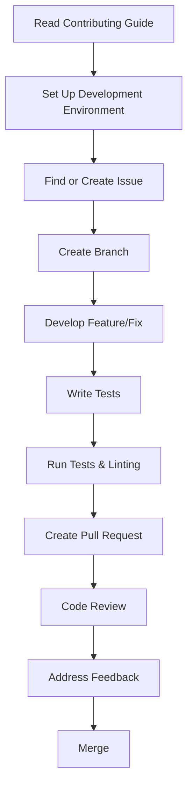

# AMP Documentation

Welcome to the AMP HTML documentation! This directory contains comprehensive guides, tutorials, and references for developing with the AMP framework.

## 📚 Table of Contents

### Getting Started

- [Contributing to AMP](contributing.md) - How to contribute to the AMP project
- [Contributing Code and Features](contributing-code.md) - Detailed guide for code contributions
- [Getting Started (Quick)](getting-started-quick.md) - Quick start guide for development
- [Getting Started (End-to-End)](getting-started-e2e.md) - Complete setup and development workflow

### Development Guidelines

- [Developing](developing.md) - Development guidelines and best practices
- [Design Principles](design-principles.md) - Core design principles for AMP
- [Building an AMP Extension](building-an-amp-extension.md) - Guide for creating AMP components
- [Testing](testing.md) - Testing guidelines and procedures
- [Writing CSS](writing-css.md) - CSS guidelines for AMP runtime

### Accessibility

- [Accessibility Guidelines](accessibility.md) - Comprehensive accessibility guide for AMP development

### Project Management

- [Code Ownership](code-ownership.md) - Understanding code ownership in AMP
- [Design Reviews](design-reviews.md) - Design review process
- [Issue Priorities](issue-priorities.md) - How issues are prioritized
- [Release Schedule](release-schedule.md) - AMP release process and schedule
- [LTS Release](lts-release.md) - Long-term support release information

### Performance and Quality

- [Metrics](metrics.md) - Performance metrics and measurement
- [Component Validator Rules](component-validator-rules.md) - Validation rules for components

### Advanced Topics

- [Origin Trials](origin-trials.md) - Participating in origin trials
- [Running Server-Side Experiments](running-server-side-experiment.md) - Server-side experimentation
- [Web Standards Related to AMP](web-standards-related-to-amp.md) - Web standards and AMP
- [Validator Release Schedule](validator-release-schedule.md) - AMP validator release information

### Community and Governance

- [Governance](governance.md) - AMP project governance
- [Creating a Welcoming Community](creating-a-welcoming-community.md) - Community guidelines
- [Creating Good First Issues](creating-good-first-issues.md) - Guide for maintainers
- [Good First Issues Template](good-first-issues-template.md) - Template for good first issues

### Build System

- [AMP Module Build](amp-module-build.md) - Building AMP modules
- [Build On Duty](build-on-duty.md) - Build system maintenance

### Support

- [Support](support.md) - How to get help with AMP

## 🚀 Quick Navigation

### For New Contributors

1. Start with [Contributing to AMP](contributing.md)
2. Follow the [Getting Started (End-to-End)](getting-started-e2e.md) guide
3. Read about [Design Principles](design-principles.md)
4. Check out [Good First Issues](https://github.com/ampproject/amphtml/labels/good%20first%20issue)

### For Component Developers

1. Read [Building an AMP Extension](building-an-amp-extension.md)
2. Follow [Development Guidelines](developing.md)
3. Understand [Accessibility Guidelines](accessibility.md)
4. Learn about [Testing](testing.md) procedures

### For Reviewers and Maintainers

1. Understand [Code Ownership](code-ownership.md)
2. Learn about [Design Reviews](design-reviews.md)
3. Follow [Issue Priorities](issue-priorities.md)
4. Read about [Creating Good First Issues](creating-good-first-issues.md)

## 🔧 Development Workflow



## 📋 Quick Reference

### Common Commands

```bash
# Development server
amp

# Build production
amp dist

# Run tests
amp unit
amp integration

# Linting and formatting
amp lint --fix
amp prettify --fix

# PR checks
amp pr-check
```

### Key Resources

- [AMP Website](https://amp.dev) - Official AMP documentation and guides
- [GitHub Repository](https://github.com/ampproject/amphtml) - AMP HTML source code
- [Slack Community](https://bit.ly/amp-slack-signup) - Join the AMP community
- [Working Groups](https://github.com/ampproject/meta/tree/main/working-groups) - Active working groups

## 🤝 Community

### Communication Channels

- **GitHub Issues**: Bug reports and feature requests
- **Slack**: Real-time community discussion
- **Design Reviews**: Weekly engineering reviews
- **Working Groups**: Focused collaboration on specific areas

### Getting Help

- Check existing [GitHub Issues](https://github.com/ampproject/amphtml/issues)
- Join the [#contributing](https://amphtml.slack.com/messages/C9HRJ1GPN/) Slack channel
- Read the [Support](support.md) documentation
- Ask questions on [Stack Overflow](https://stackoverflow.com/questions/tagged/amp-html) with the `amp-html` tag

## 📈 Contribution Statistics

Want to see your impact? Check out:

- [Contributor Graph](https://github.com/ampproject/amphtml/graphs/contributors)
- [Pulse Activity](https://github.com/ampproject/amphtml/pulse)
- [Release Notes](https://github.com/ampproject/amphtml/releases)

---

**Note**: This documentation is continuously updated. If you find any issues or have suggestions for improvement, please [open an issue](https://github.com/ampproject/amphtml/issues/new) or [submit a pull request](https://github.com/ampproject/amphtml/compare).

Last updated: October 2025