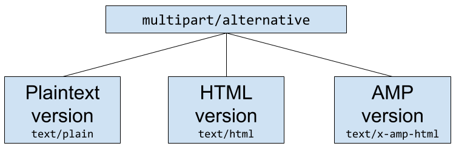

# Structure and rendering of AMP emails

Email is structured as a [MIME tree](https://en.wikipedia.org/wiki/MIME). This MIME tree contains the message body and any attachments to the email.

To embed AMP within an email, add a new MIME part with a content type of `text/x-amp-html` as a descendant of `multipart/alternative`. It should live alongside the existing `text/html` or `text/plain` parts. This ensures that the email message works on all clients.

<amp-img alt="AMP for Email MIME Parts Diagram"
    layout="responsive"
    width="752" height="246"
    src="https://github.com/ampproject/amphtml/raw/main/docs/spec/img/amp-email-mime-parts.png">
<noscript>

</noscript>
</amp-img>

For more information about the `multipart/alternative` subtype, refer to [RFC 1521, section 7.2.3](https://tools.ietf.org/html/rfc1521#section-7.2.3).

## Additional information

The `text/x-amp-html` part must be nested under a `multipart/alternative` node.
An email cannot have more than one `text/x-amp-html` part inside a `multipart/alternative` node.

The `multipart/alternative` must contain at least one non-AMP (`text/plain` or `text/html`) node in addition to the
`text/x-amp-html` node. This will be displayed to users whose email clients don't support AMP or who opted out via
their email provider's settings.

Note: Some email clients[[1]](https://openradar.appspot.com/radar?id=6054696888303616) will only render the last MIME part,
so we recommend placing the `text/x-amp-html` MIME part _before_ the `text/html` MIME part.

### Replying/forwarding semantics

The email client strips out the `text/x-amp-html` part of the MIME tree when a user replies to or forwards an AMP email message.

### Expiry

The email client may stop displaying the AMP part of an email after a set period of time, e.g. 30 days. In this
case, emails will display the `text/html` or `text/plain` part.

## Example

<!-- prettier-ignore-start -->
```html
From:  Person A <persona@example.com>
To: Person B <personb@example.com>
Subject: An AMP email!
Content-Type: multipart/alternative; boundary="001a114634ac3555ae05525685ae"

--001a114634ac3555ae05525685ae
Content-Type: text/plain; charset="UTF-8"; format=flowed; delsp=yes

Hello World in plain text!

--001a114634ac3555ae05525685ae
Content-Type: text/x-amp-html; charset="UTF-8"

<!doctype html>
<html ⚡4email>
<head>
  <meta charset="utf-8">
  <style amp4email-boilerplate>body{visibility:hidden}</style>
  <script async src="https://cdn.ampproject.org/v0.js"></script>
</head>
<body>
Hello World in AMP!
</body>
</html>
--001a114634ac3555ae05525685ae
Content-Type: text/html; charset="UTF-8"

<span>Hello World in HTML!</span>
--001a114634ac3555ae05525685ae--
```
<!-- prettier-ignore-end -->
