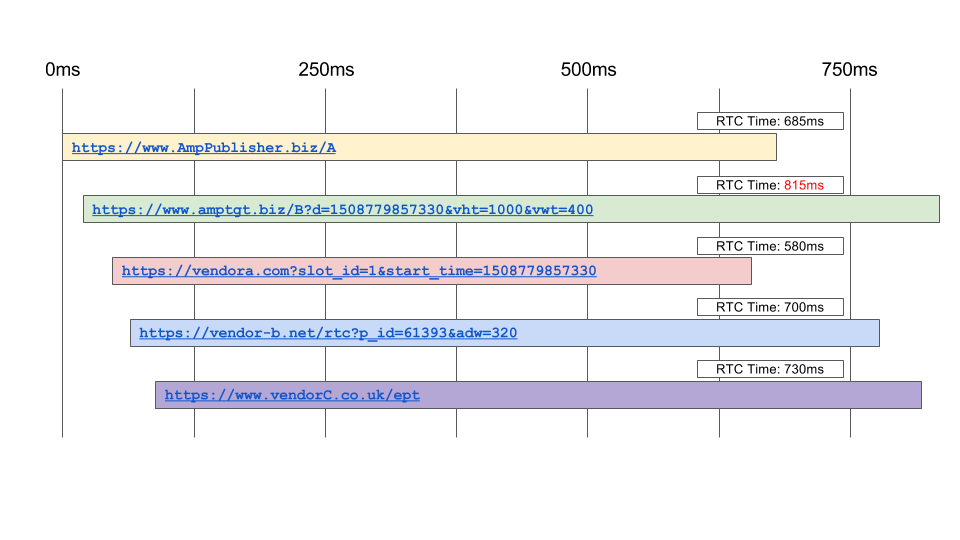

# AMP Real Time Config

## Objective

For AMP Fast Fetch, support publisher-specified, multiple, simultaneous callouts in order to augment targeting information included in the ad request.

## Background

Remote HTML support was added for Delayed Fetch to support first-party cookie targeting. This was because AMP does not allow custom JavaScript, and pages served from the AMP cache are identical for each user. However, Remote HTML leverages the fact that custom JavaScript execution occurs as a part of generating an ad request via Delayed Fetch. Fast Fetch allows for sending the ad request early by moving all code related to ad generation within the AMP runtime, disallowing any custom JavaScript as part of ad request creation. Therefore Fast Fetch is incompatible with Remote HTML. Real Time Config (RTC) has been added as an optional feature of Fast Fetch to allow for publishers to add user-targeting information to ad requests from AMP pages in a generic way that can be utilized by any ad networks, and any user-targeting vendors. Common use cases for RTC are to retrieve 1st party or 3rd party data, or to integrate 3rd party demand, also known as Header Bidding.

## Overview

The design of RTC is per-slot, with a **maximum of 5 parallel callouts allowed per slot**. RTC is usable by any Fast Fetch network implementation. Call-outs for all slots will be sent as soon as possible. There are two different types of callouts that will be supported:

### Custom URL callout

The publisher specifies a custom URL that should be called out to. For example, a publisher may specify their own targeting server as a custom URL. If the ad network in use supports macro substitution for custom URLs, the publisher may specify macros in the URL. See the [URL Macro Substitution](#url-macro-substitution) section for details.

### Vendor-specified URL Callout

RTC supports call-outs to third-party vendors. For example, take VendorFooBar which provides an API service that returns similar interests when provided a given interest (i.e. "baseball" yields ["sports", "apple-pie"]). If VendorFooBar wants publishers to be able to use them for RTC call outs, they simply add their call-out url with built-in macros to the AMP RTC vendor registry. Then publishers specify that they want to call out to VendorFooBar, and supply the value to substitute into the macro. This gives the Vendor complete control over the actual URL, with the Publisher only needing to supply the relevant inputs. See the [URL Macro Substitution](#url-macro-substitution) section for details.

In both cases, the results of these call-outs are passed to the Fast Fetch implementations as part of ad url construction via the **`getAdUrl`** method. The ad network Fast Fetch implementation then uses results of these callouts to generate the ad URL. The semantics of how the ad network uses the RTC results to general the ad URL is specific to each individual network's implementation of Fast Fetch, so please refer to network-specific documentation for details.

## Design

### Per-Slot RTC Specification

Publishers may use RTC to send callouts to a maximum of 5 different endpoints. Each `amp-ad` element that uses RTC must have the `rtc-config` attribute set with valid JSON.

#### Example 1: RTC specification on an amp-ad

```html
<amp-ad
  width="320"
  height="50"
  type="network-foo"
  data-slot="/1234/5678"
  rtc-config='{
            "vendors": {
              "vendorA": {"SLOT_ID": "1"},
              "vendorB": {"PAGE_ID": "2"},
              "vendorC": {"SLOT_W": "320", "SLOT_H": "50"}
              },
            "urls": [
              "https://www.AmpPublisher.biz/targetingA",
              "https://www.AmpPublisher.biz/targetingB"
            ],
            "timeoutMillis": 750}'
>
</amp-ad>
```

The value of `rtc-config` must conform to the following specification:

```json
{
  "vendors": {
    "vendor1": {
      "MACRO_1": "MACRO_VALUE_1",
      "MACRO_2": "MACRO_VALUE_2"
    },
    "vendor2": {
      "MACRO_1": "MACRO_VALUE_1",
      "MACRO_2": "MACRO_VALUE_2"
    }
  },
  "urls": [
    "https://www.exampleA.com/endpoint",
    {
      "url": "https://www.exampleB.com/endpoint",
      "errorReportingUrl": "https://www.exampleB.com/endpoint?e=ERROR_TYPE&h=HREF"
    }
  ],
  "timeoutMillis": 500
}
```

-   `vendors`
    -   Optional parameter
    -   Type: Object
        -   Key is the name of the vendor to use.
            -   Vendor to use must appear as a key in [callout-vendors.js](https://github.com/ampproject/amphtml/blob/main/src/service/real-time-config/callout-vendors.js)
        -   Value is a mapping of macros to values.
    -   Macros for a given vendor URL are specified by that particular vendor.
        -   For example, in the Example 1 above, VendorA has specified the macro SLOT_ID in their callout URL (see [Vendor URL Specification](#vendor-url-specification)). The RTC config specifies the value "1" to substitute for SLOT_ID in the callout URL. You may also set the value of a macro as a JSON object or array. This JSON object will be stringified automatically prior to replacement in the URL.
        -   Vendors can use the same macros as other vendors.
-   `urls`
    -   Optional parameter
    -   Type: Array of strings or objects.
    -   Each value in the array must be a valid RTC endpoint URL, or an object that contains a `url` and an `errorReportingUrl` as URL strings. Note that all URL strings must be secure (i.e. start with HTTPS). The array can be a mix of both of these types, as seen in the example above. In the case that an object is specified, the `url` within this object is treated equivalently as if it had been specified directly within the array, and errors from callouts to that URL are sent to its corresponding **errorReportingUrl**. The URLs specified here are the "custom URLs" mentioned above and throughout this document.
        -   See [RTC Callout Endpoint and Response Specification](#rtc-callout-endpoint-and-response-specification) section below on all requirements for endpoint.
        -   See [RTC Error Pingback](#rtc-error-pingback) section below for information on how errorReportingUrl is used to send sampled RTC errors, and how to specify an errorReportingUrl.
-   `timeoutMillis`
    -   Optional parameter
    -   Type: integer
    -   Value in milliseconds for timeout to use for each individual RTC callout. Must be less than default value of 1000ms, and greater than 0.

While all three parameters of rtc-config are optional, either "vendors" or "urls" _must be specified_ for RTC to occur. Both may be specified simultaneously. If neither "vendors" nor "urls" are specified, there are no endpoints to callout to and RTC is aborted. An error will be logged to the console.

### Vendor URL Specification

To spare publishers the details of having to construct URLs for external vendors, vendors may register a URL with macros in a central file called [callout-vendors.js](https://github.com/ampproject/amphtml/blob/main/src/service/real-time-config/callout-vendors.js), which maps unique vendor names to an object which includes a URL and a list of allowed macros that can be substituted into `url`. Vendors may include these macros in their URLs, which publishers can then specify the value for. Additionally, vendors may specify an `errorReportingUrl`. This errorReportingUrl will be sent 1% sampled-per-page errors from callouts to their RTC endpoint. For instance:

```text
/** amp-a4a/0.1/callout-vendors.js */
vendors: {
   "vendor1": {
     "url": "https://vendor1.com/slot_id=SLOT_ID",
     "macros": ['SLOT_ID'],
     "errorReportingUrl": "https://vendor1.com/e=ERROR_TYPE&h=HREF",
   }
};
```

The only valid strings that can be replaced for a given URL are specified by the `macros` array. In the above example, the only valid macro to replace in `https://vendor1.com/slot_id=SLOT_ID` is `"SLOT_ID"`.

The `macros` attribute is optional, i.e. a vendor could specify a URL that has no macros to substitute in.

Additionally, macros can be substituted in by the Fast Fetch implementation itself. The URL for a vendor will be expanded with the correct macro values prior to callout. See [URL Macro Substitution](#url-macro-substitution) section below for detailed explanation and example.

The `errorReportingUrl` property is optional. The only available macros are ERROR_TYPE and HREF. See [RTC Error Pingback](#rtc-error-pingback) section below for more information on how error reporting works.

#### Currently Supported Vendors

-   Admax
-   Adpushup
-   AppNexus
-   AppNexus PSP
-   APS
-   Automatad
-   Andbeyond
-   Browsi
-   Criteo
-   FLUX
-   Freestar
-   Future Plc
-   Galaxie Media
-   Highfivve
-   IndexExchange
-   Kargo
-   NewsPassID
-   Lotame
-   Media.net
-   Nexx360.io
-   OpenX
-   PubMatic OpenWrap
-   Purch
-   Rubicon
-   Salesforce
-   T13
-   Tail
-   The Ozone Project
-   Yieldbot
-   Yieldlab

### RTC Callout Request Specification

RTC callout requests are sent from the AMP runtime with the following headers:

-   Accept: application/JSON
-   Origin: Whatever the origin of the page is.
-   Referer: Referer URL
-   User-Agent: Standard user-agent information

Additionally, query string parameters are optionally sent as per the specification of the URL.

RTC requests are sent using the [fetchJson method defined in xhr-impl.js.](https://github.com/ampproject/amphtml/blob/main/src/service/xhr-impl.js#L213) For RTC, in practice this is a GET request.

RTC requests are only sent to HTTPS endpoints.

### RTC Callout Endpoint and Response Specification

The RTC endpoint must respond to the RTC GET request with a valid JSON object of targeting information to insert into the ad request URL. Redirects are not allowed, and if the endpoint attempts to redirect, the RTC will be abandoned. Special care should be made to respond to these requests as quickly as possible, as there is a 1 second default timeout imposed by RTC, and publishers may optionally shorten this timeout. Responses that return after the timeout will be dropped.

Responses from one RTC callout do not affect any of the other RTC callouts. All requests are independent of each other.

The RTC callout endpoint must use HTTPS. HTTP requests are forbidden.

The RTC Response to a GET request must meet the following requirements:

-   Status Code = 200
-   See [here for Required Headers](https://github.com/ampproject/amphtml/blob/main/docs/spec/amp-cors-requests.md#ensuring-secure-responses) and note that Access-Control-Allow-Credentials: true must be present for cookies to be included in the request.
-   Body of response is a JSON object of targeting information such as:
    -   **<code>{"targeting": {"sport":["rugby","cricket"]}}</code>**</strong>
    -   The response body must be JSON, but the actual structure of that data need not match the structure here. Refer to Fast Fetch Network specific documentation for the required spec. (for example, if using DoubleClick, refer to DoubleClick docs).

### RTC Error Pingback

RTC supports sending a 1% per-page sampling of RTC errors to specified errorReportingUrl's. (I.e. 1% of pages will send RTC error pingbacks for all RTC errors that occur on that page). For any given RTC callout URL, a corresponding errorReportingUrl may be specified, which will receive pings for, and only for, errors that resulted from the associated RTC callout. For example, you can not specify one errorReportingUrl that receives batched pings for all RTC callouts from a page. The errorReportingUrl must be a secure URL that uses HTTPS.

Vendors may specify an errorReportingUrl within their config in callout-vendors.js, e.g.:

```text
/** amp-a4a/0.1/callout-vendors.js */
vendors: {
   "vendor1": {
     "url": "https://vendor1.com/slot_id=SLOT_ID",
     "macros": ['SLOT_ID'],
     "errorReportingUrl": "https://vendor1.com/e=ERROR_TYPE&h=HREF",
   }
};
```

For custom URLs specified by a publisher directly on the RTC Config, they specify the errorReportingUrl by setting values in the "url" array as an object, instead of a string, e.g.:

```html
<amp-ad
  width="320"
  height="50"
  type="network-foo"
  data-slot="/1234/5678"
  rtc-config='{
            "vendors": {
              "vendorA": {"SLOT_ID": "1"},
              },
            "urls": [
              "https://www.AmpPublisher.biz/targetingA",
              {"url": "https://www.AmpPublisher.biz/targetingB",
               "errorReportingUrl": "https://www.AmpPublisher.biz?e=ERROR_TYPE&h=HREF"}
            ],
            "timeoutMillis": 750}'
>
</amp-ad>
```

In both cases, the requirements for an errorReportingUrl are the same:

-   errorReportingUrl must use HTTPS.
-   Response should be an empty 200.
-   errorReportingUrl may utilize two available macros that will be substituted in:
    -   **ERROR_TYPE** - Will be sent as an enum value that corresponds to values in `RTC_ERROR_ENUM` found in [real-time-config-impl.js](https://github.com/ampproject/amphtml/blob/main/src/service/real-time-config/real-time-config-impl.js).
    -   **HREF** - The actual full URL of the page. Equivalent to historical value of AMP's window.context.location.href.

The error ping will be sent by creating an image pixel in the document. See `sendErrorMessage` in [real-time-config-impl.js](https://github.com/ampproject/amphtml/blob/main/src/service/real-time-config/real-time-config-impl.js) for implementation details.

### AMP Consent Integration

The AMP-Consent extension provides publishers the ability to collect and store a user's consent through a UI control, while also providing the ability to block other AMP components based on the user's consent. See [here for documentation](https://github.com/ampproject/amphtml/blob/main/extensions/amp-consent/amp-consent.md).

Real Time Config supports integration with AMP-Consent. If the AMP-consent response is neither `SUFFICIENT` nor `UNKNOWN_NOT_REQUIRED`, then by default all RTC callouts are suppressed. However, you may optionally modify this setting, to allow specific RTC callouts that should be sent regardless of the consent state. A publisher can modify this across all RTC requests for a given ad slot or on a per-RTC-callout basis. A publisher also may either permit all consent states, or only specific consent states, using the RTC Config attribute `sendRegardlessOfConsentState`.

The value of `sendRegardlessOfConsentState` should either be the boolean `true` or an array of consent policy state strings as defined in src/core/constants/consent-state.js (i.e. use the string keys, like`"UNKNOWN"` not its corresponding numeric value). In a case where the RTC callout would normally be supressed (for example if the AMP-consent response is `UNKNOWN`), it will instead be sent if `sendRegardlessOfConsentState` is set to boolean `true` or an array of values that contains a match for the AMP-consent state response (e.g. `['UNKNOWN']`). If set to an array, then only the values in that array (in addition to the defualt values of `SUFFICIENT` and `UNKNOWN_NOT_REQUIRED`) are treated as valid.

The setting of `sendRegardlessOfConsentState` can either be done once for the entire ad slot by setting it as a top-level attribute on the RTC Config, or be done individually by setting it on any individual callouts as needed. If it is set at both the top-level and per-callout level, then if there is a mismatch, the per-callout level "wins". This is detailed below in the examples.

Here are various examples of how to do this for any given ad slot:

#### Allow all RTC callouts for all consent states

```html
<amp-ad
  width="320"
  height="50"
  type="network-foo"
  data-slot="/1234/5678"
  rtc-config='{
            "vendors": {
              "vendorA": {"SLOT_ID": "1"},
              "vendorB": {"PAGE_ID": "2"},
              "vendorC": {"SLOT_W": "320", "SLOT_H": "50"}
              },
            "urls": [
              "https://www.AmpPublisher.biz/targetingA",
              "https://www.AmpPublisher.biz/targetingB"
            ],
            "sendRegardlessOfConsentState": true}'
>
</amp-ad>
```

By setting `sendRegardlessOfConsentState` at top-level to `true`, this indicates that for any consent state, all of the callouts in this RTC configuration should still be sent.

#### Allow all RTC callouts for only certain consent states

```html
<amp-ad
  width="320"
  height="50"
  type="network-foo"
  data-slot="/1234/5678"
  rtc-config='{
            "vendors": {
              "vendorA": {"SLOT_ID": "1"},
              "vendorB": {"PAGE_ID": "2"},
              "vendorC": {"SLOT_W": "320", "SLOT_H": "50"}
              },
            "urls": [
              "https://www.AmpPublisher.biz/targetingA",
              "https://www.AmpPublisher.biz/targetingB"
            ],
            "sendRegardlessOfConsentState": ["UNKNOWN"]}'
>
</amp-ad>
```

By setting `sendRegardlessOfConsentState` to an array, this indicates that only when the page consent state matches any of the consent states in the array (in this case only `UNKNOWN` in addition to the default states `SUFFICIENT` and `UNKNOWN_NOT_REQUIRED`) should all of the RTC callouts still be sent. For instance, if the page state is `INSUFFICIENT`, then none of the callout specified above will be sent. If the page state is `UNKNOWN`, then all of the callouts will be sent.

#### Allow some RTC callouts in the "url" array

```html
<amp-ad
  width="320"
  height="50"
  type="network-foo"
  data-slot="/1234/5678"
  rtc-config='{
            "vendors": {
              "vendorA": {"SLOT_ID": "1"},
              "vendorB": {"PAGE_ID": "2"},
              "vendorC": {"SLOT_W": "320", "SLOT_H": "50"}
              },
            "urls": [
              {"url": "https://www.AmpPublisher.biz/targetingA",
               "sendRegardlessOfConsentState": true},
              "https://www.AmpPublisher.biz/targetingB"
            ]}'
>
</amp-ad>
```

In this example, `sendRegardlessOfConsentState` is only set for one specific URL, the first URL in the array "urls". Take the case when the page state is `UNKNOWN`. In that case, the only RTC callout that would be sent is the one to `https://www.AmpPublisher.biz/targetingA`.

Is is also possible to set `sendRegardlessOfConsentState` here to an array as well, such as:

```html
<amp-ad
  width="320"
  height="50"
  type="network-foo"
  data-slot="/1234/5678"
  rtc-config='{
            "vendors": {
              "vendorA": {"SLOT_ID": "1"},
              "vendorB": {"PAGE_ID": "2"},
              "vendorC": {"SLOT_W": "320", "SLOT_H": "50"}
              },
            "urls": [
              {"url": "https://www.AmpPublisher.biz/targetingA",
               "sendRegardlessOfConsentState": ["UNKNOWN", "INSUFFICIENT"]},
              "https://www.AmpPublisher.biz/targetingB"
            ]}'
>
</amp-ad>
```

#### Allow some RTC callouts in the "vendors" object

```html
<amp-ad
  width="320"
  height="50"
  type="network-foo"
  data-slot="/1234/5678"
  rtc-config='{
            "vendors": {
              "vendorA": {"macros" {"SLOT_ID": "1"},
                          "sendRegardlessOfConsentState": ["UNKNOWN"]},
              "vendorB": {"PAGE_ID": "2"},
              "vendorC": {"SLOT_W": "320", "SLOT_H": "50"}
              },
            "urls": [
              "https://www.AmpPublisher.biz/targetingA",
              "https://www.AmpPublisher.biz/targetingB"
            ]}'
>
</amp-ad>
```

In this example, `sendRegardlessOfConsentState` is only set for one specific URL, the first vendor in the "vendors" object. Take the case when the page state is `UNKNOWN`. In that case, the only RTC callout that would be sent is the one to vendorA.

#### Mixture of settings

```html
<amp-ad
  width="320"
  height="50"
  type="network-foo"
  data-slot="/1234/5678"
  rtc-config='{
            "vendors": {
              "vendorA": {"macros" {"SLOT_ID": "1"},
                          "sendRegardlessOfConsentState": ["INSUFFICIENT"]},
              "vendorB": {"PAGE_ID": "2"},
              "vendorC": {"SLOT_W": "320", "SLOT_H": "50"}
              },
            "urls": [
               {"url": "https://www.AmpPublisher.biz/targetingA",
               "sendRegardlessOfConsentState": ["UNKNOWN"]},
              "https://www.AmpPublisher.biz/targetingB"
              ],
            "sendRegardlessOfConsentState": true}'
>
</amp-ad>
```

In this example, we have a mixture of various settings. In addition to all the callouts allowing the default states `SUFFICIENT` and `UNKNOWN_NOT_REQUIRED`, VendorA is set to allow page consent-state `INSUFFICIENT`, the first url in the `urls` array only state `UNKNOWN`, and the top-level setting across all the RTC callouts is set to `true`, indicating that we should send all RTC callouts regardless of consent-state. How do we reconcile these various values? As explained above, in the case where a top-level setting and a per-callout setting disagree, the per-callout setting wins.

Let's first take an example where the page consent-state is `SUFFICIENT`. This is a default allowed state, so trivially all the callouts will be sent.

Next, let's take an example where the page consent-state is `UNKNOWN`. The callout to vendorA is set to allow consent-state `INSUFFICIENT`, so it will not be sent. The callouts to vendorB and vendorC do not have individual `sendRegardlessOfConsentState` settings, so the top-level setting of `true` applies to them, and they will each be sent. In the `urls` array, the first URL has an individual setting of `UNKNOWN`, which is the current state, so it will be sent. Lastly, the final url does not have an individual setting, so the top-level setting of `true` applies to it, and it will be sent.

### Blocking RTC

The `block-rtc` provides a way to utilize the `<amp-geo>` component to detect user's geo location to decide if a RTC callout should be prevented. The value of `block-rtc` should be a comma delimited string of geo group codes which are defined in `<amp-geo>` (details [here](https://github.com/ampproject/amphtml/blob/main/extensions/amp-geo/amp-geo.md)). If no `<amp-geo>` element is found or no valid value for this attribute, then the RTC callout will occur as normal.

```html
<amp-ad
  width="300"
  height="200"
  type="network-foo"
  data-slot="/1234/5678"
  block-rtc="geoGroup1,geoGroup2"
  rtc-config='{
            "vendors": {
              "vendorA": {"SLOT_ID": "1"},
              "vendorB": {"PAGE_ID": "2"},
              "vendorC": {"SLOT_W": "320", "SLOT_H": "50"}
              },
            "urls": [
              "https://www.AmpPublisher.biz/targetingA",
              "https://www.AmpPublisher.biz/targetingB"
            ],
            "sendRegardlessOfConsentState": true}'
>
</amp-ad>

<amp-geo>
  <script type="application/json">
    {
      "ISOCountryGroups": {
        "geoGroup1": [ "preset-eea", "unknown" ],
        "geoGroup2": [ "preset-us-ca" ]
      }
    }
  </script>
</amp-geo>
```

### URL Macro Substitution

RTC supports macro substitution for building callout URLs. These macros can be specified by vendors, and by Fast Fetch implementations.

#### Vendor Defined Macros

A vendor can specify macros for substitution in their URL. The only requirement to do this is to include text in their URL in [callout-vendors.js](https://github.com/ampproject/amphtml/blob/main/src/service/real-time-config/callout-vendors.js) that is intended to be replaced.

**Example**

```text
/** amp-a4a/0.1/callout-vendors.js */
vendors: {
   "vendor1": {
     "url": "https://vendor1.com/foo?slot_id=SLOT_ID",
     "macros": ['SLOT_ID']
   }
};
```

##### Example 2: Use of Vendor URLs

If a publisher wishes to callout to vendor1, then they would specify their RTC config as:

```html
<amp-ad
  width="320"
  height="50"
  type="network-foo"
  data-slot="/1234/5678"
  rtc-config='{
            "vendors": {
              "vendor1": {"SLOT_ID": "1234"}
              }
            }'
>
</amp-ad>
```

The resulting RTC callout URL will then be, after macro expansion:

**`https://vendor1.com/foo?slot_id=1234`**

#### Fast Fetch Implementation Defined Macros

In addition to vendor-defined macros, with publishers specifying the values for substitution, there is also the ability to utilize macros defined by the Fast Fetch implementation. For example, imagine if there is a property, **fooProp,** of the element **fooEl** that is only calculated at runtime. A Fast Fetch network that wants to support optionally adding the value of fooProp to RTC callout URLs that it sends can do so by overriding the method [getCustomRealTimeConfigMacros on AmpA4a ](https://github.com/ampproject/amphtml/blob/main/extensions/amp-a4a/0.1/amp-a4a.js)in their Fast Fetch implementation. The method should return a mapping of macros to values or functions that resolve to a value.

##### Example 3: Fast Fetch implementation defined macros

For example, Ad Network AmpAdCom overrides the property in their Fast Fetch Implementation:

```js
/** amp-ad-network-ampadcom-impl.js */

export class AmpAdNetworkAmpAdComImpl extends AmpA4A {
...
/** @override */
getCustomRealTimeConfigMacros() {
  return {
    ‘FOO_PROP’: getElementById(‘fooEl’).getAttribute(‘fooProp’),
    ‘OTHER_PROP’: ‘staticValue’
  }
}
```

Then, publishers and vendors alike would be able to specify the macro FOO_PROP in their URL, and the value would be substituted in at runtime by the Fast Fetch implementation.

##### Vendor Macro Substitution with Fast Fetch Network Macro Substitution

It is possible for a vendor to specify macros in their URL into which the Fast Fetch implementation will substitute values, in addition to their own custom macros that the publisher may specify in the rtc-config. Take the following example:

###### Example 4

Vendor1 wants to allow publishers to substitute in the value of the slot_id, and allow the Fast Fetch network implementation to substitute in the start time. Thus, they define their URL in [callout-vendors.js](https://github.com/ampproject/amphtml/blob/main/src/service/real-time-config/callout-vendors.js) as follows. Note, the vendor only lists SLOT_ID in the macros array, even though SLOT_ID and START are both macros in their URL. The macros array is a list of macros that can be utilized by the publisher. Fast Fetch will always attempt to substitute in network-defined macros, regardless of whether they are defined in the macros array.

```js
/** amp-a4a/0.1/callout-vendors.js */
vendors: {
   "vendor1": {
     "url": "https://vendor1.com/slot_id=SLOT_ID&start_time=START",
     "macros": ['SLOT_ID']
   }
};
```

The Fast Fetch implementation has overridden **getCustomRealTimeConfigMacros**, and supports the macro 'START', as seen here:

```js
/** amp-ad-network-ampadcom-impl.js */

export class AmpAdNetworkAmpAdComImpl extends AmpA4A {
...
/** @override */
getCustomRealTimeConfigMacros() {
  return {
    'START': Date.now()
  }
}
```

Finally, a publisher who wishes to use Vendor1 with AmpAdCom's Fast Fetch implementation defines their rtc-config as:

```html
<!-- ampPublisher.biz/some/example/page.html -->
<amp-ad
  width="320"
  height="50"
  type="network-foo"
  data-slot="/1234/5678"
  rtc-config='{
                "vendors": {
                  "vendor1": {"SLOT_ID": "1234"}
                }
              }'
>
</amp-ad>
```

After URL macro expansion, the resulting URL is then

```http
https://vendor1.com/slot_id=1234&start_time=1508508227577
```

##### Conflicting macro substitution

It is possible, but inadvisable, to have a situation where a vendor specifies the same macro as the Fast Fetch network, i.e. in the above example if **getCustomRealTimeConfigMacros** was defined as

```js
/** amp-ad-network-ampadcom-impl.js */

export class AmpAdNetworkAmpAdComImpl extends AmpA4A {
...
/** @override */
getCustomRealTimeConfigMacros() {
  return {
    'START': Date.now(),
    'SLOT_ID': '5678'
  }
}
```

There is a collision in this case, because the Fast Fetch network is specifying a value to substitute for SLOT_ID, but the vendor has declared SLOT_ID as their custom macro, and the publisher is then trying to substitute in '1234' as the value. In a case like this, the Fast Fetch implementation always wins, i.e. the final URL would be:

```http
https://vendor1.com/slot_id=5678&start_time=1508508227577
```

### RTC Callout Result Merging

The merging of the results of the RTC callouts into the ad request URL is determined by the Fast Fetch network implementation, and thus may vary. Please refer to the specific documentation for the Fast Fetch implementation in use, for instance refer to the DoubleClick RTC documentation if using DoubleClick for Fast Fetch.

### Error Cases

Listed below are the most prominent error cases in RTC. For usage of the following error cases, see [real-time-config-impl.js](https://github.com/ampproject/amphtml/blob/main/src/service/real-time-config/real-time-config-impl.js)

##### Misconfigured RTC Config

If the RTC config specified by the publisher does not meet the specification defined in this document, an error will be logged to the console, and RTC will be aborted.

##### Bad JSON Response

If the response from an RTC callout is not valid JSON, i.e. JSON.parse fails, the response is dropped and ignored. An error is logged to the console.

##### Duplicate Callout URLs

RTC does not allow multiple callouts to identical URLs. Multiple callouts to the same domain are allowed, provided something in the path is different. I.e.

This is not allowed:

<table>
  <tr>
   <td>Callout 1: <a href="`https://www.vendor1.com/foo?slot_id=1234"`>`https://www.vendor1.com/foo?slot_id=1234`</a>
<p>
Callout 2: <a href="`https://www.vendor1.com/foo?slot_id=1234`">`https://www.vendor1.com/foo?slot_id=1234`</a>
   </td>
  </tr>
  <tr>
   <td>Not allowed
   </td>
  </tr>
</table>

This is allowed:

<table>
  <tr>
   <td>Callout 1: <a href="`https://www.vendor1.com/foo?slot_id=1234`">`https://www.vendor1.com/foo?slot_id=1234`</a>
<p>
Callout 2: <a href="`https://www.vendor1.com/foo?slot_id=1234`">`https://www.vendor1.com/foo?slot_id=5678`</a>
   </td>
  </tr>
  <tr>
   <td>Allowed
   </td>
  </tr>
</table>

In the case that more than one callout is attempted to be sent to the same URL, only one will be sent, and an error will be logged to the console for each subsequent attempt to send a callout to that URL.

##### Insecure URLs

All RTC requests must be sent to valid SSL endpoints. An attempt to send a request to a URL that does not start with `https://` will be dropped. An error will be logged to the console.

##### Maximum Callouts Exceeded

RTC only allows a maximum of 5 RTC callouts to be sent per ad slot. Whether or not a valid response is received is irrelevant. If a request is dropped prior to actually being sent, it does not count against this limit. For instance, if a publisher specifies 7 URLs to send callouts to, and 2 of them get dropped due to being insecure URLs, then only 5 callouts will actually be sent. In the case that more than 5 callouts are attempted to be sent, only the first 5 will be, and all subsequent callouts will be ignored. An error will be logged to the console for each dropped callout.

A publisher's custom URLs take precedence over vendor URLs, and are called out in the order in which they were specified. Then, the vendor URLs are called out, also in the order in which they were specified.

##### Network Failure

If the XHR GET fails somehow, for example, if network connectivity is lost, the request is lost and an error is logged to the console.

##### Unknown Vendor

If a publisher specifies a vendor in their RTC-config that is not actually declared in callout-vendors.js, an error is logged to the console, and no request is sent.

##### Timeout

The timeout is either the default timeout of 1000ms, or a shorter timeout specified by the publisher in the RTC-config. If the time for a callout to complete exceeds the timeout, the request is dropped and an error is logged.

### Single Request Architecture (SRA) Support

There is no SRA support at this time. In the event that SRA and RTC are attempted to be used on the same page, RTC will take precedence, and SRA will not be used.

## End-to-End Example

AmpPublisher.biz uses FadNetwork's Fast Fetch implementation for all of their AMP pages. AmpPublisher.biz wants to start using RTC on their pages to add targeting information to their ad requests. They plan to make callouts to VendorA, VendorB, VendorC, and also to their own custom targeting servers: AmpPublisher.biz/A, and aptgt.biz/B.

First, AmpPublisher's developer opens up callout-vendors.js to make sure that all of their desired vendors actually support RTC, and find:

```js
/** amp-a4a/0.1/callout-vendors.js */
vendors: {
   "vendor-a": {
     "url": "https://vendora.com?slot_id=SLOT_ID&start_time=START",
     "macros": ["SLOT_ID"]
   },
  "vendor-b": {
     "url": "https://vendor-b.net/rtc?p_id=PAGE_ID&adw=AD_W",
     "macros": ["PAGE_ID", "AD_W"]
   },
  "vendorc": {
     "url": "https://www.vendorC.co.uk/ept"
   }
};
```

All of the desired vendors are supported, thus they can use all of them.

AmpPublisher now wants to check what macros they have available to use from FadNetwork's Fast Implementation, so they open up **amp-ad-network-fadnetwork-impl.js** and check the implementation of **getCustomRealTimeConfigMacros**:

```js
/** amp-ad-network-fadnetwork-impl.js */

export class AmpAdNetworkFadNetworkImpl extends AmpA4A {
...
/** @override */
getCustomRealTimeConfigMacros() {
  return {
    'START': Date.now(),
    'V_HT': getViewportHeight(),
    'V_WT': getViewportWidth()
  }
}
```

They see that FadNetwork supports the macros START, V_HT, and V_WT. AmpPublisher then decides that for their two targeting servers they want to call out to, only one of them could actually use these macros.

AmpPublisher has also decided that the default timeout of 1000ms per callout is too slow for their purposes, and wants to shorten it to 750ms.

Thus, they define their rtc-config:

```html
<amp-ad
  width="320"
  height="50"
  type="fadnetwork"
  data-slot="/1234/5678"
  rtc-config='{
                "vendors": {
                  "vendor-a": {"SLOT_ID": "1"},
                  "vendor-b": {"PAGE_ID": "61393", "AD_W": "320"},
                  "vendorc": {}
                },
                "urls": [
                  "https://www.AmpPublisher.biz/A",
                  "https://www.amptgt.biz/B?d=START&vht=V_HT&vwt=V_WT"
                ],
                "timeoutMillis": 750
              }'
>
</amp-ad>
```

The setup of the HTML page is now done. At runtime, the next steps happen:

Real-time-config-manager parses the rtc-config from the ad slot, and uses macro substitution to construct the following 5 URLs:

```http
https://vendora.com?slot_id=1&start_time=1508779857330
https://vendor-b.net/rtc?p_id=61393&adw=320
https://www.vendorC.co.uk/ept
https://www.AmpPublisher.biz/A
https://www.amptgt.biz/B?d=1508779857330&vht=1000&vwt=400
```

These 5 URLs are then called out to as quickly as possible in parallel. A publisher's custom URLs take precedence over vendor URLs, so the actual order in which they send is:



The results of the 5 callouts are:

```js
/** Callout 1 response https://www.AmpPublisher.biz/A */
{"targeting": {"ages": "18-24", "g":["m", "f", "o"]}}

/** Callout 2 response https://www.amptgt.biz/B?d=1508779857330&vht=1000&vwt=400 */
No Response, request was timed out due to surpassing 750ms.

/** Callout 3 response VendorA */
{"targeting": {"vacation": ["beach", "city"]}}

/** Callout 4 response VendorB */
{"targeting": {"ages": "35-45", "i": {"sport": "baseball"}}}

/** Callout 5 response Vendor C */
{"targeting": {"i": {"city": "NYC"}}}
```

AmpA4a builds a promise to an array of RTC Response Objects, and passes that Promise to **getAdUrl** in FadNetwork's Fast Fetch Implementation, which then resolves this promise.

```js
/** amp-ad-network-fadnetwork-impl.js */

export class AmpAdNetworkFadNetworkImpl extends AmpA4A {
...

  /** @override */
  getAdUrl(opt_rtcResponsesPromise) {
    return opt_rtcResponsesPromise.then(rtcResponseArray => {
      buildAndSendAdUrl(rtcResponseArray);
    });
  }
}
```

In this specific case, the Promise resolves to the following array:

```js
[
  /** Callout 1 RTC Response Object */
  {
    response: '{"targeting": {"ages": "18-24", "g":["m", "f", "o"]}}',
    rtcTime: 685,
    callout: 'www.AmpPublisher.biz',
  },

  /** Callout 2 RTC Response Object */
  {error: 'timeout', rtcTime: 750, callout: 'www.amptgt.biz'},

  /** Callout 3 RTC Response Object */
  {error: 'malformed_json_response', rtcTime: 580, callout: 'vendora'},

  /** Callout 4 RTC Response Object */
  {
    response: '{"targeting": {"ages": "35-45", "i": {"sport": "baseball"}}}',
    rtcTime: 700,
    callout: 'vendor-b',
  },

  /** Callout 5 RTC Response Object */
  {
    response: '{"targeting": {"i": {"city": "NYC"}}}',
    rtcTime: 730,
    callout: 'vendorc',
  },
];
```

**Example of Resolved Value of opt_rtcResponsesPromise passed to getAdUrl**

**_Explanation of Errors in RTC Responses _**

_Callout 2 surpassed the timeout of 750ms, so it gets dropped and an error is logged to the console._

_Callout 3 returns unparseable JSON, so it gets dropped and an error is logged._

_Callout 1, 4, and 5 all return valid JSON and cause no errors_

The Fast Fetch Implementation for FadNetwork then uses this array of RTC response objects to build and send the ad request URL. It is at the discretion of FadNetwork to merge these parameters however they see fit. In this example, FadNetwork simply does a deep merge of all the successful RTC callout responses, with the last response given precedence in case of collision, and gets the resulting JSON:

```json
{
  "targeting": {
    "ages": "35-45",
    "g": ["m", "f", "o"],
    "i": {"sport": "baseball", "city": "NYC"}
  }
}
```

pub-8924498097353634

**Result of merging successful RTC Callouts 1, 4, and 5**

FadNetwork then constructs and encodes their Ad URL as:

```http
https://www.fadnetwork.biz/adServer?%7B%E2%80%9Ctargeting%E2%80%9D:%20%7B%E2%80%9Cages%E2%80%9D:%20%E2%80%9C35-45%E2%80%9D,%20%E2%80%9Cg%E2%80%9D:%5B%E2%80%9Cm%E2%80%9D,%20%E2%80%9Cf%E2%80%9D,%20%E2%80%9Co%E2%80%9D%5D,%20%E2%80%9Ci%E2%80%9D:%20%7B%E2%80%9Csport%E2%80%9D:%20%E2%80%9Cbaseball%E2%80%9D,%20%E2%80%9Ccity%E2%80%9D:%20%E2%80%9CNYC%E2%80%9D%7D%7D
```

**FadNetwork's resulting Ad Request URL (use decodeURI to see original json)**

From this point forward, all Fast Fetch behavior is exactly the same as non-RTC use cases, and regular Fast Fetch documentation may be consulted for additional questions.
