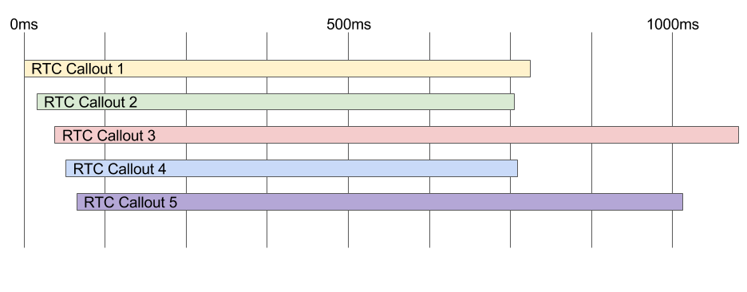
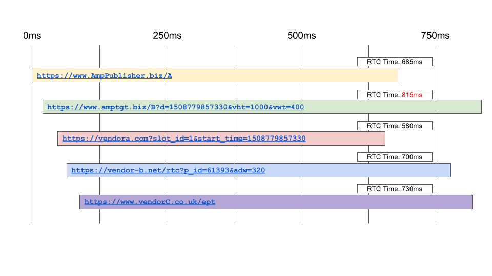

## AMP RTC Publisher Implementation Guide


### Introduction

This implementation guide is intended for publishers who wish to begin using Real Time Config in their AMP Pages.


### Background

For full details and background, please refer to the [RTC Documentation](./rtc-documentation.md). This is designed to be a simplified guide.

AMP Real Time Config (RTC) is a new feature of Fast Fetch that allows Publishers to augment their ad requests with targeting information that is retrieved at runtime. Previously, all targeting data for Fast Fetch ad requests had to be statically defined on the amp-ad element. RTC allows up to 5 callouts to targeting servers for each individual ad slot, the results of which are appended to the ad request.

### Requirements for Use

To use RTC, you must meet the following requirements:


*   Use an ad network that supports Fast Fetch and AMP RTC
*   Set the _rtc-config_ attribute on each amp-ad element for which RTC is to be used, as specified below.


### Overview

To use RTC, specify the attribute _rtc-config_ on each amp-ad element for which RTC should be performed. The _rtc-config_ specifies a list of third-party vendors and/or publisher-defined URLs, which should be called to retrieve targeting information. The default timeout for these callouts is 1 second, but the publisher may optionally specify a shorter timeout.

Each individual RTC callout has this 1 second timeout imposed on it, but the callouts are sent quickly one after the other and execute in parallel.


<table>
  <tr>
   <td>



   </td>
  </tr>
  <tr>
   <td>Figure 1: RTC Callouts Timing Diagram
<p>
<em>Note, starting times for the diagrams have been spaced out for display purposes only. In reality, all RTC callouts are sent out faster.</em>
   </td>
  </tr>
</table>


Example from Figure 1:


*   RTC Callout 1 starts at 0ms, and returns at 780ms, for a total time of 780ms. It does not timeout.
*   RTC Callout 2 starts at 20ms, and returns at 760ms, for a total time of 740ms. It does not timeout.
*   RTC Callout 3 starts at 50ms, and doesn't return until 1125ms, for a total time of 1075ms. This time surpasses the timeout of 1000ms. Thus, the request is resolved as an empty response by real-time-config-manager at 1050ms, when exactly 1000ms has elapsed from the perspective of RTC Callout 3. The ultimate response from RTC Callout 3 is dropped.
*   RTC Callout 4 starts at 75ms, and returns at 760ms, for a total time of 685ms. It is not timed out.
*   RTC Callout 5 starts at 100ms, and returns at 1010ms, for a total time of 910ms. It is not timed out. Note that RTC Callout 5 finishes more than 1000ms after the first RTC Callout is started.  

The publisher-defined URLs take precedence over the vendor-defined ones, i.e. if a publisher specifies 5 custom URLs, and 5 vendors, only the 5 custom URLs will be called out to. The vendor- and publisher-defined URLs allow for macro substitution to build the callout URL. For instance, a publisher may specify the macro values that they wish to substitute into the vendor-defined url, or a publisher may define macros in their custom URL into which the ad network Fast Fetch implementation may substitute values.

Once a publisher has defined _rtc-config_ on an amp-ad, all the work is done for them. When a user navigates to the page, as part of the Fast Fetch execution, all specified RTC callouts will be sent as early as possible to the desired endpoints, and the resulting targeting information will be merged into the ad request. The semantics of how the targeting information is merged is customized by the Fast Fetch Ad Network implementation. For details on how it will be merged, please refer to the documentation for whichever ad network you are using (i.e. DoubleClick, AdSense, etc).


### Setting up RTC Config

You may use RTC to send callouts to a maximum of 5 different endpoints. Each amp-ad element that will use RTC must have the rtc-config attribute set with valid JSON, see example:

```
##########################################
Example 1:  RTC Specification on an amp-ad
##########################################

<amp-ad width="320" height="50"
            type="network-foo"
            data-slot="/1234/5678"
            rtc-config='{
            "vendors": {
              "vendorA": {"SLOT_ID": "1"},
              "vendorB": {"PAGE_ID": "2"},
              “vendorC”: {“SLOT_W”: “320”, “SLOT_H”: “50”}          
              },
            "URLs": [
              “https://www.AmpPublisher.biz/targetingA”,
              “https://www.AmpPublisher.biz/targetingB”
            ],
            "timeoutMillis": 750}’>
</amp-ad>
```


The value of rtc-config must conform to the following specification:


```
{
	"vendors": {
"vendor1": {
"MACRO_1": "MACRO_VALUE_1",
"MACRO_2": "MACRO_VALUE_2"
},
"vendor2": {
"MACRO_1": "MACRO_VALUE_1",
"MACRO_2": "MACRO_VALUE_2"
}
	},
     "urls": ["https://www.exampleA.com/endpoint",
              "https://www.exampleb.com/endpoint"],
	"timeoutMillis": 500
}
```


*   vendors
    *   Optional parameter
    *   Type: Object
        *   Key is the name of the vendor to use.
            *   Vendor to use must appear as a key in [callout-vendors.js ](https://github.com/ampproject/amphtml/blob/master/extensions/amp-a4a/0.1/callout-vendors.js)
        *   Value is a mapping of macros to values.
    *   Macros for a given vendor URL are specified by that particular vendor.
        *   E.g., in Example 1 above, VendorA has specified the macro SLOT_ID in their callout URL (see Vendor URL Specification below). The RTC config specifies the value "1" to substitute for SLOT_ID in the callout URL.
        *   Vendors can use the same macros as other vendors.
*   urls
    *   Optional parameter
    *   Type: Array
    *   Each value in the array must be a valid RTC endpoint URL. These are the custom URLs mentioned above.
        *   See [RTC Callout Endpoint and Response Specification](#response-and-endpoint-specification) section below on all requirements for endpoint.
*   timeoutMillis
    *   Optional parameter
    *   Type: integer
    *   Value in milliseconds for timeout to use for each individual RTC callout. Must be less than default value of 1000ms, and greater than 0.

While all three parameters of _rtc-config_ are optional, either "vendors" or "urls" _must be specified_ for RTC to occur. Both may be specified simultaneously. If neither "vendors" nor "urls" are specified, there are no endpoints to callout to and RTC is aborted. An error will be logged to the console.


### Setting up an Endpoint

If a publisher wants to set up their own custom server to receive and respond to RTC callouts, they must meet the following specifications:


#### Response and Endpoint Specification

The RTC endpoint must respond to the GET request with an object of targeting information to be inserted into the ad request url. Redirects are not allowed, and if the endpoint attempts to redirect, the RTC will be abandoned. Special care should be made to respond to these requests as quickly as possible, as there is a 1 second default timeout imposed by RTC, and publishers may optionally shorten this timeout. Responses that return after the timeout will be dropped.

The endpoint must use HTTPS.

The RTC Response to a GET must meet the following requirements:

*   Status Code = 200
*   [Required Headers](https://github.com/ampproject/amphtml/blob/master/spec/amp-cors-requests.md#ensuring-secure-responses)
*   Body of response is a JSON object of targeting information such as:
    *   **<code>{"targeting": {"sport":["rugby","cricket"]}}</code>**</strong>
    *   The response body must be JSON, but the actual structure of that data need not match the structure here. Refer to Fast Fetch Network specific documentation for the required spec. (for example, if using DoubleClick, refer to DoubleClick docs).


### Merging RTC Results into Ad Requests

The merging of the results of RTC is defined per ad network. AMP RTC simply provides the results of all the callouts to getAdUrl for the given network. For specifics on how the results of RTC will be used as part of the ad request, please refer to documentation specific to the ad network you are using (i.e. DoubleClick, AdSense, etc).


### End-to-End Example

AmpPublisher.biz uses FadNetwork's Fast Fetch implementation for all of their AMP pages. AmpPublisher.biz wants to start using RTC on their pages to add targeting information to their ad requests. They plan to make callouts to VendorA, VendorB, VendorC, and also to their own custom targeting servers: AmpPublisher.biz/A, and aptgt.biz/B.

First, AmpPublisher's developer opens up callout-vendors.js to make sure that all of their desired vendors actually support RTC, and find:


```
/** amp-a4a/0.1/callout-vendors.js */
vendors: {
   "vendor-a": {
     "url": "https://vendora.com?slot_id=SLOT_ID&start_time=START",
     "macros": ["SLOT_ID"]
   },
  "vendor-b": {
     "url": "https://vendor-b.net/rtc?p_id=PAGE_ID&adw=AD_W",
     "macros": ["PAGE_ID", "AD_W"]
   },
  "vendorc": {
     "url": "https://www.vendorC.co.uk/ept"
   }
};
```


All of the desired vendors are supported, thus they can use all of them.

AmpPublisher now wants to check what macros they have available to use from FadNetwork's Fast Implementation, so they open up amp-ad-network-fadnetwork-impl.js and check the implementation of getCustomRealTimeConfigMacros:


```
/** amp-ad-network-fadnetwork-impl.js */

export class AmpAdNetworkFadNetworkImpl extends AmpA4A {
...
/** @override */
getCustomRealTimeConfigMacros() {
  return {
    'START': Date.now(),
    'V_HT': getViewportHeight(),
    'V_WT': getViewportWidth()
  }
}
```


They see that FadNetwork supports the macros START, V_HT, and V_WT. AmpPublisher then decides that for their two targeting servers they want to call out to, only one of them could actually use these macros.

AmpPublisher has also decided that the default timeout of 1000ms per callout is too slow for their purposes, and wants to shorten it to 750ms.

Thus, they define their rtc-config:


```
<amp-ad width="320" height="50"
            type="network-foo"
            data-slot="/1234/5678"
            rtc-config='{
            "vendors": {
              "vendor-a": {"SLOT_ID": "1"},
              "vendor-b": {"PAGE_ID": "61393", "AD_W": "320"},
              "vendorc": {}          
              },
            "urls": [
              "https://www.AmpPublisher.biz/A",
              "https://www.amptgt.biz/B?d=START&vht=V_HT&vwt=V_WT"
            ],
            "timeoutMillis": 750}'>
</amp-ad>

```


The setup of the HTML page is now done. At runtime, the next steps happen:

Real-time-config-manager parses the rtc-config from the ad slot, and uses macro substitution to construct the following 5 URLs:


```
https://vendora.com?slot_id=1&start_time=1508779857330
https://vendor-b.net/rtc?p_id=61393&adw=320
https://www.vendorC.co.uk/ept
https://www.AmpPublisher.biz/A
https://www.amptgt.biz/B?d=1508779857330&vht=1000&vwt=400
```


These 5 URLs are then called out to as quickly as possible in parallel. A publisher's custom URLs take precedence over vendor URLs, so the actual order in which they send is:





The results of the 5 callouts are:


```
/** Callout 1 response https://www.AmpPublisher.biz/A */
{"targeting": {"ages": "18-24", "g":["m", "f", "o"]}}

/** Callout 2 response https://www.amptgt.biz/B?d=1508779857330&vht=1000&vwt=400 */
No Response, request was timed out due to surpassing 750ms.

/** Callout 3 response VendorA */
{"targeting": {'vacation': "beach" : 'city'"

/** Callout 4 response VendorB */
{"targeting": {"ages": "35-45", "i": {"sport": "baseball"}}}

/** Callout 5 response Vendor C */
{"targeting": {"i": {"city": "NYC"}}}
```


**_Explanation of Errors in RTC Responses_**

Callout 2 surpassed the timeout of 750ms, so it gets dropped and an error is logged to the console.

Callout 3 returns unparseable JSON, so it gets dropped and an error is logged.

Callout 1, 4, and 5 all return valid JSON and cause no errors.

The Fast Fetch Implementation for FadNetwork then uses this array of RTC response objects to build and send the ad request URL. It is at the discretion of FadNetwork to merge these parameters however they see fit. In this example, FadNetwork simply does a deep merge of all the successful RTC callout responses, with the last response given precedence in case of collision, and gets the resulting JSON:


```
{“targeting”: {“ages”: “35-45”,
               “g”:[“m”, “f”, “o”],
               “i”: {“sport”: “baseball”, “city”: “NYC”}}}
```


This targeting information is then added to the Ad Request URL however FadNetwork's implementation dictates.


<table>
  <tr>
   <td>`https://www.fadnetwork.biz/adServer?%7B%E2%80%9Ctargeting%E2%80%9D:%20%7B%E2%80%9Cages%E2%80%9D:%20%E2%80%9C35-45%E2%80%9D,%20%E2%80%9Cg%E2%80%9D:%5B%E2%80%9Cm%E2%80%9D,%20%E2%80%9Cf%E2%80%9D,%20%E2%80%9Co%E2%80%9D%5D,%20%E2%80%9Ci%E2%80%9D:%20%7B%E2%80%9Csport%E2%80%9D:%20%E2%80%9Cbaseball%E2%80%9D,%20%E2%80%9Ccity%E2%80%9D:%20%E2%80%9CNYC%E2%80%9D%7D%7D`
   </td>
  </tr>
  <tr>
   <td>FadNetwork's resulting Ad Request URL (use decodeURI to see original json)
   </td>
  </tr>
</table>
