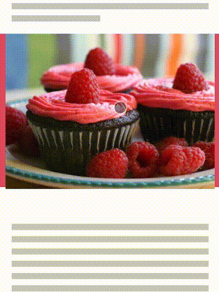
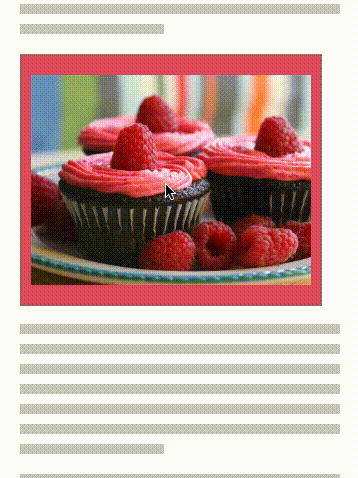

<!---
Copyright 2015 The AMP HTML Authors. All Rights Reserved.

Licensed under the Apache License, Version 2.0 (the "License");
you may not use this file except in compliance with the License.
You may obtain a copy of the License at

      http://www.apache.org/licenses/LICENSE-2.0

Unless required by applicable law or agreed to in writing, software
distributed under the License is distributed on an "AS-IS" BASIS,
WITHOUT WARRANTIES OR CONDITIONS OF ANY KIND, either express or implied.
See the License for the specific language governing permissions and
limitations under the License.
-->

# amp-lightbox

<table>
  <tr>
    <td width="40%"><strong>Description</strong></td>
    <td>Displays elements in a full-viewport “lightbox” modal.</td>
</tr>
  <tr>
    <td width="40%"><strong>Required Script</strong></td>
    <td><code>&lt;script async custom-element="amp-lightbox" src="https://cdn.ampproject.org/v0/amp-lightbox-0.1.js">&lt;/script></code></td>
  </tr>
  <tr>
    <td class="col-fourty"><strong><a href="https://amp.dev/documentation/guides-and-tutorials/develop/style_and_layout/control_layout">Supported Layouts</a></strong></td>
    <td>nodisplay</td>
  </tr>
  <tr>
    <td width="40%"><strong>Examples</strong></td>
    <td>See AMP By Example's <a href="https://ampbyexample.com/components/amp-lightbox/">amp-lightbox</a> sample.</td>
  </tr>
</table>

[TOC]

## Behavior

The `amp-lightbox` component defines child elements that display in a full-viewport overlay/modal. When the user taps or clicks an element (e.g., a button), the `amp-lightbox` ID referenced in the clicked element's `on` attribute triggers the lightbox to take up the full viewport and displays the child elements of the `amp-lightbox`.

Pressing the escape key on the keyboard closes the lightbox. Alternatively, setting the `on` attribute on one or more elements within the lightbox and setting its method to `close` closes the lightbox when the element is tapped or clicked.

```html
<button on="tap:quote-lb">See Quote</button>
<amp-lightbox id="quote-lb" layout="nodisplay">
    <blockquote>"Don't talk to me about JavaScript fatigue" - Horse JS</blockquote>
    <button on="tap:quote-lb.close">Nice!</button>
</amp-lightbox>
```


For showing images in a lightbox, there's also the [`<amp-image-lightbox>`](https://amp.dev/documentation/components/amp-image-lightbox) component.



## Attributes

<table>
  <tr>
    <td width="40%"><strong>animate-in (optional)</strong></td>
    <td>Defines the style of animation for opening the lightbox. By default, this will
be set to <code>fade-in</code>. Valid values are <code>fade-in</code>, <code>fly-in-bottom</code> and
<code>fly-in-top</code>.
<br><br>
<strong>Note</strong>: The <code>fly-in-*</code> animation presets modify the <code>transform</code> property of the
<code>amp-lightbox</code> element. Do not rely on transforming the <code>amp-lightbox</code> element
directly. If you need to apply a transform, set it on a nested element instead.</td>
  </tr>
  <tr>
    <td width="40%"><strong>close-button (required on AMPHTML ads)</strong></td>
    <td>Renders a close button header at the top of the lightbox. This attribute is only
required and valid for use with <a href="#a4a">AMPHTML Ads</a>.</td>
  </tr>
  <tr>
    <td width="40%"><strong>id (required)</strong></td>
    <td>A unique identifer for the lightbox.</td>
  </tr>
  <tr>
    <td width="40%"><strong>layout (required)</strong></td>
    <td>Must be set to <code>nodisplay</code>.</td>
  </tr>
  <tr>
    <td width="40%"><strong>scrollable (optional)</strong></td>
    <td>When the <code>scrollable</code> attribute is present, the content of the lightbox can scroll when overflowing the height of the lightbox.
<br><br>
<strong>Note</strong>: The <code>scrollable</code> attribute is not allowed when using <code>&lt;amp-lightbox&gt;</code> inside an AMPHTML ad. For details, read the <a href="#a4a">Using amp-lightbox in AMPHTML ads</a> section.</td>
  </tr>
  <tr>
    <td width="40%"><strong>scrollable (optional)</strong></td>
    <td></td>
  </tr>
</table>

## Styling

You can style the `amp-lightbox` with standard CSS.

## Actions
The `amp-lightbox` exposes the following actions you can use [AMP on-syntax to trigger](https://www.ampproject.org/docs/reference/amp-actions-and-events):

<table>
  <tr>
    <th width="20%">Action</th>
    <th>Description</th>
  </tr>
  <tr>
    <td><code>open</code> (default)</td>
    <td>Opens the lightbox.</td>
  </tr>
  <tr>
    <td><code>close</code></td>
    <td>Closes the lightbox.</td>
  </tr>
</table>

## <a id="a4a"></a> Using `amp-lightbox` in AMPHTML ads


The `amp-lightbox` component for use in AMPHTML ads is [experimental](https://amp.dev/documentation/guides-and-tutorials/learn/experimental) and under active development. To use `amp-lightbox` in AMPHTML ads, [enable the `amp-lightbox-a4a-proto` experiment](http://cdn.ampproject.org/experiments.html).


There are some differences between using `amp-lightbox` in normal AMP documents vs. [ads written in AMPHTML](../amp-a4a/amp-a4a-format.md):

### Requires close-button

For AMPHTML ads, the `close-button` attribute is required. This attribute causes a header to render at the top of your lightbox. The header contains a close button and a label that displays "Ad". Requirement of this header is needed to:

- Set a consistent and predictable user experience for AMPHTML ads.
- Ensure that an exit point for the lightbox always exists, otherwise the creative could effectlively hijack the host document content via a lightbox.

The `close-button` attribute is required and only allowed in AMPHTML ads. In regular AMP documents, you can render a close button wherever you need it as part of the `<amp-lightbox>` content.

### Scrollable lightboxes are disallowed

For AMPHTML ads, scrollable lightboxes are not allowed.

### Transparent background

When you use `<amp-lightbox>` in AMPHTML ads, the background of your `<body>` element becomes transparent because the AMP runtime resizes and realigns your creative's content before the lightbox is expanded. This is done to prevent a visual "jump" of the creative while the lightbox opens. If your creative needs a background, set it on an intermediate container (like a full-size `<div>`) instead of the `<body>`.

When the AMPHTML ad is running in a third-party environment (for example, in a non-AMP document), the creative is centered relative to the viewport and is then expanded. This is because third-party iframes need to rely on a postMessage API to enable features like frame resizing, which is asynchronous, so centering the creative first allows a smooth transition without visual jumps.

### Examples of transitions in lightbox for AMPHTML ads

In the examples below, we demonstrate how the transition looks for an AMPHTML ad that has the `animate-in="fly-in-bottom"` attribute set on the lightbox element for an AMPHTML ad in a friendly iframe, and an AMPHTML ad in a third-party iframe.

##### On friendly iframes (e.g., coming from an AMP cache)

<amp-img alt="lightbox ad in friendly iframe"
    layout="fixed"
    width="360" height="480"
    src="https://github.com/ampproject/amphtml/raw/master/spec/img/lightbox-ad-fie.gif" >
  <noscript>
    
  </noscript>
</amp-img>

##### On third-party iframes (e.g., outside the AMP cache)

<amp-img alt="lightbox ad in 3p iframe"
    layout="fixed"
    width="360" height="480"
    src="https://github.com/ampproject/amphtml/raw/master/spec/img/lightbox-ad-3p.gif" >
  <noscript>
    
  </noscript>
</amp-img>

## Validation

See [amp-lightbox rules](https://github.com/ampproject/amphtml/blob/master/extensions/amp-lightbox/validator-amp-lightbox.protoascii) in the AMP validator specification.
