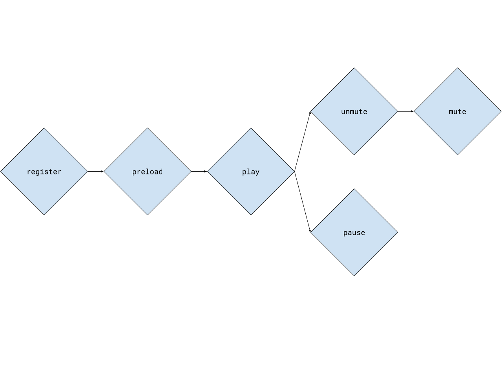

# Motivation

Web browsers generally do not allow audio to be played by media elements, unless they were explicitly played by a user gesture. [iOS Safari](https://webkit.org/blog/6784/new-video-policies-for-ios/), [Google Chrome](https://developers.google.com/web/updates/2017/09/autoplay-policy-changes), etc. This behavior causes the problem outlined by #11856 where, since stories sometimes automatically (without user input) advance to new pages with media, some stories can fail to play media on some pages.

# High-Level Design

Every story always starts muted. Because muted autoplay of video is allowed by browsers, all videos are allowed to play. We offer an audio control to users where tapping the control unmutes ALL of the media present in the story. It then subsequently re-mutes all of the media, except for any media on the current page that should have otherwise been unmuted. We herein refer to this operation of umuting and immediately (conditionally) re-muting a media element in response to user gesture as "blessing" said media element. Blessing a media element leverages the user gesture to unmute that media element, so that future unmute operations do not require a user gesture.

# Detailed Design

Some browsers (notably, iOS Safari) place an explicit maximum on the number of media elements allowed to be kept in memory at once (as we last tested it in November 2017, this limit was 16). To ensure that all media elements get blessed, even when more than 16 are present, we maintain a pool of a fixed number of media elements, where the maximum number of media elements allowed is less than 16 (currently a maximum of 8 `<video>` tags and 4 `audio` tags, for a total of 12 elements). We refer to this pool as `MediaPool`, and it handles recycling the media elements it controls by swapping them in and out of the DOM as the user navigates through a story.

By default, these `<audio>` and `<video>` elements are set to blank audio and video files. Notably, they are _not_ set to the empty string, but rather data URIs that represent an MP3 and an MP4 (respectively) that have no audio or video. This is because invoking media playback functions like `play()`, `pause()`, `mute()`, and `unmute()` does not work if the media element's source is unset.

## Lifecycle

Each media element present in the document should be registered into the media pool as soon as possible. Once registered, a media element can be blessed, and that blessed state will be honored regardless of whether the source of that media element is subsequently changed.

We preload media elements based on what we refer to as the element's "distance": how far the element is away from the user's current position in the document. For stories, we measure this distance in pages; an element on the page the user is currently viewing has a distance of 0, an element on the page immediately before or after the page the user is currently viewing has a distance of 1, an element on the page two pages before or two pages after has a distance of 2, etc. Stories currently preload elements on pages that have a distance of 2 or less. If there are more elements in the story than can fit in the `MediaPool`, then media elements are evicted based on their distance; elements with the highest distance are evicted first, until all elements that are loaded have been allocated a resource from the pool.

Once a media element has been loaded, one can call `play()`, `pause()`, `mute()`, or `unmute()`.

## Queueing

Some browsers can also have problems with the underlying media element methods interrupting one another, depending on the order in which they are invoked. For example, calling `load()` on a media element after calling `play()` can cause the promise returned by `play()` to be rejected. An example of the problems caused by this is outlined in #13232.

To resolve this, we create a task queue, stored as a property on each media element. The `MediaPool` queues all media-element-bound tasks and executes them only upon completion of the previous tasks. This eliminates the race conditions that come with invoking many of the functions on a media element, as well as from swapping the elements into (and out of) the DOM.

# Code

-   MediaPool: https://github.com/ampproject/amphtml/blob/main/extensions/amp-story/1.0/media-pool.js
-   Tasks for queue: https://github.com/ampproject/amphtml/blob/main/extensions/amp-story/1.0/media-tasks.js
