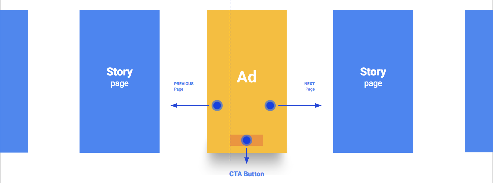
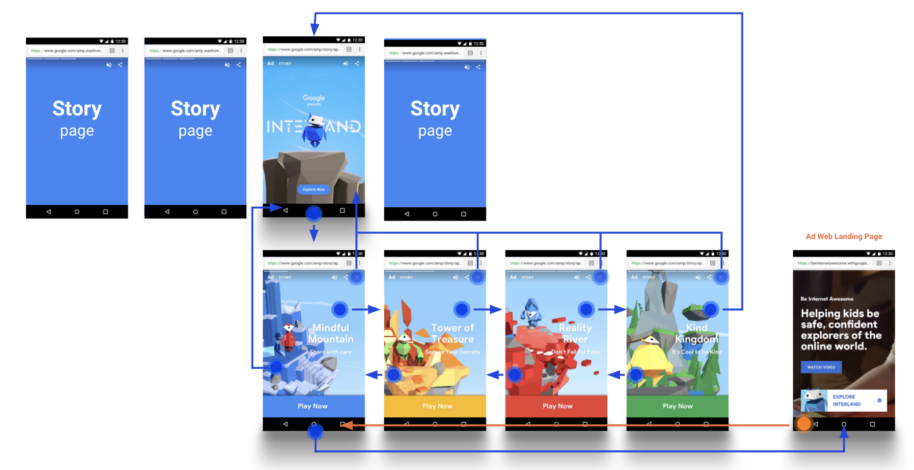
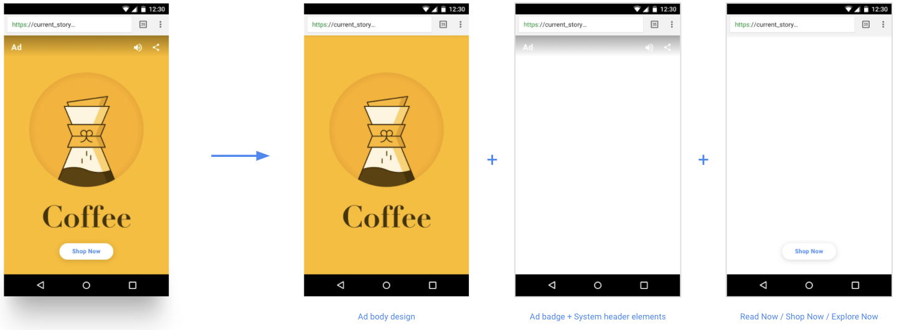

# Advertising support in AMP Stories 

This document describes the principles and practices for including ads in AMP Stories.

## AMP Story Ad Principles

The current ad formats of banners and boxes doesn't integrate well with the rest of the content around it. Ads feel out of place, are slow, interruptive and don't feel native to the rest of the story experience.

The following principles will apply to AMP Story ads:

* *Visual first*:  Inviting, bold, context-driven invitation state.
* *Native*: The ad page has the same dimensions as an organic story page. 
* *Same interaction model*: User can continue to the next screen just like they would with an organic story page.
* *Fast*: The ad never appears to a user in a half-loaded state. 

As a result, one key difference from regular web pages is that the AMP stories runtime determines the right placement of the ad page amidst the AMP story. These mechanics are explained as part of [amp-story-auto-ads](./amp-story-auto-ads.md).


## Ad formats
There are two type of ad formats supported as part of AMP Stories:

* **Single page ad** : Where the ad appears as a single page inside of an AMP story.
* **Sponsored story ad**: Where the ad is a stand-alone multi-page story.

### Single page ad 

In-line with the principles, a single page ad appears in between organic story content as a full page. 
single page ads have a predefined set of call to action buttons and those call to action buttons take a web landing page URL where the user is navigated to, on click.



### Sponsored story ad 
When publishing sponsored story ads, use the `<amp-story ad>` tag instead of `<amp-story>`, so platforms can surface these stories appropriately. Since a sponsored story ad is just a URL on the web, you can also send user traffic to a sponsored story ad from the CTA URL button of a single page ad. 



## Consistent UX

The ad label and the call to action (CTA) buttons on the ads must be consistent across all publishers and ad networks. Therefore, the AMP stories runtime takes responsibility of rendering those in a consistent manner. 




## Publisher placed ads 
This is an option for publishers who would like to place single page ads amidst AMP story content they produce. This is meant as a stop-gap until more robust ad server support is available. 

This is done using the mechanism in [Custom ad](../../ads/custom.md) extension. The ads are rendered with inlined templates in the story document
and the data for the templates is fetched remotely.

### Template
An ad template must be written in [amp-mustache](../amp-mustache/amp-mustache.md).
For example:

```html
<template type="amp-mustache" id="template-1">
  <amp-img src="{{imgSrc}}"></amp-img>
  <amp-pixel src="{{impressionUrl}}"></amp-pixel>
</template>
```

A few important things to note: 

* Templates need to be inlined in the AMP story, as direct children of a `<amp-story-auto-ads>` element.
* An element ID is required, so that the template can be referenced by the ad response.
* The selected template ID will be set as an attribute of `amp-ad`: `<amp-ad template="template-1">`
* The content inside a template should strictly follow the [rules](https://github.com/ampproject/amphtml/blob/master/extensions/amp-story/validator-amp-story.protoascii) of `amp-story-grid-layer`
* Be aware of the [restrictions](../amp-mustache/amp-mustache.md#restrictions) of `amp-mustache`.
* Ads that use different templates can be styled separately using CSS attribute selector:
```css
amp-ad[template=template-1] {
  background-color: blue;
}
amp-ad[template=template-2] {
  background-color: red;
}
```
- The CTA (call-to-action) button should NOT
be included in the template. Story defines a list of CTA buttons to select from.
For details, read the ["CTA ad" section](#cta-ad) below. 

### Ad response

#### Response payload
A server endpoint needs to provide ad responses in the following JSON format:

```json
{
  "templateId": "template-1",
  "data": {
    "imgSrc": "https://cdn.adserver.com/img-12345.jpg",
    "impressionUrl": "https://adserver.com/track?iid=18745543"
  },
  "vars": {
    "ctaType": "EXPLORE",
    "ctaUrl": "https://advertiser.com/landing-123.html",
    "impressionId": "ac2d1s2E3B"
  }
}
```

* `templateId`: the ID of the inlined template that is going to be used.
* `data`: the data model to populate the selected template. The fields should match the variable names in the selected template.
* `vars`: extra variables needed by the story. They will be added to the `amp-ad` element as data attributes, and picked by runtime for different use cases:
   * CTA button rendering (see details in the ["CTA ad" section](#cta-ad))
   * Provide dynamic content of the ad for tracking purpose (see details in the "tracking" section)

#### Response headers
The ad request is an AMP CORS request, hence a couple of custom response headers are needed.
See [AMP CORS spec](../../spec/amp-cors-requests.md) for details.

### Tagging

In an AMP story, you cannot put an `amp-ad` directly onto the page, instead, all ads
are fetched and displayed by the [amp-story-auto-ads](./amp-story-auto-ads.md)
extension.

Here is a full example using `amp-story-auto-ads` together with some templates inlined:

```html
<amp-story>
  <amp-story-auto-ads>
     <script type=”application/json”>
      {
          "ad-attributes": {
            "type": "custom",
            "data-url": "https://adserver.com/getad?slot=abcd1234"
          }
       }
     </script>

     <template type="amp-mustache" id="template-1">
       <amp-img src="{{imgSrc}}"></amp-img>
       <amp-pixel src="{{impressionUrl}}"></amp-pixel>
     </template>

     <template type="amp-mustache" id="template-2">
       <div class="creative-line-1">{{creativeLine1}}</div>
       <div class="creative-line-2">{{creativeLine2}}</div>
       <amp-pixel src="{{impressionUrl}}"></amp-pixel>
     </template>
  </amp-story-auto-ads>
  ...
```

At runtime, an `amp-ad` element is dynamically inserted:

```html
<amp-ad type="custom"
  data-src="https://adserver.com/getad?slot=abcd1234"
</amp-ad>
```

And an ad request is made to this URL: `https://adserver.com/getad?slot=abcd1234`.
Each story can only have one `amp-story-auto-ads` element.

### CTA ad
To provide a consistent user experience, the AMP story runtime is responsible for rendering 
the button of a CTA ad. The URL and button text is provided in the `var` 
object of the ad response.

*  `ctaType`: the CTA button type, of which the value is an `enum` 
   * EXPLORE: "Explore Now"
   * SHOP: "Shop Now"
   * READ: "Read Now"
   * If you need support for a new CTA button, please open a [GitHub issue](https://github.com/ampproject/amphtml/issues/new).
* `ctaUrl`: the landing page URL for the CTA button

### Tracking
Each story page that has a dynamically inserted ad is assigned a system-generated page ID, prefixed with `i-amphtml-AD-`. The `story-page-visible` trigger can be used to track ad views.

Also, ad response can leverage the `var` object to set data attributes to the `amp-ad` tag, to be used by amp-analytics as [data vars](../amp-analytics/analytics-vars.md#variables-as-data-attribute).


## Ad server support for AMP story ads 
Ad servers that would like to support advertising for AMP stories should open a [GitHub issue](https://github.com/ampproject/amphtml/issues/new), and we'll be in touch. 

If you are a publisher, please reach out to your ad server regarding ad support for stories. 

