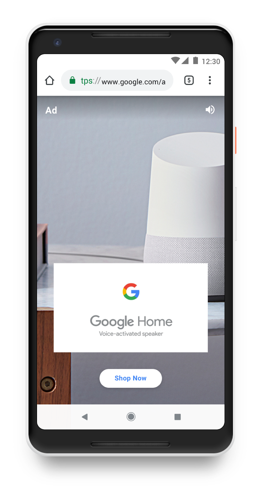

# Advertise in AMP Stories

AMP Stories are a full-screen tappable experience that immerses readers in the content. Advertising with AMP Story ads allows for seamless and disruption-free integration into the user’s journey, keeping them engaged and delighted by the platform. 

For information on how to include ads in your AMP stories, [refer to our guide](https://www.ampproject.org/docs/ads/advertise_amp_stories). 

# Best practices for creating an AMP Story ad

If you are interested in creating an ad for the AMP Story platform, [refer to our best practices guide](https://www.ampproject.org/docs/ads/story_ads_best_practices).


## Ad formats
There are two type of ad formats supported as part of AMP Stories:

* **Single page ad** : Where the ad appears as a single page inside of an AMP story.
* **Sponsored story ad**: Where the ad is a stand-alone multi-page story.

### Sample Single page ad

AMP Story ads are AMPHTML ads, but have required meta tag data, meet defined layout specifications and required UI elements. An AMP Story ad will always include a call to action(CTA) button and an ad label displayed as a text disclaimer at the top of the page.


### Sponsored story ad
 A sponsored story ad is just an URL on the web. Therefore you can drive user traffic to a sponsored story ad from the CTA URL button of a single page ad. In the future, there may be the ability to inline the entire sponsored story inside a regular AMP story, but that's pending user experimentation.


## Consistent UX

To keep the user experience consistent, the AMP Story runtime is responsible for rendering the ad label and the CTA button.



## CTA
To provide a consistent user experience, the AMP story runtime is responsible for rendering
the button of a CTA ad.

## Meta tag data

Meta tag data specifies that the ad meets the AMP Story format, sets the CTA button text enum, directs where the button will send the user and what type of page it is. 

```html
<html amp4ads>
  <head>
    <meta charset="utf-8">
    <meta name="viewport" content="width=device-width,minimum-scale=1">

    <!-- Specifies where the user is directed -->
    <meta name="amp-cta-url" content="%%CLICK_URL_UNESC%%%%DEST_URL%%">

    <!-- Specifies the call to action button text enum -->
    <meta name="amp-cta-type" content="EXPLORE">

    <!-- Specifies what type of landing page the user is direct to -->
    <meta name="amp-cta-landing-page-type" content="NONAMP">

    <style amp4ads-boilerplate>body{visibility:hidden}</style>
    <style amp-custom>
     amp-img {height: 100vh}
    </style>
    <script async src="https://cdn.ampproject.org/amp4ads-v0.js"></script>
  </head>
  <body>
    <amp-img src=%%FILE:JPG1%% layout="responsive" height="1280" width="720"></amp-img>
  </body>
</html>
```


The `amp-cta-type` tag must include one of the available options below for the CTA Button text enum. This ensures a consistent user experience for AMP Story readers. 

### CTA Text Enum
The CTA button must be configured from a pre-defined set of choices.
  * APPLY_NOW: "Apply Now"
  * BOOK_NOW: "Book"
  * BUY_TICKETS: "Buy Tickets"
  * DOWNLOAD: "Download"
  * EXPLORE: "Explore Now"
  * GET_NOW: "Get Now"
  * INSTALL: "Install Now" (Note that deep links to apps (e.g. whatsapp://chat) are not supported but publishers can link to the App Store page or the Google Play Store page using http/https).
  * LISTEN: "Listen Now"
  * MORE: "More"
  * OPEN_APP: "Open App"
  * ORDER_NOW: "Order Now"
  * PLAY: "Play"
  * READ: "Read Now"
  * SHOP: "Shop Now"
  * SHOW: "Show"
  * SHOWTIMES: "Showtimes"
  * SIGN_UP: "Sign Up"
  * SUBSCRIBE: "Subscribe Now"
  * USE_APP: "Use App"
  * VIEW: "View"
  * WATCH: "Watch"
  * WATCH_EPISODE: "Watch Episode"

If you need support for a new CTA button, please open a [GitHub issue](https://github.com/ampproject/amphtml/issues/new).

### Tracking
Each story page that has a dynamically inserted ad is assigned a system-generated page ID, prefixed with `i-amphtml-Ad-`. The `story-page-visible` trigger can be used to track ad views.

Also, ad response can leverage the `var` object to set data attributes to the `amp-ad` tag, to be used by amp-analytics as [data vars](../amp-analytics/analytics-vars.md#variables-as-data-attribute).

### CTA Landing Page Enum
This enum can be used to indicate the type of landing page. In the future the AMP
runtime may make special optimitizations (e.g. preloading) based on these values.
 * `STORY` - Landing page is a sponsored story.
 * `AMP` - Landing page is a valid AMP page.
 * `NONAMP` - Any other type of web page.

 Note: all pages will default to `NONAMP` if this enum is missing.

## Ad server support for AMP story ads

Ad servers that would like to support advertising for AMP stories should open a [GitHub issue](https://github.com/ampproject/amphtml/issues/new), and we'll be in touch.

If you are a publisher, please reach out to your ad server regarding ad support for stories.

### Ad servers that are currently supported
**Important** Ad servers are only supported in `amp-story` version `1.0`. For information
on migrating from 0.1 => 1.0 please see the [migration docs](https://github.com/ampproject/amphtml/blob/master/extensions/amp-story/amp-story.md#migrating-from-01-to-10).
* [Google Ad Manager (previously DoubleClick](https://www.ampproject.org/docs/ads/advertise_amp_stories#google-ad-manager)


## Publisher placed ads
This is an option for publishers who would like to place single page ads amidst AMP story content they produce. This is meant as a stop-gap until more robust ad server support is available.

This is done using the mechanism in [Custom ad](../../ads/custom.md) extension. The ads are rendered with inlined templates in the story document
and the data for the templates is fetched remotely.

### Template
An ad template must be written in [amp-mustache](../amp-mustache/amp-mustache.md).
For example:

```html
<template type="amp-mustache" id="template-1">
  <amp-img layout="fill" src="{{imgSrc}}"></amp-img>
  <amp-pixel src="{{impressionUrl}}"></amp-pixel>
</template>
```

A few important things to note:

* Templates need to be inlined in the AMP story, as direct children of a `<amp-story-auto-ads>` element.
* An element ID is required, so that the template can be referenced by the ad response.
* The selected template ID will be set as an attribute of `amp-ad`: `<amp-ad template="template-1">`
* The content inside a template should strictly follow the [rules](https://github.com/ampproject/amphtml/blob/master/extensions/amp-story/validator-amp-story.protoascii) of `amp-story-grid-layer`
* Be aware of the [restrictions](../amp-mustache/amp-mustache.md#restrictions) of `amp-mustache`.
* Ads that use different templates can be styled separately using CSS attribute selector:
```css
amp-ad[template=template-1] {
  background-color: blue;
}
amp-ad[template=template-2] {
  background-color: red;
}
```
- The CTA (call-to-action) button should NOT
be included in the template. Story defines a list of CTA buttons to select from.
For details, read the ["CTA ad" section](#cta-ad) below.

### Ad response

#### Response payload
A server endpoint needs to provide ad responses in the following JSON format:

```json
{
  "templateId": "template-1",
  "data": {
    "imgSrc": "https://cdn.adserver.com/img-12345.jpg",
    "impressionUrl": "https://adserver.com/track?iid=18745543"
  },
  "vars": {
    "ctaType": "EXPLORE",
    "ctaUrl": "https://advertiser.com/landing-123.html",
    "impressionId": "ac2d1s2E3B"
  }
}
```

* `templateId`: the ID of the inlined template that is going to be used.
* `data`: the data model to populate the selected template. The fields should match the variable names in the selected template.
* `vars`: extra variables needed by the story. They will be added to the `amp-ad` element as data attributes, and picked by runtime for different use cases:
   * CTA button rendering (see details in the ["CTA ad" section](#cta-ad))
   * Provide dynamic content of the ad for tracking purpose (see details in the "tracking" section)

#### Response headers
The ad request is an AMP CORS request, hence a couple of custom response headers are needed.
See [AMP CORS spec](../../spec/amp-cors-requests.md) for details.

### Tagging

In an AMP story, you cannot put an `amp-ad` directly onto the page, instead, all ads
are fetched and displayed by the [amp-story-auto-ads](./amp-story-auto-ads.md)
extension.

Here is a full example using `amp-story-auto-ads` together with some templates inlined:

```html
<amp-story>
  <amp-story-auto-ads>
     <script type=”application/json”>
        {
          "ad-attributes": {
            "type": "custom",
            "data-url": "https://adserver.com/getad?slot=abcd1234"
          }
        }
     </script>

     <template type="amp-mustache" id="template-1">
       <amp-img src="{{imgSrc}}"></amp-img>
       <amp-pixel src="{{impressionUrl}}"></amp-pixel>
     </template>

     <template type="amp-mustache" id="template-2">
       <div class="creative-line-1">{{creativeLine1}}</div>
       <div class="creative-line-2">{{creativeLine2}}</div>
       <amp-pixel src="{{impressionUrl}}"></amp-pixel>
     </template>
  </amp-story-auto-ads>
  ...
```

At runtime, an `amp-ad` element is dynamically inserted:

```html
<amp-ad type="custom"
  data-url="https://adserver.com/getad?slot=abcd1234"
</amp-ad>
```

And an ad request is made to this URL: `https://adserver.com/getad?slot=abcd1234`.
Each story can only have one `amp-story-auto-ads` element.

