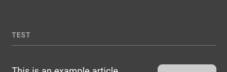
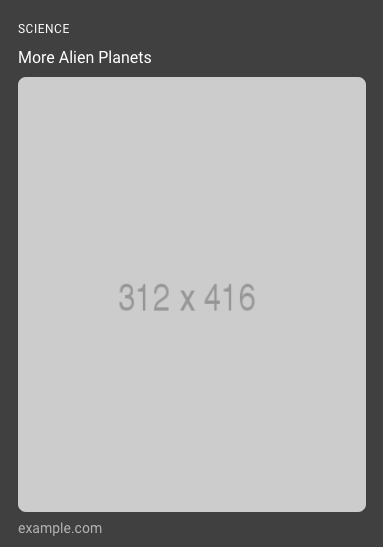

<!--
Copyright 2019 The AMP HTML Authors. All Rights Reserved.

Licensed under the Apache License, Version 2.0 (the "License");
you may not use this file except in compliance with the License.
You may obtain a copy of the License at

      http://www.apache.org/licenses/LICENSE-2.0

Unless required by applicable law or agreed to in writing, software
distributed under the License is distributed on an "AS-IS" BASIS,
WITHOUT WARRANTIES OR CONDITIONS OF ANY KIND, either express or implied.
See the License for the specific language governing permissions and
limitations under the License.
-->

# amp-story-bookend

The `amp-story-bookend` is the last screen of the story. It contains related links, sharing options, call to action links, and more.

<figure class="centered-fig">
  <amp-anim alt="related article example" width="300" height="533" layout="fixed" src="https://github.com/ampproject/amphtml/raw/master/extensions/amp-story/img/related-articles.gif">
    <noscript>
    
  </noscript>
  </amp-anim>
</figure>

## Configuration

Importing the JSON configuration through the `src` attribute:

```html
<amp-story standalone>
  <amp-story-page id="cover">
    ...
  </amp-story-page>
  <!-- `layout=nodisplay` is required. -->
  <amp-story-bookend src="bookendv1.json" layout="nodisplay">
  </amp-story-bookend>
  <amp-story></amp-story
></amp-story>
```

If you don't want to fetch the bookend configuration from a server, you can also specify it inline:

```html
<amp-story standalone>
  ...
  <amp-story-bookend layout="nodisplay">
    <script type="application/json">
       {
         "bookendVersion": "v1.0",
         "shareProviders": [ ... ],
         "components": [ ... ]
      }
    </script>
  </amp-story-bookend>
  <amp-story></amp-story
></amp-story>
```

Next, you must fill in the JSON configuration. This is where you customize the bookend. The overall structure of the config looks like so:

```json
{
  "bookendVersion": "v1.0",
  "shareProviders": [
    ...
  ],
  "components": [
    ...
  ]
}
```

It is required to specify you are using the v1.0 version by including the first line.

### Bookend components

The bookend is made up of a variety of components. These components can be articles, call to action links, text, and more.

They are specified in the `components` field of the configured JSON. See the [Example JSON response](#example-json-response) section below for an example.

#### heading

The `heading` component has a `text` field, which can be used to append a title to a group of articles.

```json
{
  "type": "heading",
  "text": "More to Read"
}
```

<amp-img alt="Bookend heading component" layout="fixed"
src="https://github.com/ampproject/amphtml/raw/master/extensions/amp-story/img/amp-story-bookend-component-heading.png" width="386" height="123">
<noscript>

</noscript>
</amp-img>

#### small

The `small` component can be used to link to related articles. This component requires the following fields: `title`, `url`, and optionally an `image`.

```json
{
  "type": "small",
  "title": "This is India an the best places you should go",
  "url": "http://example.com/article.html",
  "image": "http://placehold.it/256x128"
}
```

<amp-img alt="Bookend small component" layout="fixed"
src="https://github.com/ampproject/amphtml/raw/master/extensions/amp-story/img/amp-story-bookend-component-small.png" width="379" height="192">
<noscript>

</noscript>
</amp-img>

#### landscape

The `landscape` component can be used for alternative formats of content, like videos. This component requires the following fields: `title`, `url`, and `image`. Optionally, you can add a `category` field, which displays a subheading above the title.

```json
{
  "type": "landscape",
  "title": "TRAPPIST-1 Planets May Still Be Wet Enough for Life",
  "url": "http://example.com/article.html",
  "category": "astronomy",
  "image": "http://placehold.it/256x128"
}
```

<amp-img alt="Bookend landscape component" layout="fixed"
src="https://github.com/ampproject/amphtml/raw/master/extensions/amp-story/img/amp-story-bookend-component-landscape.png" width="388" height="410">
<noscript>

</noscript>
</amp-img>

#### portrait

The `portrait` component can be used to link to other stories. This component requires the following fields: `title`, `url`, and `image`. Optionally, you can add a `category` field, which displays a subheading above the title.

```json
{
  "type": "portrait",
  "category": "Science",
  "title": "New discovery found",
  "url": "http://example.com/article.html",
  "image": "http://placehold.it/312x416"
}
```

<amp-img alt="Bookend portrait component" layout="fixed"
src="https://github.com/ampproject/amphtml/raw/master/extensions/amp-story/img/amp-story-bookend-component-portrait.png" width="382" height="522">
<noscript>

</noscript>
</amp-img>

#### cta-link

The `cta-link` component lets you specify links for call to actions (e.g., `Read More` or `Subscribe`). This component has a `links` key, which specifies an array of links. Each link is an object with a `text` and `url` values.

```json
{
  "type": "cta-link",
  "links": [
    {
      "text": "Sign Up",
      "url": "example.com/signup"
    },
    {
      "text": "Subscribe",
      "url": "example.com/subscribe"
    }
  ]
}
```

<amp-img alt="Bookend cta-links component" layout="fixed"
src="https://github.com/ampproject/amphtml/raw/master/extensions/amp-story/img/amp-story-bookend-component-cta-links.png" width="381" height="81">
<noscript>

</noscript>
</amp-img>

#### textbox

The `textbox` component lets you specify text inside the bookend (for example, photo credits). This component requires a `text` array, where each element of the array is a line of text.

```json
{
  "type": "textbox",
  "text": [
    "Food by Enrique McPizza",
    "Choreography by Gabriel Filly",
    "Script by Alan Ecma S.",
    "Direction by Jon Tarantino"
  ]
}
```

<amp-img alt="Bookend textbox component" layout="fixed"
src="https://github.com/ampproject/amphtml/raw/master/extensions/amp-story/img/amp-story-bookend-component-textbox.png" width="591" height="358">
<noscript>

</noscript>
</amp-img>

**AMP-to-AMP linking**

For documents displayed in an AMP viewer, links typically navigate `_top` or open in a new window. Links to AMP pages, however, may continue to be displayed in the viewer. To enable this behavior, add `"amphtml": true` to a component that supports links. For example:

```json
...
{
  "type": "small",
  "title": "This is India an the best places you should go",
  "url": "http://example.com/my-amp-document.html",
  "image": "http://placehold.it/256x128",
  "amphtml": true
},
{
  "type": "cta-link",
  "links": [
    {
      "text": "Sign Up",
      "url": "example.com/signup",
      "amphtml": true
    },
    {
      "text": "Subscribe",
      "url": "example.com/subscribe"
    }
  ]
},
...
```

### Social sharing

The configuration for social sharing is defined in the `shareProviders` field of the response object, and it's optional.

This field should contain a string, where each string respresents a share provider's name (e.g. `twitter`).

When extra parameters are required, an object with key-value pairs should be used. The object should contain a key `provider` with a value (e.g. `facebook`) corresponding to the provider's name. The next key-values will depend on the share provider.

The list of available providers is the same as in the [amp-social-share](https://amp.dev/documentation/components/amp-social-share) component.

Each of these providers has a different set of available parameters ([see `data-param-*`](https://amp.dev/documentation/components/amp-social-share#data-param-*)). The configuration object takes these parameters without the `data-param-` prefix (for example, the `data-param-app_id` would appear in the configuration object as `app_id`).

### JSON configuration

The `<amp-story-bookend>` must have a `src` attribute pointing to the JSON configuration of the bookend. It is described as a URL endpoint that accepts GET requests and returns a JSON response with the contents of the bookend. If omitted, the amp-story component renders a default UI for the end screen. The system is responsible for fetching the data necessary to render related and trending articles. This can be served from a static JSON file, or dynamically-generated (e.g., to calculate what is currently trending).

### Example JSON response

```text
{
  // You must specify version v1.0.
  "bookendVersion": "v1.0",
  "shareProviders": [
    "email",
    "tumblr",
    {
      "provider": "twitter",
      // You can add custom sharing parameters depending on the social platform.
      "text": "This is custom share text that I would like for the Twitter platform"
    },
    {
      "provider": "facebook",
      // Facebook requires an `app_id` param
      "app_id": "MY_FACEBOOK_APP_ID"
    }
  ],
  "components": [
    {
      "type": "heading",
      "text": "More to read"
    },
    {
      "type": "small",
      "title": "This is India an the best places you should go",
      "url": "http://example.com/article.html",
      "image": "http://placehold.it/256x128"
    },
    ...
  ]
}
```
