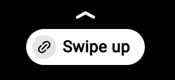
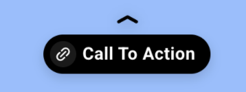
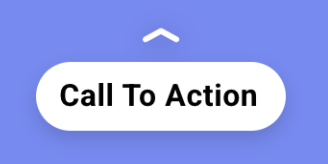

<!--
Copyright 2019 The AMP HTML Authors. All Rights Reserved.

Licensed under the Apache License, Version 2.0 (the "License");
you may not use this file except in compliance with the License.
You may obtain a copy of the License at

      http://www.apache.org/licenses/LICENSE-2.0

Unless required by applicable law or agreed to in writing, software
distributed under the License is distributed on an "AS-IS" BASIS,
WITHOUT WARRANTIES OR CONDITIONS OF ANY KIND, either express or implied.
See the License for the specific language governing permissions and
limitations under the License.
-->

# amp-story-page-outlink

## Usage

Story page outlinks allow you to provide additional content in the form of a link on specific pages. This content can be revealed by users through a "swipe up" gesture, or a tap on bottom of the page. A UI button guiding the viewer to open the attachment will appear at the bottom of every page with a `amp-story-page-outlink` element.

`amp-story-page-outlink` elements accept a single `a` element child.

<amp-img alt="AMP Story page attachment" layout="fixed" src="https://github.com/ampproject/amphtml/raw/main/extensions/amp-story/img/amp-story-page-outlink.gif" width="240" height="480">
  <noscript>
    
  </noscript>
</amp-img>

```html
<amp-story-page id="foo">
  <amp-story-grid-layer template="fill">
    <amp-img src="https://example.ampproject.org/helloworld/bg1.jpg" width="900" height="1600">
  </amp-story-grid-layer>
  <amp-story-page-outlink
    layout="nodisplay">
    <a href="https://www.google.com" title="Link Description"></a>
  </amp-story-page-outlink>
</amp-story-page>
```

## Placement

The `<amp-story-page-outlink>` element must be the last child of `<amp-story-page>`, and must have the `layout="nodisplay"` attribute.

[tip type="important"]
Both [`amp-story-page-outlink`](amp-story-page-outlink.md) and `amp-story-page-attachment` must be the last child tag of an [`amp-story-page`](amp-story-page.md). Because of this, you may include neither or one, but not both.
[/tip]

## Customizeable Attributes

When no special attributes are set, the following default UI will render at the bottom of every page with a `amp-story-page-outlink` element:



```html
<amp-story-page-outlink
  layout="nodisplay">
    <a href="https://www.google.com">Call To Action</a>
</amp-story-page-outlink>
```

### `cta-text`

Customizes the call to action text displayed on the UI prompt to open the attachment.
Default: "Swipe up"


```html
<amp-story-page-outlink layout="nodisplay" cta-text="Read More"
  >...</amp-story-page-outlink>
```

### `theme`

String that represents the color theme, default is light. Accepts values `light`, `dark`, and `custom`.

`theme="custom"` requires two additional attributes:

<ul>
  <li>cta-accent-color: String that represents the custom theme’s color.</li>
  <li>cta-accent-element: String that represents the element to apply the custom theme to. Accepts values `text` and `background`.</li>
</ul>

Contrast protection is automatically applied to ensure readability and a11y compliance ie. When the accent element is “background”, the higher contrast color (black or white) is applied to the text.



```html
<amp-story-page-outlink
  ...
  theme="dark">
    <a href="https://www.google.com">Call To Action</a>
</amp-story-page-outlink>
```


```html
<amp-story-page-outlink
  ...
  theme="custom"
  cta-accent-color="#0047FF"
  cta-accent-element="background">
    <a href="https://www.google.com">Call To Action</a>
</amp-story-page-outlink>
```

### `cta-image`

String that represents a URL pointing to an img. 32 x 32px is suggested. A link icon will be displayed by default if this attribute is not set.


```html
<amp-story-page-outlink
  ...
  cta-image="/static/images/32x32icon.jpg">
    <a href="https://www.google.com">Call To Action</a>
</amp-story-page-outlink>
```

Specifying `none` will remove the default link icon.



```html
<amp-story-page-outlink
  ...
  cta-image="none">
    <a href="https://www.google.com">Call To Action</a>
</amp-story-page-outlink>
```
