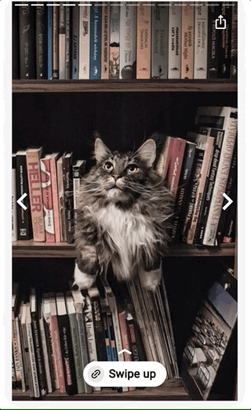

<!--
Copyright 2021 The AMP HTML Authors. All Rights Reserved.

Licensed under the Apache License, Version 2.0 (the "License");
you may not use this file except in compliance with the License.
You may obtain a copy of the License at

      http://www.apache.org/licenses/LICENSE-2.0

Unless required by applicable law or agreed to in writing, software
distributed under the License is distributed on an "AS-IS" BASIS,
WITHOUT WARRANTIES OR CONDITIONS OF ANY KIND, either express or implied.
See the License for the specific language governing permissions and
limitations under the License.
-->

# amp-story-page-outlink

## Usage

`amp-story-page-outlink` provide a UI for a one-tap outlink experience. The outlink can be opened by users through a "swipe up" gesture, or a tap on the call to action element. 
A UI button prompting the viewer to open the attachment will appear at the bottom of every page with a `amp-story-page-outlink` element.
It must have the `layout="nodisplay"` attribute.

`amp-story-page-outlink` requires a single `a` element child.

<amp-img alt="AMP Story page attachment" layout="fixed" src="img/amp-story-page-outlink.gif" width="240" height="480">
  <noscript>
    
  </noscript>
</amp-img>

```html
<amp-story-page id="page-outlink-example">
  <amp-story-grid-layer template="fill">
    <amp-img src="https://example.ampproject.org/helloworld/bg1.jpg" width="900" height="1600">
  </amp-story-grid-layer>
  <amp-story-page-outlink layout="nodisplay">
    <a href="https://www.google.com" title="Link Description"></a>
  </amp-story-page-outlink>
</amp-story-page>
```

## Placement

The `<amp-story-page-outlink>` element must be the last child of `<amp-story-page>`, and must have the `layout="nodisplay"` attribute.

[tip type="important"]
Both [`amp-story-page-outlink`](amp-story-page-outlink.md) and [`amp-story-page-attachment`](amp-story-page-attachment.md) must be the last child tag of an [`amp-story-page`](amp-story-page.md). Because of this, you may include neither or one, but not both.
[/tip]

## Attributes

When no attributes are set, the default UI will render:


```html
<amp-story-page-outlink layout="nodisplay">
    <a href="https://www.google.com"></a>
</amp-story-page-outlink>
```

### `cta-text` (optional)

String that customizes the button text. The default is "Swipe up".


```html
<amp-story-page-outlink 
  layout="nodisplay" 
  cta-text="Read More">
  ...
</amp-story-page-outlink>
```

### `theme` (optional)

String representing the color theme, default is light. Accepts values `light`, `dark`, and `custom`.

`theme="custom"` requires two additional attributes:

<ul>
  <li>`cta-accent-color`: String that represents the custom theme’s color.</li>
  <li>`cta-accent-element`: String that represents the element to apply the custom theme to. Accepts values `text` and `background`.</li>
</ul>

Contrast protection is automatically applied to ensure readability and a11y compliance. For example, when the accent element is “background”, the higher contrast color (black or white) is applied to the text.


```html
<amp-story-page-outlink
  layout="nodisplay" 
  theme="dark">
    <a href="https://www.google.com">Call To Action</a>
</amp-story-page-outlink>
```


```html
<amp-story-page-outlink
  layout="nodisplay" 
  theme="custom"
  cta-accent-color="#0047FF"
  cta-accent-element="background">
    <a href="https://www.google.com">Call To Action</a>
</amp-story-page-outlink>
```

### `cta-image` (optional)

String representing a URL pointing to an image. 32x32px is suggested. A link icon will be displayed by default.


```html
<amp-story-page-outlink
  layout="nodisplay" 
  cta-image="/static/images/32x32icon.jpg">
    <a href="https://www.google.com">Call To Action</a>
</amp-story-page-outlink>
```

Specifying `cta-image=none` will remove the default link icon.


```html
<amp-story-page-outlink
  layout="nodisplay"
  cta-image="none">
    <a href="https://www.google.com">Call To Action</a>
</amp-story-page-outlink>
```

[tip type="note"]
The functionality of `amp-story-page-outlink` used to be supported by [`amp-story-page-attachment`](https://amp.dev/documentation/components/amp-story-page-attachment/?format=stories). Please use `amp-story-page-outlink` for one-tap outlinking UI.
[/tip]
