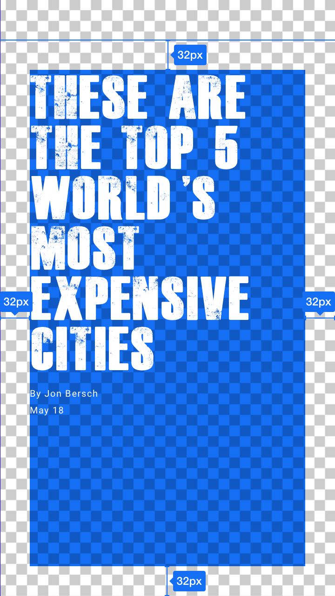
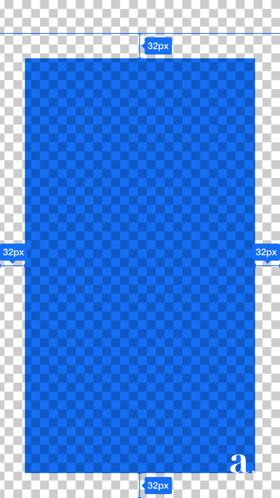
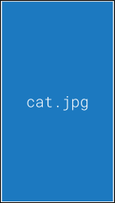
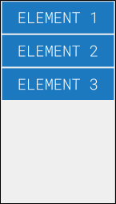
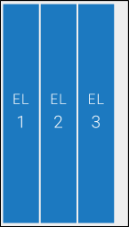
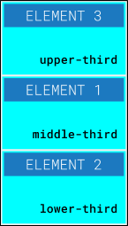

<!--
Copyright 2017 The AMP HTML Authors. All Rights Reserved.

Licensed under the Apache License, Version 2.0 (the "License");
you may not use this file except in compliance with the License.
You may obtain a copy of the License at

      http://www.apache.org/licenses/LICENSE-2.0

Unless required by applicable law or agreed to in writing, software
distributed under the License is distributed on an "AS-IS" BASIS,
WITHOUT WARRANTIES OR CONDITIONS OF ANY KIND, either express or implied.
See the License for the specific language governing permissions and
limitations under the License.
-->

# <a name="`amp-story`"></a> `amp-story`

**THIS IS EXPERIMENTAL AND UNDER ACTIVE DEVELOPMENT!!**

`amp-story` is an extension to AMP that enables a new format for storytelling. Spec is subject to change and there will be bugs; please help by filing issues.

## `amp-story` Format

### Create Your AMP HTML Page with `amp-story`

The following markup is a decent starting point or boilerplate. Copy this and save it to a file with a `.html` extension.

```html
<!doctype html>
<html amp lang="en">
  <head>
    <meta charset="utf-8">
    <script async src="https://cdn.ampproject.org/v0.js"></script>
    <script async custom-element="amp-story"
        src="https://cdn.ampproject.org/v0/amp-story-0.1.js"></script>
    <title>Hello, amp-story</title>
    <link rel="canonical" href="http://example.ampproject.org/my-story.html" />
    <meta name="viewport"
        content="width=device-width,minimum-scale=1,initial-scale=1">
    <style amp-boilerplate>body{-webkit-animation:-amp-start 8s steps(1,end) 0s 1 normal both;-moz-animation:-amp-start 8s steps(1,end) 0s 1 normal both;-ms-animation:-amp-start 8s steps(1,end) 0s 1 normal both;animation:-amp-start 8s steps(1,end) 0s 1 normal both}@-webkit-keyframes -amp-start{from{visibility:hidden}to{visibility:visible}}@-moz-keyframes -amp-start{from{visibility:hidden}to{visibility:visible}}@-ms-keyframes -amp-start{from{visibility:hidden}to{visibility:visible}}@-o-keyframes -amp-start{from{visibility:hidden}to{visibility:visible}} @keyframes -amp-start{from{visibility:hidden}to{visibility:visible}}</style><noscript><style amp-boilerplate>body{-webkit-animation:none;-moz-animation:none;-ms-animation:none;animation:none}</style></noscript>
  </head>
  <body>
    <amp-story standalone>
      <amp-story-page id="my-first-page">
        <amp-story-grid-layer template="fill">
          <amp-img src="https://example.ampproject.org/helloworld/bg1.jpg"
              width="900" height="1600">
          </amp-img>
        </amp-story-grid-layer>
        <amp-story-grid-layer template="vertical">
          <h1>Hello, amp-story!</h1>
        </amp-story-grid-layer>
      </amp-story-page>
      <amp-story-page id="my-second-page">
        <amp-story-grid-layer template="fill">
          <amp-img src="https://example.ampproject.org/helloworld/bg2.gif"
              width="900" height="1600">
          </amp-img>
        </amp-story-grid-layer>
        <amp-story-grid-layer template="vertical">
          <h1>The End</h1>
        </amp-story-grid-layer>
      </amp-story-page>
    </amp-story>
  </body>
</html>
```

The content in the body creates a story with two pages.  Each page has a full bleed background image, with a simple string of text on top of it.

But there's a lot of additional code in the head of the page that might not be immediately obvious. Let's deconstruct the required markup.

### Required Markup

AMP HTML documents with `amp-story` MUST:

| RULE | DESCRIPTION |
| --- | --- |
| Start with the `<!doctype html>` doctype. | Standard for HTML. |
| Contain a top-level `<html ⚡>` tag (`<html amp>` is accepted as well). | Identifies the page as AMP content. |
| Contain `<head>` and `<body>` tags. | Optional in HTML but not in AMP. |
| Contain a `<meta charset="utf-8">` tag as the first child of their `<head>` tag. | Identifies the encoding for the page. |
| Contain a `<script async src="https://cdn.ampproject.org/v0.js"></script>` tag as the second child of their `<head>` tag. | Includes and loads the AMP JS library.  This is a forked version specific to amp-story; when the feature is generally available, the normal v0.js hosted from cdn.ampproject.org must be used. |
| Contain a `<script async src="https://cdn.ampproject.org/v0/amp-story-0.1.js" custom-element="amp-story"></script>` tag as the third child of their `<head>` tag. | Includes and loads the amp-story JS library. |
| Contain a `<link rel="canonical" href="$STORY_URL" />` tag inside their `<head>`. | Points to itself. Learn more in [Make Your Page Discoverable](https://www.ampproject.org/docs/guides/discovery.html). |
| Contain a `<meta name="viewport" content="width=device-width,minimum-scale=1">` tag inside their `<head>` tag. It's also recommended to include `initial-scale=1`. | Specifies a responsive viewport. Learn more in [Create Responsive AMP Pages](https://www.ampproject.org/docs/guides/responsive/responsive_design.html). |
| Contain the [AMP boilerplate code](https://www.ampproject.org/docs/reference/spec/amp-boilerplate.html) in their `<head>` tag. | CSS boilerplate to initially hide the content until AMP JS is loaded. |
| Contain an `<amp-story standalone>` tag in the body of the document | Identifies that the document is a story. |

## Story


### `<amp-story>` component

#### Description

This component represents an entire Story.  The component itself will implement the UI shell, including handling gestures and navigation, and inserting the application shell UI (controls, progress bar, etc).

#### Attributes

  * **standalone** [required]: Identifies that the document is a story.
  * **related-articles** [optional]: A URL endpoint that accepts GET requests and returns a JSON response with links to related and trending stories, to be shown on a screen at the end of the story.  If omitted, the amp-story component will render a default UI for the end screen.  See the [related-articles endpoint section](#related-articles-json-endpoint) for the JSON response format.
  * **background-audio** [optional]: A URI to an audio file that should be played throughout the story.

#### Children

One or more [`<amp-story-page>`](#amp-story-page-component) components, containing each of the individual screens of the story.  The first page specified in document order will be the first page shown in the story.

#### Example

```html
<amp-story standalone>
  <amp-story-page>[...]</amp-story-page>
  <amp-story-page>[...]</amp-story-page>
  <amp-story-page>[...]</amp-story-page>
</amp-story>
```

### Related Articles JSON endpoint


#### Description

This is a URL endpoint that returns the data for the end screen of the story, containing related links, etc.  The system is responsible for fetching the data necessary to render related and trending articles.  This can be served from a static JSON file, or dynamically-generated (e.g. to calculate what is currently trending).

Each section uses the string key provided the publisher as a heading/name for the section in the UI then the array of articles as the articles to be shown in that section.  The domain and favicon of each linked article are automatically parsed/fetched from the specified URL for each piece of content.

#### Example Response

```json
{
  "More to Read": [
    {
      title: "My friends, this is India [...]",
      url: "http://a-publisher.com/india"
      image: "./media/b1.jpg"
    },
    {
      title: "A wonderful weekend with Tenturi",
      url: "http://a-publisher.com/tenturi"
      image: "./media/b2.jpg"
    },
    ...
  ],
}
```

## Pages

### `<amp-story-page>` component


#### Description

Represents the content seen on a single page of a story.

#### Attributes

  * **id** [required]: A unique identifier for the page.  Can be used for styling the page and its descendents in CSS, and is also used to uniquely identify the page in the URL fragment.
  * **auto-advance-after** [optional]: When to auto-advance to the next page.  If omitted, the page will not automatically advance.  Must be either:
    * A positive amount of [time](https://developer.mozilla.org/en-US/docs/Web/CSS/time) to wait before automatically advancing to the next page
    * An ID of an [HTMLMediaElement](https://developer.mozilla.org/en-US/docs/Web/API/HTMLMediaElement) or video-interface video whose completion will trigger the auto-advance
  * **background-audio** [optional]: A URI to an audio file that should be played while this page is in view.

#### Children

One or more [layers](#layers).  Layers are stacked bottom-up (the first layer specified in the DOM is at the bottom; the last layer specified in the DOM is at the top).

#### Example

```html
<amp-story-page id="cover">
  <amp-story-grid-layer template="fill">
    <amp-video src="background.mp4"></amp-video>
  </amp-story-grid-layer>
  <amp-story-grid-layer template="vertical">
    <h1>These are the Top 5 World's Most...</h1>
    <p>Jon Bersch</p>
    <p>May 18</p>
  </amp-story-grid-layer>
  <amp-story-grid-layer template="vertical" 
      align-content="end" justify-content="end">
    <amp-img src="a-logo.svg"></amp-img>
  </amp-story-grid-layer>
</amp-story-page>
```

### Layers

#### Description

Layers are stacked on top of one another to create the desired visual effect.

<span style="font-size: 60px; vertical-align: top"> +  + 
 = </span>

#### Children

Layers can contain any of the following elements (to be expanded over time):

  * Media
    * `<amp-audio>`
    * `<amp-gfycat>`
    * `<amp-google-vrview-image>`
    * `<amp-img>`
    * `<amp-video>`
    * `<source>`
    * `<track>`
  * Analytics & Measurement
    * `<amp-analytics>`
    * `<amp-experiment>`
    * `<amp-pixel>`
  * Sectioning
    * `<address>`
    * `<article>`
    * `<aside>`
    * `<footer>`
    * `<h1>` — `<h6>`
    * `<header>`
    * `<hgroup>`
    * `<nav>`
    * `<section>`
  * Text
    * `<abbr>`
    * `<amp-fit-text>`
    * `<amp-font>`
    * `<amp-gist>`
    * `<b>`
    * `<bdi>`
    * `<bdo>`
    * `<blockquote>`
    * `<br>`
    * `<cite>`
    * `<code>`
    * `<data>`
    * `<del>`
    * `<dfn>`
    * `<div>`
    * `<em>`
    * `<figcaption>`
    * `<figure>`
    * `<hr>`
    * `<i>`
    * `<ins>`
    * `<kbd>`
    * `<main>`
    * `<mark>`
    * `<p>`
    * `<pre>`
    * `<q>`
    * `<rp>`
    * `<rt>`
    * `<rtc>`
    * `<ruby>`
    * `<s>`
    * `<samp>`
    * `<small>`
    * `<span>`
    * `<strong>`
    * `<sub>`
    * `<sup>`
    * `<time>`
    * `<u>`
    * `<var>`
    * `<wbr>`
  * Lists
    * `<amp-list>`
    * `<amp-live-list>`
    * `<dd>`
    * `<dl>`
    * `<dt>`
    * `<li>`
    * `<ol>`
    * `<ul>`
  * Tables
    * `<caption>`
    * `<col>`
    * `<colgroup>`
    * `<table>`
    * `<tbody>`
    * `<td>`
    * `<tfoot>`
    * `<th>`
    * `<thead>`
    * `<tr>`
  * Other
    * `<amp-install-serviceworker>`
    * `<noscript>`

### `<amp-story-grid-layer>` component

#### Description

This is a layer that lays its children out into a grid.  Its implementation is based off of the [CSS Grid Spec](https://www.w3.org/TR/css-grid-1/).

#### Attributes

  * **template** [optional]: If set, determines the layout of this grid layer.  Available templates are described in the [Templates](#templates) section below.
  * (On children of `<amp-story-grid-layer>`) **grid-area** [optional]: The named area (from using a `template` that defines them) in which the element containing this attribute should appear

#### Templates

##### `fill`

The `fill` template shows its first child full bleed.  All other children are not shown.



Names Areas:

  * (none)

Example:

```html
<amp-story-grid-layer template="fill">
  <amp-img src="cat.jpg"></amp-img>
</amp-story-grid-layer>
````

##### `vertical`

The `vertical` template lays its elements out along the y-axis.  By default, its elements are aligned to the top, and can take up the entirety of the screen along the x-axis.



Named Areas:

  * (none)

Example:

```html
<amp-story-grid-layer template="vertical">
  <p>Element 1</p>
  <p>Element 2</p>
  <p>Element 3</p>
</amp-story-grid-layer>
```

##### `horizontal`

The `horizontal` template lays its elements out along the x-axis.  By default, its elements are aligned to the start of the line and can take up the entirety of the screen along the y-axis.



Named Areas:

  * (none)

Example:

```html
<amp-story-grid-layer template="horizontal">
  <p>Element 1</p>
  <p>Element 2</p>
  <p>Element 3</p>
</amp-story-grid-layer>
```

##### `thirds`

The `thirds` template divides the screen into three equally-sized rows, and allows slotting content into each area.



Named Areas:

  * `upper-third`
  * `middle-third`
  * `lower-third`

Example:

```html
<amp-story-grid-layer template="thirds">
  <p grid-area="middle-third">Element 1</p>
  <p grid-area="lower-third">Element 2</p>
  <p grid-area="upper-third">Element 3</p>
</amp-story-grid-layer>
```
