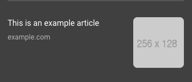

<!--
Copyright 2017 The AMP HTML Authors. All Rights Reserved.

Licensed under the Apache License, Version 2.0 (the "License");
you may not use this file except in compliance with the License.
You may obtain a copy of the License at

      http://www.apache.org/licenses/LICENSE-2.0

Unless required by applicable law or agreed to in writing, software
distributed under the License is distributed on an "AS-IS" BASIS,
WITHOUT WARRANTIES OR CONDITIONS OF ANY KIND, either express or implied.
See the License for the specific language governing permissions and
limitations under the License.
-->

# <a name="`amp-story`"></a> `amp-story`

<table>
  <tr>
    <td width="40%"><strong>Description</strong></td>
    <td>A rich, visual storytelling format.</td>
  </tr>
  <tr>
    <td width="40%"><strong>Availability</strong></td>
    <td><div><a href="https://www.ampproject.org/docs/reference/experimental.html">Experimental</a></td>
  </tr>
  <tr>
    <td width="40%"><strong>Required Script</strong></td>
    <td><code>&lt;script async custom-element="amp-story" src="https://cdn.ampproject.org/v0/amp-story-1.0.js">&lt;/script></code></td>
  </tr>
  <tr>
    <td class="col-fourty"><strong><a href="https://www.ampproject.org/docs/guides/responsive/control_layout.html">Supported Layouts</a></strong></td>
    <td>none</td>
  </tr>
  <tr>
    <td width="40%"><strong>Examples</strong></td>
    <td><ul>
      <li>See AMP By Example's <a href="https://ampbyexample.com/stories/introduction/amp_story_hello_world/">Hello World</a> sample.</li>
      <li>Learn from the <a href="https://www.ampproject.org/docs/tutorials/visual_story">Create a visual AMP story</a> tutorial.</li>
    </ul></td>
  </tr>
</table>


This component is under active development. For any issues, please [file a GitHub issue](https://github.com/ampproject/amphtml/issues/new).


[TOC]

## Version notes

| Version | Description                                                            |
| ------- | ---------------------------------------------------------------------- |
| 1.0     | Current version, since 2018-07-16.                                     |
| 0.1     | Initial implementation.  Deprecated, and will be removed on 2019-03-19 |

## Migrating from 0.1 to 1.0

As of 2018-07-16, version 0.1 is considered deprecated, and will be removed on 2019-03-19.  This may cause minor breaking changes, as your stories will automatically be upgraded to use version 1.0.  We recommend manually migrating your pages to version 1.0 before this date to ensure functionality and proper design.

### New bookend capabilities

We've added new capabilities to the amp-stories bookend, enabling richer component support and visual layouts. Some of the changes include:

* Share providers are sorted according to the JSON configuration.
* New bookend components:
  * Call to action links
  * Text box
  * Portrait and landscape cards

To use these new capabilities, add an `<amp-story-bookend>` tag as the last child of your `<amp-story>` with the required attributes like so:

```html
<amp-story standalone>
  <amp-story-page id="cover">
    ...
  </amp-story-page>
  <!-- `src` and `layout=nodisplay` are required. -->
  <amp-story-bookend src="bookendv1.json" layout="nodisplay">
  </amp-story-bookend>
<amp-story>
```

Learn more about the new components and how to specify them in the JSON configuration in the [amp-story-bookend](#bookend-amp-story-bookend) section.

### New metadata requirements

We've added new metadata attributes to the `<amp-story>` element. These metadata attributes will be used for displaying a preview of the story across the AMP stories ecosystem. For example, these attributes can be used to render an engaging preview link in the bookend of a related story. Providing these attributes will also help ensure your story is future-proof for rich, embedded experiences in AMP stories surfaces to come.

```html
<!-- `title`, `publisher`, `publisher-logo-src` and `poster-portrait-src` will soon be required. -->
<amp-story standalone title="My Story"
    publisher="The AMP Team"
    publisher-logo-src="https://example.com/logo/1x1.png"
    poster-portrait-src="https://example.com/my-story/poster/3x4.jpg">

<!-- `poster-square-src` and `poster-landscape-src` are optional, but strongly recommended. -->
<amp-story standalone title="My Story"
    publisher="The AMP Team"
    publisher-logo-src="https://example.com/logo/1x1.png"
    poster-portrait-src="https://example.com/my-story/poster/3x4.jpg"
    poster-square-src="https://example.com/my-story/poster/1x1.jpg"
    poster-landscape-src="https://example.com/my-story/poster/4x3.jpg">
```

Note that these metadata attributes supplement and do not replace any Structured Data (e.g. JSON-LD) on the page. We still recommend adding [Structured Data](https://developers.google.com/search/docs/data-types/article#amp-sd) to all your AMP pages, including AMP stories.

The new attributes:

| ATTRIBUTE | DESCRIPTION |
| -- | -- |
| `title` [required] | The title of the story. |
| `publisher` [required] | The name of the story's publisher. |
| `publisher-logo-src` [required] | The publisher's logo in square format (1x1 aspect ratio). |
| `poster-portrait-src` [required] | The story poster in portrait format (3x4 aspect ratio). |
| `poster-square-src` | The story poster in square format (1x1 aspect ratio). |
| `poster-landscape-src` | The story poster in landscape format (4x3 aspect ratio). |

#### `publisher-logo-src` guidelines

The following guidelines apply to the image for the publisher logo:

- The file should be a raster file, such as `.jpg`, `.png`, or `.gif`.  Avoid vector files, such as `.svg` or `.eps`.
- Avoid animated images, such as animated gifs.
- The graphic part of the logo should be legible on the background color.

<table>
  <tr>
    <td>
      <amp-img alt="Logo with blue text on white background"
          layout="fixed"
          width="107" height="112"
          src="https://github.com/ampproject/amphtml/raw/master/extensions/amp-story/img/publisher-logo-1.png" >
        <noscript>
          
        </noscript>
      </amp-img>
      Preferred
    </td>
    <td>
      <amp-img alt="Logo with white text on blue background"
          layout="fixed"
          width="107" height="101"
          src="https://github.com/ampproject/amphtml/raw/master/extensions/amp-story/img/publisher-logo-2.png" >
        <noscript>
          
        </noscript>
      </amp-img>
      Preferred
    </td>
    <td>
      <amp-img alt="Logo with blue text on blue background"
          layout="fixed"
          width="103" height="102"
          src="https://github.com/ampproject/amphtml/raw/master/extensions/amp-story/img/publisher-logo-3.png" >
        <noscript>
          
        </noscript>
      </amp-img>
      Avoid this
    </td>
  </tr>
</table>

- The logo shape should be a square, not a rectangle.
- The background color should not be transparent.
- Use one logo per brand that is consistent across AMP stories.
- The logo should be at least 96x96 pixels.

#### Poster guidelines (for `poster-portrait-src`, `poster-landscape-src`, and `poster-square-src`)

The following guidelines apply to the image for the story poster image(s):

- The poster image should be representative of the entire AMP story.
- The poster image should be visible to the user when the user begins the AMP story.  However, the image file URL used in the metadata does not have to match exactly the URL used on the first page of the story.  The URL used in the metadata can include sizing, cropping, or minor styling changes for the preview purpose.
- The poster image should be a raster file, such as `.jpg`, `.png`, or `.gif`.  Avoid vector files, such as `.svg` or `.eps`.
- The poster image should be in 3x4 aspect ratio for portrait, 4x3 for landscape, and 1x1 for square.
- If the poster image is derived from a frame in a video, the thumbnail should be representative of the video. For example, the first frame in a video is often not representative.
- Each poster image should meet the recommended minimium size:
  - Portrait: 696px x 928px
  - Landscape: 928px x 696px
  - Square: 928px x 928px

## Overview

The `amp-story` extension provides a new format for displaying visual content that you can assemble into a story-telling experience. With an AMP story, you can provide users with bite-sized, visually rich information and content.

<figure class="centered-fig">
  <amp-anim width="300" height="533" layout="fixed" src="https://github.com/ampproject/amphtml/raw/master/extensions/amp-story/img/amp-story.gif">
    <noscript>
    
  </noscript>
  </amp-anim>
</figure>

## AMP story format

An [AMP story](#story:-amp-story) is a complete AMP HTML document that is comprised of [pages](#pages:-amp-story-page), within the pages are [layers](#layers:-amp-story-grid-layer), within the layers are AMP & HTML elements, like media, analytics, text, and so on.

<amp-img alt="AMP story tag hierarchy" layout="fixed" src="https://github.com/ampproject/docs/raw/master/assets/img/docs/amp-story-tag-hierarchy.png" width="591" height="358">
  <noscript>
    
  </noscript>
</amp-img>


### Boilerplate

The following markup is a decent starting point or boilerplate. Copy this and save it to a file with a `.html` extension.

```html
<!doctype html>
<html amp lang="en">
  <head>
    <meta charset="utf-8">
    <script async src="https://cdn.ampproject.org/v0.js"></script>
    <script async custom-element="amp-story"
        src="https://cdn.ampproject.org/v0/amp-story-1.0.js"></script>
    <title>Hello, amp-story</title>
    <link rel="canonical" href="http://example.ampproject.org/my-story.html" />
    <meta name="viewport"
        content="width=device-width,minimum-scale=1,initial-scale=1">
    <style amp-boilerplate>body{-webkit-animation:-amp-start 8s steps(1,end) 0s 1 normal both;-moz-animation:-amp-start 8s steps(1,end) 0s 1 normal both;-ms-animation:-amp-start 8s steps(1,end) 0s 1 normal both;animation:-amp-start 8s steps(1,end) 0s 1 normal both}@-webkit-keyframes -amp-start{from{visibility:hidden}to{visibility:visible}}@-moz-keyframes -amp-start{from{visibility:hidden}to{visibility:visible}}@-ms-keyframes -amp-start{from{visibility:hidden}to{visibility:visible}}@-o-keyframes -amp-start{from{visibility:hidden}to{visibility:visible}}@keyframes -amp-start{from{visibility:hidden}to{visibility:visible}}</style><noscript><style amp-boilerplate>body{-webkit-animation:none;-moz-animation:none;-ms-animation:none;animation:none}</style></noscript>
  </head>
  <body>
    <amp-story standalone>
      <amp-story-page id="my-first-page">
        <amp-story-grid-layer template="fill">
          <amp-img src="https://example.ampproject.org/helloworld/bg1.jpg"
              width="900" height="1600">
          </amp-img>
        </amp-story-grid-layer>
        <amp-story-grid-layer template="vertical">
          <h1>Hello, amp-story!</h1>
        </amp-story-grid-layer>
      </amp-story-page>
      <amp-story-page id="my-second-page">
        <amp-story-grid-layer template="fill">
          <amp-img src="https://example.ampproject.org/helloworld/bg2.gif"
              width="900" height="1600">
          </amp-img>
        </amp-story-grid-layer>
        <amp-story-grid-layer template="vertical">
          <h1>The End</h1>
        </amp-story-grid-layer>
      </amp-story-page>
      <amp-story-bookend src="bookendv1.json" layout="nodisplay">
      </amp-story-bookend>
    </amp-story>
  </body>
</html>
```

The content in the body creates a story with two pages.  Each page has a full bleed background image, with a simple string of text on top of it.

### Required markup for amp-story

The AMP story HTML format follows the [same markup requirements as a valid AMP HTML document](https://www.ampproject.org/docs/reference/spec#required-markup), along with the following additional requirements:


| RULE | DESCRIPTION |
| ---- | --- |
| The `<amp-story standalone>` element is the only child element of `<body>`. | Identifies that the document is an AMP story. |
| Contain a `<script async src="https://cdn.ampproject.org/v0/amp-story-1.0.js" custom-element="amp-story"></script>` tag as the third child of the `<head>` tag. | Includes and loads the amp-story JS library. |
| Contain a `<link rel="canonical" href="$STORY_URL">` tag inside the `<head>`. | The link points to the story itself, identifying the story as the canonical document. |

## Story: `amp-story`

The `amp-story` component represents an entire story.  The component itself  implements the UI shell, including handling gestures and navigation, and inserting the application shell UI (controls, progress bar, etc).

<figure class="centered-fig">
  <amp-anim alt="amp-story example" width="300" height="533" layout="fixed" src="https://github.com/ampproject/amphtml/raw/master/extensions/amp-story/img/amp-story.gif">
    <noscript>
    
  </noscript>
  </amp-anim>
</figure>

### Example

```html
<amp-story
    standalone
    title="My Story"
    publisher="The AMP Team"
    publisher-logo-src="https://example.com/logo/1x1.png"
    poster-portrait-src="https://example.com/my-story/poster/3x4.jpg"
    poster-square-src="https://example.com/my-story/poster/1x1.jpg"
    poster-landscape-src="https://example.com/my-story/poster/4x3.jpg"
    background-audio="my.mp3">
  <amp-story-page>[...]</amp-story-page>
  <amp-story-page>[...]</amp-story-page>
  <amp-story-page>[...]</amp-story-page>
  <amp-story-bookend src="./related.json"></amp-story-bookend>
</amp-story>
```

### Attributes

##### standalone [required]

Identifies that the AMP document is a story.

##### title [required]

The title of the story.

##### publisher [required]

The name of the story's publisher.

##### publisher-logo-src [required]

A URL to the story publisher's logo in square format (1x1 aspect ratio). For example `publisher-logo-src="https://example.com/logo/1x1.png"`, where 1x1.png is a 36x36 px logo.

##### poster-portrait-src [required]

A URL to the [story poster](#posters) in portrait format (3x4 aspect ratio).

##### supports-landscape [optional]

Enables landscape orientation support on mobile devices and a full bleed landscape experience on desktop devices.

##### background-audio [optional]

A URL to an audio file that plays throughout the story.

##### poster-square-src [optional]

A URL to the [story poster](#posters) in square format (1x1 aspect ratio).

##### poster-landscape-src [optional]

A URL to the [story poster](#posters) in landscape format (4x3 aspect ratio).

### Posters

A "poster" is an image that displays in the UI until your story is loaded. The poster can generally be the first screen of your story, although you can use any image that is representative of the story.

### Landscape orientation and full bleed desktop experience opt in

If the `supports-landscape` attribute is specified on the `<amp-story>` element, it will:

  * Allow the story to be seen when a mobile device is held in a landscape orientation.
  * Change the desktop experience to an immersive full bleed mode, replacing the default three portrait panels experience.

Usage: `<amp-story ... supports-landscape>...</amp-story>`

<figure class="centered-fig">
  <span class="special-char">Before:</span>
  <amp-anim alt="Desktop three panels experience" layout="flex-item" src="https://raw.githubusercontent.com/ampproject/amphtml/master/extensions/amp-story/img/amp-story-desktop-three-panels.gif" width="400" height="299">
  <noscript></noscript>
  </amp-anim>
  <span class="special-char">After:</span>
  <amp-anim alt="Desktop full bleed experience" layout="flex-item" src="https://raw.githubusercontent.com/ampproject/amphtml/master/extensions/amp-story/img/amp-story-desktop-full-bleed.gif" width="400" height="299">
  <noscript></noscript>
  </amp-anim>
</figure>

### Children (of amp-story)

The `<amp-story>` component contains one or more [`<amp-story-page>`](#pages:-amp-story-page) components, containing each of the individual screens of the story.  The first page specified in the document order is the first page shown in the story.

## Pages: `amp-story-page`

The `<amp-story-page>` component represents the content to display on a single page of a story.

<figure class="centered-fig">
  <amp-anim alt="Page 1 example" width="300" height="533" layout="fixed" src="https://github.com/ampproject/amphtml/raw/master/extensions/amp-story/img/pages-page-1.gif">
  <noscript>
    
  </noscript>
  </amp-anim>
</figure>
<figure class="centered-fig">
  <amp-anim alt="Page 2 example" width="300" height="533" layout="fixed" src="https://github.com/ampproject/amphtml/raw/master/extensions/amp-story/img/pages-page-2.gif">
  <noscript>
    
  </noscript>
  </amp-anim>
</figure>

### Example

```html
<amp-story-page id="cover">
  <amp-story-grid-layer template="fill">
    <amp-video layout="fill" src="background.mp4" poster="background.png" muted autoplay></amp-video>
  </amp-story-grid-layer>
  <amp-story-grid-layer template="vertical">
    <h1>These are the Top 5 World's Most...</h1>
    <p>Jon Bersch</p>
    <p>May 18</p>
  </amp-story-grid-layer>
  <amp-story-grid-layer template="thirds">
    <amp-img grid-area="bottom-third" src="a-logo.svg" width="64" height="64"></amp-img>
  </amp-story-grid-layer>
</amp-story-page>
```

### Attributes

##### id [required]

A unique identifier for the page. Can be used for styling the page and its descendants in CSS, and is also used to uniquely identify the page in the URL fragment.

##### auto-advance-after [optional]

Specifies when to auto-advance to the next page.  If omitted, the page will not automatically advance. The value for `auto-advance-after` must be either:

  * A positive amount of [time](https://developer.mozilla.org/en-US/docs/Web/CSS/time) to wait before automatically advancing to the next page
  * An ID of an [HTMLMediaElement](https://developer.mozilla.org/en-US/docs/Web/API/HTMLMediaElement) or video-interface video whose completion will trigger the auto-advance

For example:

```html
<amp-story-page id="tokyo" auto-advance-after="1s">
```

##### background-audio [optional]

A URI to an audio file that plays while this page is in view.

For example:

```html
<amp-story-page id="zurich" background-audio="./media/switzerland.mp3">
```

### Children (of amp-story-page)

The `<amp-story-page>` component contains one or more [layers](#layers).  Layers are stacked bottom-up (the first layer specified in the DOM is at the bottom; the last layer specified in the DOM is at the top).

## Layers

Layers are stacked on top of one another to create the desired visual effect.

### `amp-story-grid-layer`

The `<amp-story-grid-layer>` component lays its children out into a grid.  Its implementation is based off of the [CSS Grid Spec](https://www.w3.org/TR/css-grid-1/).

<div class="flex-images">
  <amp-img alt="Layer 1" layout="flex-item" src="https://raw.githubusercontent.com/ampproject/amphtml/master/extensions/amp-story/img/layers-layer-1.gif" width="200" height="355">
  <noscript></noscript>
  </amp-img>
  <span class="special-char">+</span>
  <amp-img alt="Layer 2" layout="flex-item" src="https://raw.githubusercontent.com/ampproject/amphtml/master/extensions/amp-story/img/layers-layer-2.jpg" width="200" height="355">
  <noscript></noscript></amp-img>
  <span class="special-char">+</span>
  <amp-img alt="Layer 3" layout="flex-item" src="https://raw.githubusercontent.com/ampproject/amphtml/master/extensions/amp-story/img/layers-layer-3.jpg" width="200" height="355">
  <noscript></noscript></amp-img></amp-img>
  <span class="special-char">=</span>
  <amp-img alt="All layers" layout="flex-item" src="https://raw.githubusercontent.com/ampproject/amphtml/master/extensions/amp-story/img/layers-layer-4.gif" width="200" height="355">
  <noscript></noscript></amp-img></amp-im</amp-img>
</div>

#### Attributes


##### template [required]

The `template` attribute determines the layout of the grid layer. Available templates are described in the [Templates](#templates) section below.


##### grid-area [optional]

This attribute is specified on children of `<amp-story-grid-layer>`.  `grid-area` specifies the named area (from using a `template` that defines them) in which the element containing this attribute should appear.

Example:

```html
<amp-story-grid-layer template="thirds">
  <p grid-area="middle-third">Element 1</p>
  <p grid-area="lower-third">Element 2</p>
  <p grid-area="upper-third">Element 3</p>
</amp-story-grid-layer>
```

#### Templates

The following are available templates to specify for the layout of the grid layer.


To see the layout templates in use, check out the [layouts demo on AMP By Example](https://ampbyexample.com/stories/features/layouts/).


##### fill

The `fill` template shows its first child full bleed. All other children are not shown.

Names Areas: (none)

Example:

<amp-img alt="Fill template example" layout="fixed" src="https://github.com/ampproject/amphtml/raw/master/extensions/amp-story/img/template-fill.png" width="145" height="255">
  <noscript>
    
  </noscript>
</amp-img>

```html
<amp-story-grid-layer template="fill">
  <amp-img src="cat.jpg"></amp-img>
</amp-story-grid-layer>
```

##### vertical

The `vertical` template lays its elements out along the y-axis.  By default, its elements are aligned to the top, and can take up the entirety of the screen along the x-axis.

Names Areas: (none)

<amp-img alt="Vertical template example" layout="fixed" src="https://github.com/ampproject/amphtml/raw/master/extensions/amp-story/img/template-vertical.png" width="145" height="255">
  <noscript>
    
  </noscript>
</amp-img>

```html
<amp-story-grid-layer template="vertical">
  <p>Element 1</p>
  <p>Element 2</p>
  <p>Element 3</p>
</amp-story-grid-layer>
```

##### horizontal

The `horizontal` template lays its elements out along the x-axis.  By default, its elements are aligned to the start of the line and can take up the entirety of the screen along the y-axis.

Names Areas: (none)

<amp-img alt="Horizontal template example" layout="fixed" src="https://github.com/ampproject/amphtml/raw/master/extensions/amp-story/img/template-horizontal.png" width="145" height="255">
  <noscript>
    
  </noscript>
</amp-img>

```html
<amp-story-grid-layer template="horizontal">
  <p>Element 1</p>
  <p>Element 2</p>
  <p>Element 3</p>
</amp-story-grid-layer>
```

##### thirds

The `thirds` template divides the screen into three equally-sized rows, and allows you to slot content into each area.

Named Areas:

  * `upper-third`
  * `middle-third`
  * `lower-third`

<amp-img alt="Horizontal template example" layout="fixed" src="https://github.com/ampproject/amphtml/raw/master/extensions/amp-story/img/template-thirds.png" width="145" height="255">
  <noscript>
    
  </noscript>
</amp-img>

```html
<amp-story-grid-layer template="thirds">
  <p grid-area="middle-third">Element 1</p>
  <p grid-area="lower-third">Element 2</p>
  <p grid-area="upper-third">Element 3</p>
</amp-story-grid-layer>
```

#### Children

An `amp-story-grid-layer` can contain any of the following elements:

**Note**: This list will be expanded over time.

<table>
  <tr>
    <th width="40%">Area</td>
    <th>Allowable tags </th>
  </tr>
  <tr>
    <td>Media</td>
    <td>
      <ul>
        <li><code>&lt;amp-audio></code></li>
        <li><code>&lt;amp-gfycat></code></li>
        <li><code>&lt;amp-google-vrview-image></code></li>
        <li><code>&lt;amp-img></code></li>
        <li><code>&lt;amp-video></code></li>
        <li><code>&lt;source></code></li>
        <li><code>&lt;track></code></li>
      </ul>
    </td>
  </tr>
  <tr>
    <td>Analytics & Measurement</td>
    <td>
      <ul>
        <li><code>&lt;amp-analytics></code></li>
        <li><code>&lt;amp-experiment></code></li>
        <li><code>&lt;amp-pixel></code></li>
      </ul>
    </td>
  </tr>
  <tr>
    <td>Sectioning</td>
    <td>
      <ul>
        <li><code>&lt;address></code></li>
        <li><code>&lt;article></code></li>
        <li><code>&lt;aside></code></li>
        <li><code>&lt;footer></code></li>
        <li><code>&lt;h1>-&lt;h6></code></li>
        <li><code>&lt;header></code></li>
        <li><code>&lt;hgroup></code></li>
        <li><code>&lt;nav></code></li>
        <li><code>&lt;section></code></li>
        <li><code>&lt;amp-story-cta-layer></code></li>
      </ul>
    </td>
  </tr>
  <tr>
    <td>Text</td>
    <td>
      <ul>
        <li><code>&lt;abbr></code></li>
        <li><code>&lt;amp-fit-text></code></li>
        <li><code>&lt;amp-font></code></li>
        <li><code>&lt;amp-gist></code></li>
        <li><code>&lt;b></code></li>
        <li><code>&lt;bdi></code></li>
        <li><code>&lt;bdo></code></li>
        <li><code>&lt;blockquote></code></li>
        <li><code>&lt;br></code></li>
        <li><code>&lt;cite></code></li>
        <li><code>&lt;code></code></li>
        <li><code>&lt;data></code></li>
        <li><code>&lt;del></code></li>
        <li><code>&lt;dfn></code></li>
        <li><code>&lt;div></code></li>
        <li><code>&lt;em></code></li>
        <li><code>&lt;figcaption></code></li>
        <li><code>&lt;figure></code></li>
        <li><code>&lt;hr></code></li>
        <li><code>&lt;i></code></li>
        <li><code>&lt;ins></code></li>
        <li><code>&lt;kbd></code></li>
        <li><code>&lt;main></code></li>
        <li><code>&lt;mark></code></li>
        <li><code>&lt;p></code></li>
        <li><code>&lt;pre></code></li>
        <li><code>&lt;q></code></li>
        <li><code>&lt;rp></code></li>
        <li><code>&lt;rt></code></li>
        <li><code>&lt;rtc></code></li>
        <li><code>&lt;ruby></code></li>
        <li><code>&lt;s></code></li>
        <li><code>&lt;samp></code></li>
        <li><code>&lt;small></code></li>
        <li><code>&lt;span></code></li>
        <li><code>&lt;strong></code></li>
        <li><code>&lt;sub></code></li>
        <li><code>&lt;sup></code></li>
        <li><code>&lt;time></code></li>
        <li><code>&lt;u></code></li>
        <li><code>&lt;var></code></li>
        <li><code>&lt;wbr></code></li>
      </ul>
    </td>
  </tr>
  <tr>
    <td>Lists</td>
    <td>
      <ul>
        <li><code>&lt;amp-list></code></li>
        <li><code>&lt;amp-live-list></code></li>
        <li><code>&lt;dd></code></li>
        <li><code>&lt;dl></code></li>
        <li><code>&lt;dt></code></li>
        <li><code>&lt;li></code></li>
        <li><code>&lt;ol></code></li>
        <li><code>&lt;ul></code></li>
      </ul>
    </td>
  </tr>
  <tr>
    <td>Tables</td>
    <td>
      <ul>
        <li><code>&lt;caption></code></li>
        <li><code>&lt;col></code></li>
        <li><code>&lt;colgroup></code></li>
        <li><code>&lt;table></code></li>
        <li><code>&lt;tbody></code></li>
        <li><code>&lt;td></code></li>
        <li><code>&lt;tfoot></code></li>
        <li><code>&lt;th></code></li>
        <li><code>&lt;thead></code></li>
        <li><code>&lt;tr></code></li>
      </ul>
    </td>
  </tr>
  <tr>
    <td>Links</td>
    <td>
      <ul>
        <li><code>&lt;a></code></li>
      </ul>
    </td>
  </tr>
  <tr>
    <td>Other</td>
    <td>
      <ul>
        <li><code>&lt;amp-install-serviceworker></code></li>
        <li><code>&lt;noscript></code></li>
      </ul>
    </td>
  </tr>
</table>

#### Links in amp-story-grid-layer

We support inline links `<a>` as a descendant of `amp-story-grid-layer`. Whenever a link is tapped a tooltip will be shown - deferring the corresponding action until the user taps again in the tooltip.

#### Customizing tooltip for links

You can customize the contents of the tooltip displayed on top of a user interactive element by specifying the following attributes. If they are not specified, a fallback value will be provided automatically.

<figure class="centered-fig">
  <span class="special-char">Example:</span>
  <amp-anim alt="Embedded component example" layout="flex-item" src="https://raw.githubusercontent.com/ampproject/amphtml/master/extensions/amp-story/img/amp-story-tooltip.gif" width="300" height="553">
  <noscript></noscript>
  </amp-anim>
</figure>

##### `data-tooltip-icon`

Takes in a `src` where the icon image is located.

##### `data-tooltip-text`

A string that will be shown when the tooltip appears.

Example:

```html
<a href="https://www.google.com" role="link" data-tooltip-icon="./assets/ic_amp_googblue_1x_web_24dp.png" data-tooltip-text="Go to page">
  Click me!
</a>
```

### `amp-story-cta-layer`

The `<amp-story-cta-layer>` component allows the usage of `<a>` and `<button>` elements inside an `<amp-story-page>`.

#### Constraints

* If specified, the `<amp-story-cta-layer>` element must be the last layer within an `<amp-story-page>`. As a result, effectively every `<amp-story-page>` can have exactly one or exactly zero of the `<amp-story-cta-layer>` element.
* Positioning and sizing of this layer cannot be controlled. It is always 100% width of the page, 20% height of the page, and aligned to the bottom of the page.

#### Example

```html
<amp-story-page id="vertical-template-thirds">
  <amp-story-grid-layer template="thirds">
    <div class="content" grid-area="upper-third">Paragraph 1</div>
    <div class="content" grid-area="middle-third">Paragraph 2</div>
    <div class="content" grid-area="lower-third">Paragraph 3</div>
  </amp-story-grid-layer>
  <amp-story-cta-layer>
    <a href="https://www.ampproject.org" class="button">Outlink here!</a>
  </amp-story-cta-layer>
</amp-story-page>
```

<amp-img alt="CTA Layer" layout="fixed"
    src="https://raw.githubusercontent.com/ampproject/amphtml/master/extensions/amp-story/img/layers-cta-layer.png"
    width="404" height="678">
  <noscript>
    
  </noscript>
</amp-img>

[Complete example found in the examples directory](https://github.com/ampproject/amphtml/blob/master/examples/amp-story/cta-layer-outlink.html)

#### Children

The `amp-story-cta-layer` allows mostly the same descendants as `amp-story-grid-layer`, and additionally allows `<a>` and `<button>` tags.

For an updated list of supported children, be sure to take a look at the [amp-story-cta-layer-allowed-descendants](https://github.com/ampproject/amphtml/blob/master/extensions/amp-story/validator-amp-story.protoascii) field in the validation rules.

## Page attachments

### `amp-story-page-attachment`

<amp-img alt="AMP Story page attachment" layout="fixed" src="https://github.com/ampproject/amphtml/raw/master/extensions/amp-story/img/amp-story-page-attachment.gif" width="240" height="480">
  <noscript>
    
  </noscript>
</amp-img>

Attach additional content to a story page!

Story page attachments allow you to provide additional AMPHTML content to specific pages. This content can be revealed by users through a "swipe up" gesture, or a tap on the call to action element.
A UI prompt to open the attachment will automatically be added at the bottom of every page that configured an attachment.

The `<amp-story-page-attachment>` element must be the last child of `<amp-story-page>`, and must have the `layout="nodisplay"` attribute. The attachment AMPHTML content is expected to be provided inline in your AMP Story, within this `<amp-story-page-attachment>` tag.

### Allowed content and components

Story page attachments allow the same HTML elements as AMP Story along with additional components listed below, such as third party video players or social media embeds. This means you can add additional content that is too verbose or disallowed in an AMP Story page.

<details>
  <summary>List of allowed AMP components in a page attachment</summary>
  <ul>
    <li><code>&lt;amp-3d-gltf></code></li>
    <li><code>&lt;amp-3q-player></code></li>
    <li><code>&lt;amp-accordion></code></li>
    <li><code>&lt;amp-audio></code></li>
    <li><code>&lt;amp-beopinion></code></li>
    <li><code>&lt;amp-bodymovin-animation></code></li>
    <li><code>&lt;amp-brid-player></code></li>
    <li><code>&lt;amp-brightcove></code></li>
    <li><code>&lt;amp-byside-content></code></li>
    <li><code>&lt;amp-call-tracking></code></li>
    <li><code>&lt;amp-carousel></code></li>
    <li><code>&lt;amp-dailymotion></code></li>
    <li><code>&lt;amp-date-countdown></code></li>
    <li><code>&lt;amp-embedly-card></code></li>
    <li><code>&lt;amp-facebook></code></li>
    <li><code>&lt;amp-facebook-comments></code></li>
    <li><code>&lt;amp-facebook-like></code></li>
    <li><code>&lt;amp-facebook-page></code></li>
    <li><code>&lt;amp-fit-text></code></li>
    <li><code>&lt;amp-fx-collection></code></li>
    <li><code>&lt;amp-fx-flying-carpet></code></li>
    <li><code>&lt;amp-gfycat></code></li>
    <li><code>&lt;amp-gfycat></code></li>
    <li><code>&lt;amp-gist></code></li>
    <li><code>&lt;amp-gist></code></li>
    <li><code>&lt;amp-google-document-embed></code></li>
    <li><code>&lt;amp-google-vrview-image></code></li>
    <li><code>&lt;amp-google-vrview-image></code></li>
    <li><code>&lt;amp-hulu></code></li>
    <li><code>&lt;amp-ima-video></code></li>
    <li><code>&lt;amp-image-slider></code></li>
    <li><code>&lt;amp-img></code></li>
    <li><code>&lt;amp-imgur></code></li>
    <li><code>&lt;amp-instagram></code></li>
    <li><code>&lt;amp-izlesene></code></li>
    <li><code>&lt;amp-jwplayer></code></li>
    <li><code>&lt;amp-kaltura-player></code></li>
    <li><code>&lt;amp-list></code></li>
    <li><code>&lt;amp-list></code></li>
    <li><code>&lt;amp-live-list></code></li>
    <li><code>&lt;amp-live-list></code></li>
    <li><code>&lt;amp-mathml></code></li>
    <li><code>&lt;amp-mowplayer></code></li>
    <li><code>&lt;amp-nexxtv-player></code></li>
    <li><code>&lt;amp-o2-player></code></li>
    <li><code>&lt;amp-ooyala-player></code></li>
    <li><code>&lt;amp-pan-zoom></code></li>
    <li><code>&lt;amp-pinterest></code></li>
    <li><code>&lt;amp-playbuzz></code></li>
    <li><code>&lt;amp-powr-player></code></li>
    <li><code>&lt;amp-reach-player></code></li>
    <li><code>&lt;amp-reddit></code></li>
    <li><code>&lt;amp-riddle-quiz></code></li>
    <li><code>&lt;amp-soundcloud></code></li>
    <li><code>&lt;amp-springboard-player></code></li>
    <li><code>&lt;amp-timeago></code></li>
    <li><code>&lt;amp-twitter></code></li>
    <li><code>&lt;amp-video></code></li>
    <li><code>&lt;amp-video-iframe></code></li>
    <li><code>&lt;amp-vimeo></code></li>
    <li><code>&lt;amp-vine></code></li>
    <li><code>&lt;amp-viqeo-player></code></li>
    <li><code>&lt;amp-vk></code></li>
    <li><code>&lt;amp-wistia-player></code></li>
    <li><code>&lt;amp-yotpo></code></li>
    <li><code>&lt;amp-youtube></code></li>
  </ul>
</details>

### Example

```html
<amp-story-page id="foo">
  <amp-story-grid-layer template="fill">
    <amp-img src="https://example.ampproject.org/helloworld/bg1.jpg" width="900" height="1600">
  </amp-story-grid-layer>
  <amp-story-page-attachment layout="nodisplay">
    <h1>My title</h1>
    <p>Lots of interesting text with <a href="https://example.ampproject.org">links</a>!</p>
    <p>More text and a YouTube video!</p>
    <amp-youtube
        data-videoid="b4Vhdr8jtx0"
        layout="responsive"
        width="480" height="270">
    </amp-youtube>
    <p>And a tweet!</p>
    <amp-twitter
        data-tweetid="885634330868850689"
        layout="responsive"
        width="480" height="270">
    </amp-twitter>
  </amp-story-page-attachment>
</amp-story-page>
```

## Animations

Every element inside an `<amp-story-page>` can have an entrance animation.

You can configure animations by specifying a set of [animation attributes](#animation-attributes) on the element; no additional AMP extensions or configuration is needed.

### Animation effects

The following animation effects are available as presets for AMP stories:


| Preset name       | Default duration (ms) | Default delay (ms) |
| ----------------- | --------------------- | ------------------ |
| `drop`            | 1600                  | 0 |
| `fade-in`         | 500                   | 0 |
| `fly-in-bottom`   | 500                   | 0 |
| `fly-in-left`     | 500                   | 0 |
| `fly-in-right`    | 500                   | 0 |
| `fly-in-top`      | 500                   | 0 |
| `pulse`           | 500                   | 0 |
| `rotate-in-left`  | 700                   | 0 |
| `rotate-in-right` | 700                   | 0 |
| `twirl-in`        | 1000                  | 0 |
| `whoosh-in-left`  | 500                   | 0 |
| `whoosh-in-right` | 500                   | 0 |
| `pan-left`        | 1000                  | 0 |
| `pan-right`       | 1000                  | 0 |
| `pan-down`        | 1000                  | 0 |
| `pan-up`          | 1000                  | 0 |
| `zoom-in`         | 1000                  | 0 |
| `zoom-out`        | 1000                  | 0 |



See a [live demo of all the AMP story animations](https://ampbyexample.com/stories/features/animations/) on AMP By Example.



### Animation attributes

#####  animate-in [required]

Use this attribute to specify the name of the entrance [animation preset](#animation-effects).

*Example*: A heading flies in from left of the page.

```html
<h2 animate-in="fly-in-left">
Fly from left!
</h2>
```

##### animate-in-duration [optional]

Use this attribute to specify the duration of the entrance animation, in seconds or milliseconds (e.g., 0.2s or 200ms). The default duration depends on the animation preset you specified.

*Example*: A heading flies in from left of the page and the animation finishes within half a second.

```html
<h2 animate-in="fly-in-left" animate-in-duration="0.5s" >
Fly from left!
</h2>
```

##### animate-in-delay [optional]

Use this attribute to specify the delay before starting the animation. The value must be greater than or equal to 0, in seconds or milliseconds (for example, 0.2s or 200ms). The default delay depends on the animation preset you specified.

*Example*: After 0.4 seconds, a heading flies in from the left of the page and completes its entrance within 0.5 seconds.

```html
<h2 animate-in="fly-in-left"
    animate-in-duration="0.5s"
    animate-in-delay="0.4s">
Fly from left!
</h2>
```


The animation delay is not guaranteed to be exact. Additional delays can be caused by loading the `amp-animation` extension in the background when the first animated element has been scanned. The attribute contract is defined as *delay this animation for at least N milliseconds*. This applies to all elements including those with a delay of 0 seconds.


##### animate-in-after [optional]

Use this attribute to chain or sequence animations (for example, animation2 starts after animation1 is complete). Specify the ID of the animated element that this element's animation will follow. The element must be present on the same `<amp-story-page>`. The delay is applied after the previous element's animation has finished. For further details, see the [Sequencing animations](#sequencing-animations) section below.

For example, in the following code, `object2` animates in after `object1` completes their entrance:

```html
<amp-story-page id="page1">
  <amp-story-grid-layer template="vertical">
    <div id="object1"
        animate-in="rotate-in-left">
        1
    </div>
    <div id="object2"
        animate-in="fly-in-right"
        animate-in-after="object1">
        2 <!-- will start after object1 has finished -->
    </div>
  </amp-story-grid-layer>
</amp-story-page>
```

##### scale-start, scale-end [optional, only works with `zoom-in` & `zoom-out` animations]

Use these two attributes to further specify the parameters of your zoom-in and zoom-out animations. The value must be greater than or equal to 0, and decimals are allowed. The default will be scale-start: 1 and scale-start: 3 for zoom-in, and the inverse for zoom-out.

*Example*: An image zooming-in from 2x to 5x its size over 4 seconds.

```html
<amp-img animate-in="zoom-in" scale-start="2" scale-end="5" animate-in-duration="4s" layout="fixed" src="https://picsum.photos/720/320?image=1026" width="720" height="320">
</amp-img>
```

##### translate-x [optional, only works with `pan-left` & `pan-right` animations]

Use this attribute to specify the horizontal panning of your image in a pan-left/pan-right animation. The value must be greater than or equal to 0 in pixels. The default value will pan the whole width of the specified image.

*Example*: An image panning 200px to the left over 10 seconds.

```html
<amp-img animate-in="pan-left" translate-x="200px" animate-in-duration="10s" layout="fixed" src="https://picsum.photos/720/320?image=1026" width="720" height="320">
</amp-img>
```

##### translate-y [optional, only works with `pan-up` & `pan-down` animations]

Use this attribute to specify the vertical panning of your image in a pan-up/pan-down animation. The value must be greater than or equal to 0 in pixels. The default value will pan the whole height of the specified image.

*Example*: An image panning 50px down over 15 seconds.

```html
<amp-img animate-in="pan-down" translate-y="50px" animate-in-duration="15s" layout="fixed" src="https://picsum.photos/720/320?image=1026" width="720" height="320">
</amp-img>
```

### Sequencing animations

To chain animations in sequence, use the `animate-in-after` attribute. All elements in a given chain must be present in the same `<amp-story-page>`. Elements without the `animate-in-after` attribute do not belong to a sequence chain, and will start independently on page entrance.

```html
<amp-story-page id="my-sequencing-page">
  <amp-story-grid-layer template="vertical">
    <div class="circle"
        animate-in="drop-in"
        animate-in-duration="1.8s">
      1 <!-- will start independently -->
    </div>
    <div id="rotate-in-left-obj"
        class="square"
        animate-in="rotate-in-left"
        animate-in-after="fade-in-obj"
        animate-in-delay="0.2s">
      2 <!-- will start after fade-in-obj has finished -->
    </div>
    <div class="square"
        animate-in-after="rotate-in-left-obj"
        animate-in="whoosh-in-right"
        animate-in-delay="0.2s">
      3 <!-- will start after rotate-in-left-obj has finished -->
    </div>
    <div id="fade-in-obj"
        class="circle"
        animate-in="fade-in"
        animate-in-duration="2.2s">
      1 <!-- will start independently -->
    </div>
  </amp-story-grid-layer>
</amp-story-page>
```
### Combining multiple animations

You can apply multiple entrance animations on one element (for example, an element flies into the page and fades in at the same time). It's not possible to assign more than one animation preset to a single element; however, elements with different entrance animations can be nested to combine them into one.

```html
<div animate-in="fly-in-left">
   <div animate-in="fade-in">
     I will fly-in and fade-in!
   </div>
</div>
```


If a composed animation is supposed to start after the end of a separate element's animation, make sure that all nested elements that compose the animation have the attribute `animate-in-after` set to the same `id`.


## Bookend: `amp-story-bookend`

The `amp-story-bookend` is the last screen of the story. It contains related links, sharing options, call to action links, and more.

<figure class="centered-fig">
  <amp-anim alt="related article example" width="300" height="533" layout="fixed" src="https://github.com/ampproject/amphtml/raw/master/extensions/amp-story/img/related-articles.gif">
    <noscript>
    
  </noscript>
  </amp-anim>
</figure>

To use it, include an `<amp-story-bookend>` tag as the child of your `<amp-story>` with the required attribute `layout=nodisplay`.
You can then specify the JSON configuration in a separate file and import it through the `src` attribute, or you can place it inline.

Importing the JSON configuration through the `src` attribute:

```html
<amp-story standalone>
  <amp-story-page id="cover">
    ...
  </amp-story-page>
  <!-- `layout=nodisplay` is required. -->
  <amp-story-bookend src="bookendv1.json" layout=nodisplay>
  </amp-story-bookend>
<amp-story>
```

If you don't want to fetch the bookend configuration from a server, you can also specify it inline:

```html
<amp-story standalone>
  ...
  <amp-story-bookend layout=nodisplay>
    <script type="application/json">
      {
        "bookendVersion": "v1.0",
        "shareProviders": [ ... ],
        "components": [ ... ]
     }
    </script>
  </amp-story-bookend>
<amp-story>
```

Next, you must fill in the JSON configuration. This is where you customize the bookend. The overall structure of the config looks like so:

```text
{
  "bookendVersion": "v1.0",
  "shareProviders": [
    ...
  ],
  "components": [
    ...
  ]
}

```

It is required to specify you are using the v1.0 version by including the first line.

#### Bookend components

The bookend is made up of a variety of components. These components can be articles, call to action links, text, and more.

They are specified in the `components` field of the configured JSON. See the [Example JSON response](#example-json-response) section below for an example.

##### heading

The `heading` component has a `text` field, which can be used to append a title to a group of articles.


```json
{
  "type": "heading",
  "text": "More to Read"
}
```

<amp-img alt="Bookend heading component" layout="fixed"
src="https://github.com/ampproject/amphtml/raw/master/extensions/amp-story/img/amp-story-bookend-component-heading.png" width="386" height="123">
  <noscript>
    
  </noscript>
</amp-img>


##### small

The `small` component can be used to link to related articles. This component requires the following fields: `title`, `url`, and optionally an `image`.

```json
{
  "type": "small",
  "title": "This is India an the best places you should go",
  "url": "http://example.com/article.html",
  "image": "http://placehold.it/256x128"
}
```

<amp-img alt="Bookend small component" layout="fixed"
src="https://github.com/ampproject/amphtml/raw/master/extensions/amp-story/img/amp-story-bookend-component-small.png" width="379" height="192">
  <noscript>
    
  </noscript>
</amp-img>

##### landscape

The `landscape` component can be used for alternative formats of content, like videos. This component requires the following fields: `title`, `url`, and `image`. Optionally, you can add a `category` field, which displays a subheading above the title.

```json
{
  "type": "landscape",
  "title": "TRAPPIST-1 Planets May Still Be Wet Enough for Life",
  "url": "http://example.com/article.html",
  "category": "astronomy",
  "image": "http://placehold.it/256x128"
}
```

<amp-img alt="Bookend landscape component" layout="fixed"
src="https://github.com/ampproject/amphtml/raw/master/extensions/amp-story/img/amp-story-bookend-component-landscape.png" width="388" height="410">
  <noscript>
    
  </noscript>
</amp-img>

##### portrait

The `portrait` component can be used to link to other stories. This component requires the following fields: `title`, `url`, and `image`. Optionally, you can add a `category` field, which displays a subheading above the title.

```json
{
  "type": "portrait",
  "category": "Science",
  "title": "New discovery found",
  "url": "http://example.com/article.html",
  "image": "http://placehold.it/312x416"
}
```

<amp-img alt="Bookend portrait component" layout="fixed"
src="https://github.com/ampproject/amphtml/raw/master/extensions/amp-story/img/amp-story-bookend-component-portrait.png" width="382" height="522">
  <noscript>
    
  </noscript>
</amp-img>

##### cta-link

The `cta-link` component lets you specify links for call to actions (e.g., `Read More` or `Subscribe`). This component has a `links` key, which specifies an array of links. Each link is an object with a `text` and `url` values.

```json
{
  "type": "cta-link",
  "links": [
    {
      "text": "Sign Up",
      "url": "example.com/signup"
    },
    {
      "text": "Subscribe",
      "url": "example.com/subscribe"
    }
  ]
}
```

<amp-img alt="Bookend cta-links component" layout="fixed"
src="https://github.com/ampproject/amphtml/raw/master/extensions/amp-story/img/amp-story-bookend-component-cta-links.png" width="381" height="81">
  <noscript>
    
  </noscript>
</amp-img>

##### textbox

The `textbox` component lets you specify text inside the bookend (for example, photo credits). This component requires a `text` array, where each element of the array is a line of text.

```json
{
  "type": "textbox",
  "text": [
    "Food by Enrique McPizza",
    "Choreography by Gabriel Filly",
    "Script by Alan Ecma S.",
    "Direction by Jon Tarantino"
  ]
}
```

<amp-img alt="Bookend textbox component" layout="fixed"
src="https://github.com/ampproject/amphtml/raw/master/extensions/amp-story/img/amp-story-bookend-component-textbox.png" width="591" height="358">
  <noscript>
    
  </noscript>
</amp-img>

**AMP-to-AMP linking**

For documents displayed in an AMP viewer, links typically navigate `_top` or open in a new window. Links to AMP pages, however, may continue to be displayed in the viewer. To enable this behavior, add `"amphtml": true` to a component that supports links. For example:

```json
...
{
  "type": "small",
  "title": "This is India an the best places you should go",
  "url": "http://example.com/my-amp-document.html",
  "image": "http://placehold.it/256x128",
  "amphtml": true
},
{
  "type": "cta-link",
  "links": [
    {
      "text": "Sign Up",
      "url": "example.com/signup",
      "amphtml": true
    },
    {
      "text": "Subscribe",
      "url": "example.com/subscribe"
    }
  ]
},
...
```

#### Social sharing

The configuration for social sharing is defined in the `shareProviders` field of the response object, and it's optional.

This field should contain a string, where each string respresents a share provider's name (e.g. `twitter`).

When extra parameters are required, an object with key-value pairs should be used. The object should contain a key `provider` with a value (e.g. `facebook`) corresponding to the provider's name. The next key-values will depend on the share provider.

The list of available providers is the same as in the [amp-social-share](https://www.ampproject.org/docs/reference/components/amp-social-share) component.

Each of these providers has a different set of available parameters ([see `data-param-*`](https://www.ampproject.org/docs/reference/components/amp-social-share#data-param-*)). The configuration object takes these parameters without the `data-param-` prefix (for example, the `data-param-app_id` would appear in the configuration object as `app_id`).

#### JSON configuration
The `<amp-story-bookend>` must have a `src` attribute pointing to the JSON configuration of the bookend. It is described as a URL endpoint that accepts GET requests and returns a JSON response with the contents of the bookend.  If omitted, the amp-story component renders a default UI for the end screen. The system is responsible for fetching the data necessary to render related and trending articles.  This can be served from a static JSON file, or dynamically-generated (e.g., to calculate what is currently trending).

#### Example JSON response

```text
{
  // You must specify version v1.0.
  "bookendVersion": "v1.0",
  "shareProviders": [
    "email",
    "tumblr",
    {
      "provider": "twitter",
      // You can add custom sharing parameters depending on the social platform.
      "text": "This is custom share text that I would like for the Twitter platform"
    },
    {
      "provider": "facebook",
      // Facebook requires an `app_id` param
      "app_id": "MY_FACEBOOK_APP_ID"
    }
  ],
  "components": [
    {
      "type": "heading",
      "text": "More to read"
    },
    {
      "type": "small",
      "title": "This is India an the best places you should go",
      "url": "http://example.com/article.html",
      "image": "http://placehold.it/256x128"
    },
    ...
  ]
}

```

## Other components usable in AMP stories
The following are other components usable in AMP stories that require some story-specific caveats.

- [amp-consent](https://www.ampproject.org/docs/reference/components/amp-consent#prompt-ui-for-stories)
- [amp-sidebar](https://www.ampproject.org/docs/reference/components/amp-sidebar)

For more generally usable components see the [list of allowed children](https://www.ampproject.org/docs/reference/components/amp-story#children).

## Validation

See [amp-story rules](https://github.com/ampproject/amphtml/blob/master/extensions/amp-story/validator-amp-story.protoascii) in the AMP validator specification.

## Localization

To localize your story, include the language code in the `lang` attribute on the `<html>` tag of your story, such as `<html  lang="en">` for English.  The supported language codes are:

* ar (Arabic)
* de (German)
* en-GB (English, UK)
* en (English, US)
* es-419 (Spanish, Central/Latin America)
* es (Spanish, Spain)
* fr-CA (French, Canada)
* fr (French, France)
* hi (Hindi)
* id (Indonesian)
* it (Italian)
* ja (Japanese)
* ko (Korean)
* nl (Dutch)
* no (Norwegian)
* pt-BR (Portuguese, Brazil)
* pt (Portuguese, Portugal)
* ru (Russian)
* tr (Turkish)
* vi (Vietnamese)
* zh-TW (Traditional Chinese)
* zh (Simplified Chinese)

Additionally, for right-to-left languages, you may include the `dir="rtl"` attribute on the `<html>` tag of your story.  This may be used in conjunction with the language code as well, e.g. `<html  lang="ar" dir="rtl">`.

## Related resources

* [Tutorial: Create a visual AMP story](https://www.ampproject.org/docs/tutorials/visual_story)
* [Samples on AMP By Example](https://ampbyexample.com/stories/#stories/introduction)
* [Best practices for creating an AMP story](https://www.ampproject.org/docs/guides/amp_story_best_practices)
