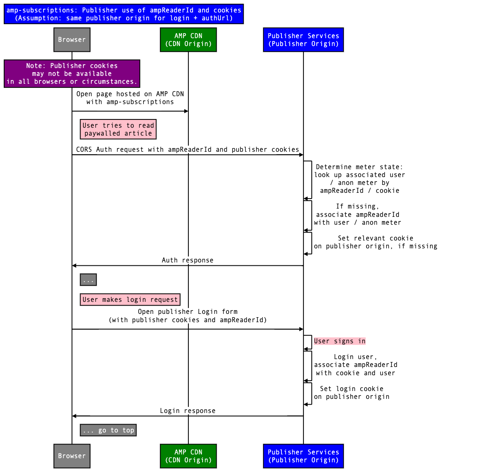

<!---
Copyright 2018 The AMP HTML Authors. All Rights Reserved.

Licensed under the Apache License, Version 2.0 (the "License");
you may not use this file except in compliance with the License.
You may obtain a copy of the License at

      http://www.apache.org/licenses/LICENSE-2.0

Unless required by applicable law or agreed to in writing, software
distributed under the License is distributed on an "AS-IS" BASIS,
WITHOUT WARRANTIES OR CONDITIONS OF ANY KIND, either express or implied.
See the License for the specific language governing permissions and
limitations under the License.
-->

# amp-subscriptions

## Usage

The `amp-subscriptions` extension implements subscription-style access/paywall rules.

The solution comprises the following components:

1. [**AMP Reader ID**][1]: provided by the AMP ecosystem, this is a unique identifier of the Reader as seen by AMP.
2. [**Local service**][2]: provided by the Publisher to control and monitor access to documents.
   1. [**Authorization endpoint**][3]: provided by the Publisher, returns the response that explains which part of a document the Reader can consume.
   2. [**Login page**][4]: provided by the publisher, allows the Publisher to authenticate the Reader and connect their identity with AMP Reader ID.
   3. [**Subscribe page**][5]: provided by the publisher, allows the Reader to purchase a subscription from the Publisher.
   4. [**Pingback endpoint**][6]: provided by the Publisher, is used to send the “view” impression for a document.
3. [**Vendor services**][7]: registered AMP extensions that cooperate with the main `amp-subscriptions` extension.
4. [**Fallback entitlement**][8]: provided by the Publisher, determines what the Reader can see in the event that all services fail to respond to the calls made to the Authorization endpoints.
5. [**Service score factors**][9]: provided by the Publisher, used if no service returns a valid entitlement to determine which service is used as the default service.
6. [**Structured data markup**][10]: Schema.org page-level configuration, provided by the Publisher.
7. [**Attributes**][11]: authored by the Publisher, defines which parts of a document are visible in which circumstances.
8. [**Actions**][12]: fulfilled by a particular service to present the Reader with a specific experience.

### Flow

1. Google AMP Cache returns the document to the Reader with some sections obscured using [Attributes][11].
2. The AMP Runtime calls the [Authorization endpoint][3] of all configured services.
   1. If all services fail to respond, the [Fallback Entitlement][8] will be used.
3. The AMP Runtime uses the response to either hide or show different sections as defined by the [Attributes][11].
4. After the document has been shown to the Reader, AMP Runtime calls the Pingback endpoint that can be used by the Publisher to update the countdown meter (number of free views used).
5. The Publisher can place specific [Actions][12] in the AMP document in order to:
   1. Launch their own [Login page][4] to authenticate the Reader and associate the Reader’s identity in their system with the [AMP Reader ID][1]
   2. Launch their own [Subscribe page][5] to allow the Reader to purchase a new subscription
   3. Launch login or subscribe actions from [Vendor Services][7].

### Relationship to `amp-access`

The `amp-subscriptions` extension is similar to [`amp-access`](../amp-access/amp-access.md)
and in many features builds on top of `amp-access`. However, it's a much more
specialized version of access/paywall protocol. Some of the key differences are:

1. The `amp-subscriptions` entitlements response is similar to the amp-access
   authorization, but it's strictly defined and standardized.
2. The `amp-subscriptions` extension allows multiple services to be configured
   for the page to participate in access/paywall decisions. Services are executed
   concurrently and prioritized based on which service returns the positive response.
3. AMP viewers are allowed to provide `amp-subscriptions` a signed authorization
   response based on an independent agreement with publishers as a proof of access.
4. In `amp-subscriptions` content markup is standardized allowing apps and crawlers to easily detect premium content sections.

Because of standardization of markup, support for multiple providers, and improved viewer
support it is recommended that new publisher and paywall provider implementations
use `amp-subscriptions`.

### AMP Reader ID

To assist access services and use cases, AMP Access introduced the concept of _Reader ID_.

The Reader ID is an anonymous and unique ID created by the AMP ecosystem. It is unique for each Reader/Publisher pair - a Reader is identified differently to two different Publishers. It is a non-reversible ID. The Reader ID is included in all AMP/Publisher communications and has very high entropy. Publishers can use the Reader ID to identify the Reader and map it to their own identity systems.

The Reader ID is constructed on the user device and intended to be long-lived. However, it follows the normal browser storage rules, including those for incognito windows. The intended lifecycle of a Reader ID is 1 year between uses or until the user clears their cookies. The Reader IDs are not currently shared between devices.

The Reader ID is constructed similarly to the mechanism used to build ExternalCID described [here](https://docs.google.com/document/d/1f7z3X2GM_ASb3ZCI_7tngglxwS6WoWi1EB3aKzdf6vo/edit#heading=h.hb9q0wpwwhuf). An example Reader ID is `amp-OFsqR4pPKynymPyMmplPNMvxSTsNQob3TnK-oE3nwVT0clORaZ1rkeEz8xej-vV6`.

### Configuration

The `amp-subscriptions` extension must be configured using JSON configuration:

<table>
  <tr>
    <th>Property</th>
    <th>Values</th>
    <th>Description</th>
  </tr>
  <tr>
    <td class="col-fourty"><code>services</code></td>
    <td>&lt;array&gt; of &lt;object&gt;</td>
    <td>This <code>array</code> must include:<ul><li>One <a href="#local-service">Local Service</a></li><li>Zero or more <a href="#vendor-services">Vendor Services</a>.</li></ul></td>
  </tr>
  <tr>
    <td class="col-fourty"><code>score</code></td>
    <td>&lt;object&gt;</td>
    <td>Determines which service is selected if no valid entitlements are returned.<br/>See <a href="#service-score-factors">Service Score Factors</a> for more details.</td>
  </tr>
  <tr>
    <td class="col-fourty"><code>fallbackEntitlement</code></td>
    <td>&lt;object&gt;</td>
    <td>Determines what level of access the Reader should have if all services fail to respond to the Authorization requests.<br/>See <a href="#fallback-entitlement">Fallback Entitlement</a> for more details.</td>
  </tr>
</table>

Here is an example of a configuration:

```html
<script type="application/json" id="amp-subscriptions">
  {
    "services": [
      {
        // Local service (required)
        "authorizationUrl": "https://pub.com/amp-authorisation?rid=READER_ID&url=SOURCE_URL",
        "pingbackUrl": "https://pub.com/amp-pingback?rid=READER_ID&url=SOURCE_URL",
        "actions":{
          "login": "https://pub.com/amp-login?rid=READER_ID&url=SOURCE_URL",
          "subscribe": "https://pub.com/amp-subscribe?rid=READER_ID&url=SOURCE_URL"
        }
      },
      {
        // Vendor services (optional)
        "serviceId": "service.vendor.com"
      }
    ],
    "score": {
      "supportsViewer": 10,
      "isReadyToPay": 9
    },
    "fallbackEntitlement": {
      "source": "fallback",
      "granted": true,
      "grantReason": "SUBSCRIBER",
      "data": {
        "isLoggedIn": false
      }
    }
  }
</script>
```

### Local service

The following properties are defined in this configuration:

<table>
  <tr>
    <th>Property</th>
    <th>Values</th>
    <th>Description</th>
  </tr>
  <tr>
    <td class="col-fourty"><code>type</code></td>
    <td>"remote" or "iframe"</td>
    <td>Default is "remote". The <a href="#iframe-mode">"iframe" mode</a> allows for messaging to be communicated to a publisher-provided iframe, instead through CORS requests to publisher provided endpoints.</td>
  </tr>
  <tr>
    <td class="col-fourty"><code>authorizationUrl</code></td>
    <td>&lt;URL&gt;</td>
    <td>The HTTPS URL for the <a href="#authorization-endpoint">Authorization Endpoint</a>.</td>
  </tr>
  <tr>
    <td class="col-fourty"><code>pingbackUrl</code></td>
    <td>&lt;URL&gt;</td>
    <td>(Optional) The HTTPS URL for the <a href="#pingback-endpoint">Pingback Endpoint</a>.</td>
  </tr>
  <tr>
    <td class="col-fourty"><code>pingbackAllEntitlements</code></td>
    <td>&lt;boolean&gt;</td>
    <td>(Optional) Whether to send entitlements from all services to the <a href="#pingback-endpoint">Pingback Endpoint</a> or not.</td>
  </tr>
  <tr>
    <td class="col-fourty"><code>actions.login</code></td>
    <td>&lt;URL&gt;</td>
    <td>The HTTPS URL for the <a href="#login-page">Login page</a>.</td>
  </tr>
  <tr>
    <td class="col-fourty"><code>actions.subscribe</code></td>
    <td>&lt;URL&gt;</td>
    <td>The HTTPS URL for the <a href="#subscribe-page">Subscribe page</a>.</td>
  </tr>
</table>

_&lt;URL&gt;_ values specify HTTPS URLs with substitution variables. The substitution variables are covered in more detail in the [URL Variables][13] section below.

Here’s an example of a "local" service configuration:

```html
<script type="application/json" id="amp-subscriptions">
  {
    "services": [
      {
        "authorizationUrl": "https://pub.com/amp-authorisation?rid=READER_ID&url=SOURCE_URL",
        "pingbackUrl": "https://pub.com/amp-pingback?rid=READER_ID&url=SOURCE_URL",
        "pingbackAllEntitlements": true,
        "actions":{
          "login": "https://pub.com/amp-login?rid=READER_ID&url=SOURCE_URL",
          "subscribe": "https://pub.com/amp-subscribe?rid=READER_ID&url=SOURCE_URL"
        }
      },
      ...
    ]
  }
</script>
```

#### URL variables

When configuring the URLs for various endpoints, the Publisher can use substitution variables. The full list of these variables are defined in the [AMP Var Spec](https://github.com/ampproject/amphtml/blob/master/spec/amp-var-substitutions.md). In addition, this spec adds a few subscriptions-specific variables such as `READER_ID` and `AUTHDATA`.

Some of the most relevant variables are described in the table below:

<table>
  <tr>
    <th>Var</th>
    <th>Description</th>
  </tr>
  <tr>
    <td class="col-thirty"><code>READER_ID</code></td>
    <td>The AMP Reader ID.</td>
  </tr>
  <tr>
    <td class="col-thirty"><code>AUTHDATA(field)</code></td>
    <td>The value of the field in the authorization response.</td>
  </tr>
  <tr>
    <td class="col-thirty"><code>RETURN_URL</code></td>
    <td>The placeholder for the return URL specified by the AMP runtime for a Login Dialog to return to.</td>
  </tr>
  <tr>
    <td class="col-thirty"><code>SOURCE_URL</code></td>
    <td>The Source URL of this AMP document. If the document is served from a CDN, the AMPDOC_URL will be a CDN URL, while SOURCE_URL will be the original source URL.</td>
  </tr>
  <tr>
    <td class="col-thirty"><code>AMPDOC_URL</code></td>
    <td>The URL of this AMP document.</td>
  </tr>
  <tr>
    <td class="col-thirty"><code>CANONICAL_URL</code></td>
    <td>The canonical URL of this AMP document.</td>
  </tr>
  <tr>
    <td class="col-thirty"><code>DOCUMENT_REFERRER</code></td>
    <td>The Referrer URL.</td>
  </tr>
  <tr>
    <td class="col-thirty"><code>VIEWER</code></td>
    <td>The URL of the AMP Viewer.</td>
  </tr>
  <tr>
    <td class="col-thirty"><code>RANDOM</code></td>
    <td>A random number. Helpful to avoid browser caching.</td>
  </tr>
</table>

Here’s an example of the URL extended with Reader ID, Canonical URL, Referrer information and random cachebuster:

```http
https://pub.com/amp-authorization?
   rid=READER_ID
  &url=CANONICAL_URL
  &ref=DOCUMENT_REFERRER
  &_=RANDOM
```

`AUTHDATA` variable is available to Pingback and Login URLs. It allows passing any field in the authorization
response as an URL parameter. E.g. `AUTHDATA(data.isLoggedIn)`.

#### Authorization endpoint

Authorization is an endpoint provided by the Publisher and called by the AMP Runtime. It is a credentialed CORS GET endpoint.

**Note:** The Authorization endpoint must implement the security protocol described in the
[AMP CORS Security Spec](https://amp.dev/documentation/guides-and-tutorials/learn/amp-caches-and-cors/amp-cors-requests#cors-security-in-amp).

This endpoint returns the Entitlements object that can be used by the [Attributes][11] to hide or show different parts of the document. Authorization endpoint is specified using the "authorizationUrl" property in the config.

The Entitlement response returned by the authorization endpoint must conform to the predefined format:
<table>
  <tr>
    <th>Property</th>
    <th>Values</th>
    <th>Description</th>
  </tr>
  <tr>
    <td class="col-fourty"><code>granted</code></td>
    <td>&lt;boolean&gt;</td>
    <td>Stating whether or not the Reader has access to the document or not.</td>
  </tr>
  <tr>
    <td class="col-fourty"><code>grantReason</code></td>
    <td>&lt;string&gt;</td>
    <td>The reason for giving the access to the document, recognized reasons are: <ul><li><code>"SUBSCRIBER"</code> meaning the user is fully subscribed.</li><li><code>"METERING"</code> meaning user is on metering.</li></ul></td>
  </tr>
  <tr>
    <td class="col-fourty"><code>data</code></td>
    <td>&lt;object&gt;</td>
    <td>Free-form data which can be used for template rendering, e.g. messaging related to metering or article count. See <a href="#customising-content">Customising Content</a> for more details.</td>
  </tr>
</table>

Example response for a Reader who is a subscriber and is logged into their account:

```js
{
  "granted": true,
  "grantReason": "SUBSCRIBER",
  "data" : {
    "isLoggedIn": true
  }
}
```

Example response for an anonymous Reader who has read 4 out of 5 free articles:

```js
{
  "granted": true,
  "grantReason": "METERING",
  "data" : {
    "isLoggedIn": false,
    "articlesRead": 4,
    "articlesLeft": 1,
    "articleLimit": 5
  }
}
```

Example response for an anonymous Reader who does not have access because they have read 5 out of 5 free articles:

```js
{
  "granted": false,
  "data" : {
    "isLoggedIn": false,
    "articlesRead": 5,
    "articlesLeft": 0,
    "articleLimit": 5
  }
}
```

Notice, while it's not explicitly visible, all vendor services also implement authorization endpoints of their own and conform to the same response format.

#### Login page

This flow will be triggered as a result of a `"login"` action as described in the [Actions][12] section.

An example of a Login page URL:

```json
{
  "actions": {
    "login": "https://pub.com/amp-login?rid=READER_ID&url=SOURCE_URL",
    ...
  }
}
```

The URL can take any parameters as defined in the [URL Variables][13] section.

#### Subscribe page

This flow will be triggered as a result of a `"subscribe"` action as described in the [Actions][12] section.

An example of a Subscribe URL:

```json
{
  "actions": {
    "subscribe": "https://pub.com/amp-subscribe?rid=READER_ID&url=SOURCE_URL",
    ...
  }
}
```

The URL can take any parameters as defined in the [URL Variables][13] section.

#### Pingback endpoint

Pingback is an endpoint provided by in the "local" service configuration and called by the AMP Runtime. It is a credentialed CORS POST endpoint.

**Note:** The Pingback endpoint must implement the security protocol described in the
[AMP CORS Security Spec](https://amp.dev/documentation/guides-and-tutorials/learn/amp-caches-and-cors/amp-cors-requests#cors-security-in-amp).

AMP Runtime calls this endpoint automatically when the Reader has started viewing the document. One of the main goals of the Pingback is for the Publisher to update metering information.

Example request:
```js
{
  "service":"local",
  "granted":true,
  "grantReason":"METERING",
  "data":{
    "isLoggedIn": false,
    "articlesRead": 2,
    "articlesLeft": 3,
    "articleLimit": 5
  }
}
```

Pingback is optional. It's only enabled when the "pingbackUrl" property is specified.

By default, as the body, pingback POST request receives the entitlement object returned by the "winning" authorization endpoint. However if the config for the "local" service contains `pingbackAllEntitlements: true` the body will contain an array of all the entitlments received, from all services, including those which do not grant access.

**Important:** The pingback JSON object is sent with `Content-type: text/plain`. This is intentional as it removes the need for a CORS preflight check.

#### Combining the AMP Reader ID with Publisher cookies

To accurately identify the Reader, the Publisher should associate the [AMP Reader ID][1] with any Publisher cookies relevant to the Reader.



**Note:** due to the way that the [AMP Reader ID][1] is created, there may be multiple [AMP Reader IDs][1] for the same the Reader so the Publisher should be able to handle that appropriately.

#### "iframe" mode

In the "iframe" mode authorization and pingback are provided by messaging to a publisher supplied iframe instead of the CORS requests to the specified authorization and pingback endpoints.

In iframe mode the `authorzationUrl` and `pingbackUrl` are deleted
and replaced by:

- "iframeSrc" - publisher supplied iframe
- "iframeVars - AMP variables to be sent to the iframe
- "type" - must be "iframe"

The "local" service is configured in "iframe" mode as follows:

```html
<script type="application/json" id="amp-subscriptions">
  {
    "services": [
      {
        "type": "iframe",
        "iframeSrc": "https://...",
        "iframeVars": [
          "READER_ID",
          "CANONICAL_URL",
          "AMPDOC_URL",
          "SOURCE_URL",
          "DOCUMENT_REFERRER"
        ],
        "actions":{
          "login": "https://...",
          "subscribe": "https://..."
        }
      },
      ...
    ]
  }
</script>
```

See [amp-access-iframe](../amp-access/0.1/iframe-api/README.md) for details of the messaging protocol.

### Vendor services

The vendor service configuration must reference the `serviceId` and can contain any additional properties allowed by the vendor service.

```html
<script type="application/json" id="amp-subscriptions">
  {
    "services": [
      {
        // Local service definition
      },
      {
        "serviceId": "service.vendor.com"
      }
    ]
  }
</script>
```

See the vendor service's documentation for details.

#### Available vendor services

- [amp-subscriptions-google](../amp-subscriptions-google/amp-subscriptions-google.md)

### Service score factors

If no service returns an entitlement that grants access, all services are compared by calculating a score for each and the highest scoring service is selected. Each service has a `"baseScore"` (default 0). A value < 100 in the `baseScore` key in any service configuration represents the initial score for that service. If no `baseScore` is specified it defaults to `0`.

The score is calculated by taking the `baseScore` for the service and adding dynamically calculated weights from `score[factorName]` configuration multiplied by the value returned by each service for that `factorName`. Services may return a value between [-1..1] for factors they support. If a service is not aware of a factor or does not support it `0` will be returned.

If publisher wishes to ignore a score factor they may either explicitly set its value to `0` or omit it from the `score` map.

Available scoring factors:

1. `supportsViewer` returns `1` when a service can cooperate with the current AMP viewer environment for this page view.
1. `isReadyToPay` returns `1` when the user is known to the service and the service has a form of payment on file allowing a purchase without entering payment details.

All scoring factors have default value of `0`. In the event of a tie the local service wins.

**Note:** If you would like to test the behavior of a document in the context of a particular viewer, you can add `#viewerUrl=` fragment parameter. For instance, `#viewerUrl=https://www.google.com` would emulate the behavior of a document inside a Google viewer.

### Fallback entitlement

If all configured services fail to get the entitlements, the entitlement configured under `fallbackEntitlement` section will be used as a fallback entitlement for `local` service. The document is unblocked based on this fallback entitlement.

Example fallback entitlement:
```js
{
  "fallbackEntitlement": {
    "source": "fallback",
    "granted": true,
    "grantReason": "SUBSCRIBER",
    "data": {
      "isLoggedIn": false
    }
  }
}
```

### Structured data markup

`amp-subscriptions` relies on the Schema.org page-level configuration for two main properties:

1.  The product ID that the user must be granted to view the content.
2.  Whether this content requires this product at this time.

The JSON-LD and Microdata formats are supported.

More detail on the markup is available [here](https://developers.google.com/search/docs/data-types/paywalled-content).

#### JSON-LD markup

Using JSON-LD, the markup would look like:

```html
<script type="application/ld+json">
  {
    "@context": "http://schema.org",
    "@type": "NewsArticle",
    "isAccessibleForFree": false,
    "publisher": {
      "@type": "Organization",
      "name": "The Norcal Tribune"
    },
    "hasPart": {...},
    "isPartOf": {
      "@type": ["CreativeWork", "Product"],
      "name" : "The Norcal Tribune",
      "productID": "norcal_tribune.com:basic"
    }
  }
</script>
```

Thus, notice that:

1.  The product ID is "norcal_tribune.com:basic" (`"productID": "norcal_tribune.com:basic"`).
2.  This document is currently locked (`"isAccessibleForFree": false`).

#### Microdata markup

Using Microdata, the markup could look like this:

```html
<div itemscope itemtype="http://schema.org/NewsArticle">
  <meta itemprop="isAccessibleForFree" content="false" />
  <div
    itemprop="isPartOf"
    itemscope
    itemtype="http://schema.org/CreativeWork http://schema.org/Product">
    <meta itemprop="name" content="The Norcal Tribune" />
    <meta itemprop="productID" content="norcal_tribute.com:basic" />
  </div>
</div>
```

A usable configuration will provide `NewsArticle` typed item with `isAccessibleForFree` property and a subitem of type `Product` that specifies the `productID`.

In this example:

1.  The product ID is "norcal_tribune.com:basic" (`"productID": "norcal_tribune.com:basic"`).
2.  This document is currently locked (`"isAccessibleForFree": false`).

The configuration is resolved as soon as `productID` and `isAccessibleForFree` are found. It is, therefore, advised to place the configuration as high up in the DOM tree as possible.


## Attributes
### `subscription-action`

An action declared in the "actions" configuration can be marked up using `subscriptions-action` attribute.

Available values:
- `login`: this will trigger the [Login page][4] of the selected service.
- `subscribe`: this will trigger the [Subscribe page][5] of the selected service.

For instance, this button will execute the "subscribe" action:

```html
<button subscriptions-action="subscribe" subscriptions-display="EXPR">
  Subscribe now
</button>
```

By default, the actions are hidden and must be explicitly shown using the `subscriptions-display` expression.

### `subscription-service`

In the markup the actions can be delegated to other services for them to execute the actions. This can be achieved by specifying `subscriptions-service` attribute.

Available values:
- `local`: this will force the `local` service to be used for a particular action.
- `{serviceId}` (e.g. `subscribe.google.com`): this will force the service with ID `serviceId` to be used for a particular action.

For instance, this button will the `subscribe.google.com` service to perform the `subscribe` action even when `local` service is selected:

```html
<button
  subscriptions-action="subscribe"
  subscriptions-service="subscribe.google.com">
  Subscribe
</button>
```

### `subscription-decorate`

In addition to delegation of the action to another service, you can also ask another service to decorate the element. Just add the attribute `subsciptions-decorate` to get the element decorated.

```html
<button
  subscriptions-decorate
  subscriptions-action="subscribe"
  subscriptions-service="subscribe.google.com">
  Subscribe
</button>
```

### `subscriptions-section`

The premium sections are shown/hidden automatically based on the authorization/entitlements response.

Available values:
- `content`: this is used to encapsulate the premium content.
- `content-not-granted`: this is used to  will force the `local` service to be used for a particular action.


For instance, you should include the premium article contents in the `content` section and any fallback content in the `content-not-granted` section:

```html
<!-- Include non-subscriber's content in here -->
<section subscriptions-section="content-not-granted">
  You are not allowed to currently view this content.
</section>

<!-- Include subscriber's content in here -->
<section subscriptions-section="content">
  This content will be hidden unless the reader is authorized.
</section>
```

__Important:__ Do not apply `subscriptions-section="content"` to the whole page. Doing so may cause a visible flash when content is later displayed, and may prevent your page from being indexed by search engines. We recommend that the content in the first viewport be allowed to render regardless of subscription state.

### `subscriptions-display`

As well as showing/hiding premium and fallback content, there are more ways to customise the document using the `subscriptions-display` attribute which uses expressions for actions and dialogs. The value of `subscriptions-display` is a boolean expression defined in a SQL-like language. The grammar is defined in [amp-access Appendix A](../amp-access/amp-access.md#appendix-a-amp-access-expression-grammar).

Values in the `data` object of an Entitlements response can be used to build expressions. In this example the values of `isLoggedIn` and `isSubscriber` are in the `data` object and are used to conditionally show UI for login and upgrading your account:

```html
<section>
  <button
    subscriptions-action="login"
    subscriptions-display="NOT data.isLoggedIn">
    Login
  </button>
  <div subscriptions-actions subscriptions-display="data.isLoggedIn">
    <div>My Account</div>
    <div>Sign out</div>
  </div>
  <div
    subscriptions-actions
    subscriptions-display="data.isLoggedIn AND NOT grantReason = 'SUBSCRIBER'">
    <a href="...">Upgrade your account</a>
  </div>
</section>
```

__Important:__ Do not use `data` for granting/denying access to content, conditional display of content based on user access, or displaying user or account related information.

#### Using scores to customise content

The score factors returned by each configured service can be used to control the display of content within dialogs. For example `factors['subscribe.google.com'].isReadyToPay` would be the "ready to pay" score factor from the `subscribe.google.com` service (also known as `amp-subscriptions-google`). Similarly `factors['local'].isReadyToPay` would be for the local service and `scores['subscribe.google.com'].supportsViewer` would be the score factor for the Google service supporting the current viewer.

Sample usage:

```html
<!-- Shows a Subscribe with Google button if the user is ready to pay -->
<button
  subscriptions-display="factors['subscribe.google.com'].isReadyToPay"
  subscriptions-action="subscribe"
  subscriptions-service="subscribe.google.com"
  subscriptions-decorate>
  Subscribe with Google
</button>
```

#### `subscriptions-dialog`

The paywall dialogs are shown automatically based on the authorization/entitlements response.

A dialog is marked up using the `subscriptions-dialog` and `subscriptions-display` attributes:

```html
<div subscriptions-dialog subscriptions-display="EXPR">
  This content will be shown as a dialog when "subscription-display" expression
  matches.
</div>
```

The element on which `subscriptions-dialog` dialog is specified can also be a `<template>` element in which case it will be initially rendered before being displayed as a dialog. For instance:

```html
<template type="amp-mustache" subscriptions-dialog subscriptions-display="NOT granted">
  <!-- Customise the experience for the user using the `data` object returned in the authorization response -->
  <!-- Do NOT use the `data` object to show or hide premium content as this is not always returned -->
  {{^data.articlesRead}}
  <p>
    You have read all of your free articles!
  </p>
  {{/data.articlesRead}}
  {{#data.articlesRead}}
  <p>
    You have read <b>{{data.articlesRead}}</b> articles.
  </p>
  {{/data.articlesRead}}
  {{#data.articlesLeft}}
  <p>
    You have <b>{{data.articlesLeft}}</b> free articles left!
  </p>
  {{/data.articlesLeft}}
  <button subscriptions-action="subscribe" subscriptions-service="local" subscriptions-display="true">
    Subscribe
  </button>
  <section subscriptions-display="NOT granted AND NOT data.isLoggedIn">
  <button
    subscriptions-action="login"
    subscriptions-service="local"
    subscriptions-display="NOT granted AND NOT data.isLoggedIn">
    Already subscribed?
  </button>

</template>
```

The first dialog with matching `subscriptions-display` is shown.

## Actions

Actions are provided in the `"local"` service configuration in the `"actions"` property. It is a named set of action. Any number of actions can be configured this way, but two actions are required: `"login"` and `"subscribe"`.

All actions work the same way: the popup window is opened for the specified URL. The page opened in the popup window can perform the target action, such as login/subscribe/etc, and it is expected to return by redirecting to the URL specified by the `"return"` query parameter.

Notice, while not explicitly visible, any vendor service can also implement its own actions. Or it can delegate to the `"login"` service to execute `"login"` or `"subscribe"` action.

Example action configuration:
```js
"actions":{
  "login": "https://pub.com/amp-login?rid=READER_ID&url=SOURCE_URL",
  "subscribe": "https://pub.com/amp-subscribe?rid=READER_ID&url=SOURCE_URL"
}
```

### `login`
The `login` action flow is as follows:
1. A request is made to the specified URL of the following format:
   ```http
   https://pub.com/amp-login?
     rid=READER_ID
     &url=SOURCE_URL
     &return=RETURN_URL
   ```
   **Note:** the “return” URL parameter is added by the AMP Runtime automatically if `RETURN_URL` substitution is not specified.
2. The Login page will be opened as a normal web page with no special constraints, other than it should function well as a [browser dialog](https://developer.mozilla.org/en-US/docs/Web/API/Window/open).
3. Once the Publisher has authenticated the Reader, the Publisher should associate the Publisher cookies with the [AMP Reader ID][1] as described in the [Combining the AMP Reader ID with Publisher Cookies][14] section.
4. Once the Login page completes its work, it must redirect back to the specified “Return URL” with the following format:
   ```text
   RETURN_URL#success=true|false
   ```
   Notice the use of a URL hash parameter `success`. The value is either `true` or `false` depending on whether the login succeeds or is abandoned. Ideally the Login page, when possible, will send the signal in cases of both success or failure.
5. If the `success=true` signal is returned, the AMP Runtime will repeat calls to the Authorization and Pingback endpoints to update the document’s state and report the "view" with the new access profile.


### `subscribe`
The `subscribe` flow is as follows:
1. A request is made to the specified URL of the following format:
   ```http
   https://pub.com/amp-subscribe?
     rid=READER_ID
     &url=SOURCE_URL
     &return=RETURN_URL
   ```
   **Note:** the “return” URL parameter is added by the AMP Runtime automatically if `RETURN_URL` substitution is not specified.
2. The Subscribe page will be opened as a normal web page with no special constraints, other than it should function well as a [browser dialog](https://developer.mozilla.org/en-US/docs/Web/API/Window/open).
3. Once the Subscribe page completes its work, it must redirect back to the specified “Return URL” with the following format:
   ```text
   RETURN_URL#success=true|false
   ```
   Notice the use of a URL hash parameter `success`. The value is either `true` or `false` depending on whether the login succeeds or is abandoned. Ideally the Subscribe page, when possible, will send the signal in cases of both success or failure.
4. If the `success=true` signal is returned, the AMP Runtime will repeat calls to the Authorization and Pingback endpoints to update the document’s state and report the "view" with the new access profile.

## Analytics

The `amp-subscriptions` extension triggers the following analytics signals:

1. `subscriptions-started`

- Triggered when `amp-subscriptions` is initialized.
- Data: none.

2. `subscriptions-service-registered`

- Triggered when `amp-subscriptions` is able to resolve the instance of the service. A service is free to initialize itself at anytime on the page.
- Data: `serviceId` of the selected service.

3. `subscriptions-service-activated`

- Triggered when a configured service is selected and activated for use. See [Service Score Factors][9].
- Data: `serviceId` of the selected service.

4. `subscriptions-entitlement-resolved`

- Triggered when the entitlement fetch for a service is complete.
- Data: `serviceId` and `action` of the selected service.

5. `subscriptions-access-granted`

- Triggered when the entitlement from the selected service grants access to the document.
- Data: `serviceId` of the selected service.

6. `subscriptions-paywall-activated`

- Triggered when the entitlement from the selected service does not grant access to the document.
- Data: `serviceId` of the selected service.

7. `subscriptions-access-denied`

- Triggered when the entitlement from the selected service denies access to the document.
- Data: `serviceId` of the selected service.

8. `subscriptions-service-re-authorized`

- Triggered when re-authorization of a service is complete. A service can request re-authorization after any action is performed e.g., `login`. A new entitlement is fetched for the service after re-authorization is complete.
- Data: `serviceId` of the selected service.

9. `subscriptions-action-delegated`

- Triggered just before a delegated service action is handed off to the other service. See [Action Delegation][16].
- Data: `serviceId` and the delegated `action` of the selected service.

10. `subscriptions-action-ActionName-started`

- Triggered when the execution of action `ActionName` starts.
- Data: none.

11. `subscriptions-action-ActionName-failed`

- Triggered when the execution of action `ActionName` fails due to any reason.
- Data: none.

12. `subscriptions-action-ActionName-success`

- Triggered when the execution result of action `ActionName` is reported as a success.
- Data: none.

13. `subscriptions-action-ActionName-rejected`

- Triggered when the execution result of action `ActionName` is reported as a failure.
- Data: none.

14. `subscriptions-link-requested`

- Triggered when a subscription account linking request is initiated by the selected service.
- Data: `serviceId` of the selected service.

15. `subscriptions-link-complete`

- Triggered when subscription account linking has been completed by the selected service.
- Data: `serviceId` of the selected service.

16. `subscriptions-link-canceled`

- Triggered when a subscription account linking request initiated by the selected service has been cancelled.
- Data: `serviceId` of the selected service.


[1]: #amp-reader-id
[2]: #local-service
[3]: #authorization-endpoint
[4]: #login-page
[5]: #subscribe-page
[6]: #pingback-endpoint
[7]: #vendor-services
[8]: #fallback-entitlement
[9]: #service-score-factors
[10]: #structured-data-markup
[11]: #attributes
[12]: #actions
[13]: #url-variables
[14]: #combining-the-amp-reader-id-with-publisher-cookies
[15]: #action-markup
[16]: #action-delegation