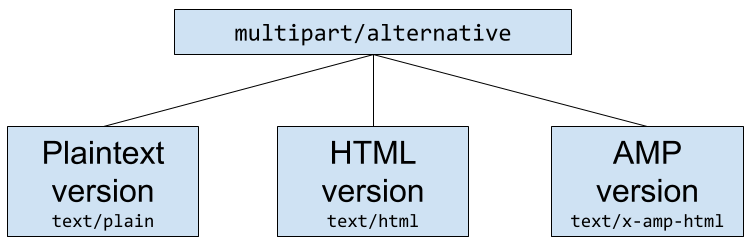

<!---
Copyright 2018 The AMP HTML Authors. All Rights Reserved.

Licensed under the Apache License, Version 2.0 (the "License");
you may not use this file except in compliance with the License.
You may obtain a copy of the License at

      http://www.apache.org/licenses/LICENSE-2.0

Unless required by applicable law or agreed to in writing, software
distributed under the License is distributed on an "AS-IS" BASIS,
WITHOUT WARRANTIES OR CONDITIONS OF ANY KIND, either express or implied.
See the License for the specific language governing permissions and
limitations under the License.
-->

AMP is a technology known for developing super fast web pages on mobile clients. AMP is a set of HTML tags backed by JavaScript that easily enables functionality with an added focus on performance and security. There are [AMP components](https://amp.dev/documentation/components.html) for everything from carousels, to responsive form elements, to retrieving fresh content from remote endpoints.

The AMP for Email format provides a subset of AMP components that you can use in email messages. Recipients of AMP emails can view and interact with the AMP components directly in the email.

## The AMP for Email Format

### Required markup

The following code represents the minimum amount of markup that makes up a valid AMP email message:

[sourcecode:html]
<!doctype html>
<html ⚡4email>
<head>
  <meta charset="utf-8">
  
  
</head>
<body>
Hello, world.
</body>
</html>
[/sourcecode]

An AMP email message MUST

- start with the doctype `<!doctype html>`. [🔗](#dctp)
- contain a top-level `<html ⚡4email>` tag (`<html amp4email>` is accepted as well). [🔗](#ampd)
- contain `<head>` and `<body>` tags (They are optional in HTML). [🔗](#crps)
- contain a `<meta charset="utf-8">` tag as the first child of their head tag. [🔗](#chrs)
- contain a `` tag inside their head tag. [🔗](#scrpt)
- contain amp4email boilerplate (``) inside their head tag to initially hide the content until AMP JS is loaded. [🔗](#boilerplate)

## AMP Components

The following is the list of [AMP components](https://amp.dev/documentation/components.html?format=email) that are currently supported in AMP email messages. The components are grouped into the following categories:

* [Dynamic Content](#dynamic-content)
* [Layout](#layout)
* [Media](#media)

### Dynamic Content

| Element | Description |
| ------- | ----------- |
| [`<amp-form>`](https://amp.dev/documentation/components/reference/amp-form.html) | Form element. The action-xhr attribute must be used in place of the regular action attribute. Can be used in conjunction with `<template type="amp-mustache">` to render a response. |
| [`<amp-selector>`](https://amp.dev/documentation/components/reference/amp-selector.html) | A multi-select widget for use within a form. |
| [`<amp-bind>` and `<amp-state>`](https://amp.dev/documentation/components/reference/amp-bind.html) | Simple scripting language in AMP that allows the manipulation of a state machine for interactions between elements. Can also be used to add behavior on certain events.  `<amp-state>` is used to remotely fetch the initial state machine values.  **Note:** It is prohibited to bind to `[href]` or `[src]`. It is also prohibited to use the `AMP.print`, `AMP.navigateTo` and `AMP.goBack` actions. |
| [`<amp-list>`](https://amp.dev/documentation/components/reference/amp-list.html) | Remotely fetches JSON data that will be rendered by an [`<amp-mustache>`](https://amp.dev/documentation/components/reference/amp-mustache.html).  **Note:** Binding to the `[src]` attribute is not allowed. Including user credentials with `credentials="include"` is also prohibited. |
| [`<template type="amp-mustache">`](https://amp.dev/documentation/components/reference/amp-mustache.html) | A Mustache template markup to render the results of an `amp-list` call. |

### Layout

| Element | Description |
| ------- | ----------- |
| [layout attributes](https://amp.dev/documentation/guides-and-tutorials/learn/amp-html-layout/index.html#layout-attributes)| Layout behavior is determined by the layout attribute. |
| [`<amp-accordion>`](https://amp.dev/documentation/components/reference/amp-accordion.html)| A UI element that facilitates showing/hiding different sections. |
| [`<amp-carousel>`](https://amp.dev/documentation/components/reference/amp-carousel.html) | A carousel UI component. |
| [`<amp-sidebar>`](https://amp.dev/documentation/components/reference/amp-sidebar.html) | A sidebar for navigational purposes. |
| [`<amp-image-lightbox>`](https://amp.dev/documentation/components/reference/amp-image-lightbox.html) | A lightbox for containing images. |
| [`<amp-lightbox>`](https://amp.dev/documentation/components/reference/amp-lightbox.html) | A lightbox for containing content. |
| [`<amp-fit-text>`](https://amp.dev/documentation/components/reference/amp-fit-text.html) | A helper component for fitting text within a certain area. |
| [`<amp-timeago>`](https://amp.dev/documentation/components/reference/amp-timeago.html) | Provides a convenient way of rendering timestamps. |

### Media

| Element | Description |
| ------- | ----------- |
| [`<amp-img>`](https://amp.dev/documentation/components/reference/amp-img.html) | An AMP component that replaces ``.  **Note:** Binding to `[src]` is not allowed. |
| [`<amp-anim>`](https://amp.dev/documentation/components/reference/amp-anim.html) | Embeds GIF files.  **Note:** Binding to `[src]` is not allowed. |

## CSS requirements

### Specifying CSS in an AMP document

All CSS in any AMP document must be included in a `
...
</head>
[/sourcecode]

[tip type="note"]

The entire `
</head>
<body>
  Check out these latest deals from our store!
  <amp-list src="https://ampbyexample.com/json/cart.json" layout="fixed-height" height="80">
    <template type="amp-mustache">
      

        <!-- These items (and their prices) can be updated dynamically. -->
        {{#cart_items}}
        

            {{name}}
            {{price}}
          

        {{/cart_items}}
        {{^cart_items}}
          There are no featured products available. Please check back again later.
        {{/cart_items}}
      

    </template>
  </amp-list>
</body>
</html>
[/sourcecode]

### Basic usage of `<amp-bind>`

The following is a fictional email that shows interactivity features by using [`<amp-bind>`](https://amp.dev/documentation/components/reference/amp-bind.html).

[sourcecode:html]
<!doctype html>
<html ⚡4email>
<head>
  <meta charset="utf-8">
  
  
  
  
</head>
<body>
  

    The current color is yellow
  

  <button on="tap:AMP.setState({state: {color: 'red'}})">
    Set color to red
  </button>
  <button on="tap:AMP.setState({state: {color: 'blue'}})">
    Set color to blue
  </button>
</body>
</html>
[/sourcecode]
## Adding AMP to existing emails

Email is structured as a [MIME tree](https://en.wikipedia.org/wiki/MIME). This MIME tree contains the message body and any attachments to the email.

Embedding AMP within an email is simple, add a new MIME part with a content type of `text/x-amp-html` as a descendant of `multipart/alternative`. It should live alongside the existing `text/html` or `text/plain` parts. This ensures that the email message works on all clients.

<amp-img alt="AMP for Email MIME Parts Diagram"
    layout="responsive"
    width="752" height="246"
    src="https://github.com/ampproject/amphtml/raw/master/spec/img/amp-email-mime-parts.png">
  <noscript>
    
  </noscript>
</amp-img>

Important things to note:

- The `text/x-amp-html` part must be nested under a `multipart/alternative` node, it will not be recognized by the email client otherwise.

- Some email clients[[1]](https://openradar.appspot.com/radar?id=6054696888303616) will only render the last MIME part, so we recommend placing the `text/x-amp-html` MIME part *before* the `text/html` MIME part.

See the following example:

[sourcecode:text]
From:  Person A <persona@gmail.com>
To: Person B <personb@gmail.com>
Subject: An AMP email!
Content-Type: multipart/alternative; boundary="001a114634ac3555ae05525685ae"

--001a114634ac3555ae05525685ae
Content-Type: text/plain; charset="UTF-8"; format=flowed; delsp=yes

Hello World in plain text!

--001a114634ac3555ae05525685ae
Content-Type: text/x-amp-html; charset="UTF-8"

<!doctype html>
<html ⚡4email>
<head>
  <meta charset="utf-8">
  
  
</head>
<body>
Hello World in AMP!
</body>
</html>
--001a114634ac3555ae05525685ae--
Content-Type: text/html; charset="UTF-8"

Hello World in HTML!
--001a114634ac3555ae05525685ae
[/sourcecode]

## Feedback & Support

For support and feedback on AMP for Email, please use the following channel: [ongoing-participation](https://github.com/ampproject/amphtml/blob/master/CONTRIBUTING.md#ongoing-participation)
