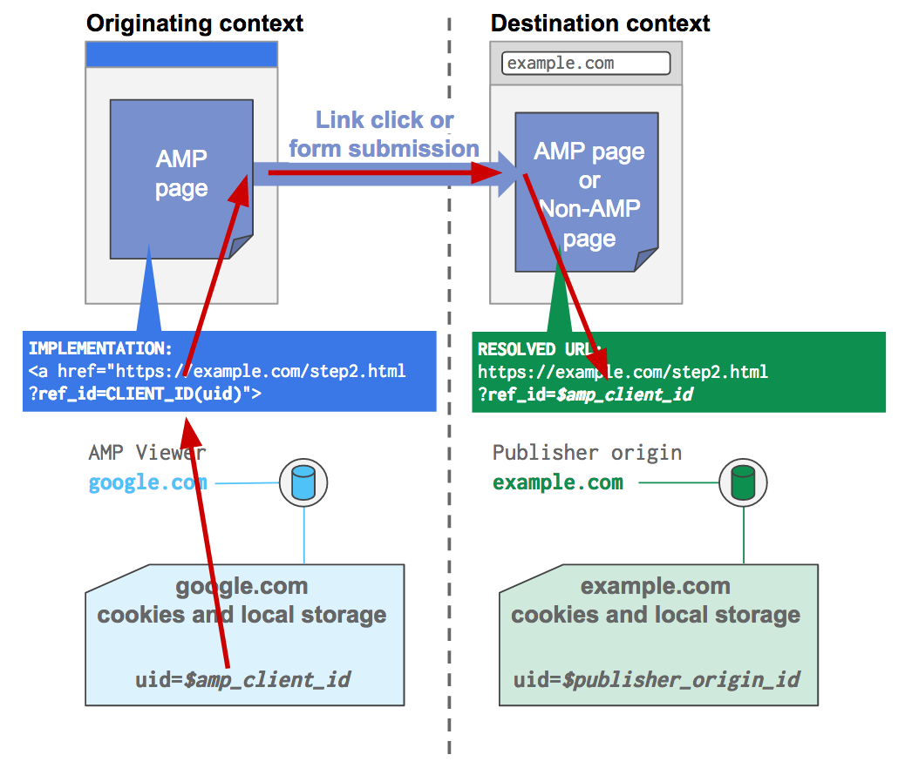

<!---
Copyright 2017 The AMP HTML Authors. All Rights Reserved.

Licensed under the Apache License, Version 2.0 (the "License");
you may not use this file except in compliance with the License.
You may obtain a copy of the License at

      http://www.apache.org/licenses/LICENSE-2.0

Unless required by applicable law or agreed to in writing, software
distributed under the License is distributed on an "AS-IS" BASIS,
WITHOUT WARRANTIES OR CONDITIONS OF ANY KIND, either express or implied.
See the License for the specific language governing permissions and
limitations under the License.
-->

# Managing non-authenticated user state with AMP

**Table of contents**

- [Background](#background)
- [Implementation guide](#implementation-guide)
  - [Before getting started](#before-getting-started)
  - [Task 1: For non-AMP pages on the publisher origin, set up an identifier and send analytics pings](#task-1-for-non-amp-pages-on-the-publisher-origin-set-up-an-identifier-and-send-analytics-pings)
  - [Task 2: For AMP pages, set up an identifier and send analytics pings by including Client ID replacement in amp-analytics pings](#task-2-for-amp-pages-set-up-an-identifier-and-send-analytics-pings-by-including-client-id-replacement-in-amp-analytics-pings)
  - [Task 3: Process analytics pings from pages on the publisher origin](#task-3-process-analytics-pings-from-pages-on-the-publisher-origin)
  - [Task 4: Process analytics pings from AMP cache or AMP viewer display contexts and establish identifier mappings (if needed)](#task-4-process-analytics-pings-from-amp-cache-or-amp-viewer-display-contexts-and-establish-identifier-mappings-if-needed)
  - [Task 5: Using Client ID in linking and form submission](#task-5-using-client-id-in-linking-and-form-submission)
- [Strongly recommended practices](#strongly-recommended-practices)

User state is an important concept on today’s web. Consider the following use cases that are enabled by managing user state:

 - A merchant builds a useful **shopping cart** that shows a user the same items during their second visit that they had added to the cart during their first visit many weeks ago. Such an experience increases the chance of the user buying that item by making sure they remain aware of the item they considered buying in the past.
 - A news publisher who can tailor **recommended articles** to a reader based on the reader’s repeated visits to the publisher’s articles, which helps keep the reader engaged and discovering more content.
 - A website developer running any type of site collects **analytics** that can tell if two pageviews belong to the same person who saw two pages or to two different people who each saw a single page. Having this insight helps to know how the site is performing, and, ultimately, how to improve it.

This article is designed to help you be more successful in **managing non-authenticated user state in AMP**, a way of providing a seamless user journey even if the user hasn’t taken an action to provide their identity, like signing in. After reviewing some of the challenges and considerations in approaching this topic, this guide outlines the ways in which user state is supported by AMP and offers recommendations on how you can approach a technical implementation.

## Background

The topic of user state deserves special attention in AMP because AMP pages can display in multiple contexts such as on your website, in Google Search or a third party app. This introduces challenges in managing user state when users travel between these.

### Display contexts for AMP pages

You can think of AMP as a portable content format that enables content to be loaded fast anywhere. AMP documents can be displayed via three noteworthy contexts:

- The publisher's origin
- An AMP cache
- An AMP viewer

<table>
  <tr>
    <th width="20%">Context</th>
    <th width="20%">Can non-AMP pages be served from here?</th>
    <th width="20%">Can AMP pages be served from here?</th>
    <th>Sample URL</th>
  </tr>
  <tr>
    <td>Publisher’s origin</td>
    <td>Yes</td>
    <td>Yes</td>
    <td><code>https://example.com/article.amp.html</code></td>
  </tr>
   <tr>
    <td>AMP cache</td>
    <td>No</td>
    <td>Yes</td>
    <td><code>https://example-com.cdn.ampproject.org/s/example.com/article.amp.html</code></td>
  </tr>
   <tr>
    <td>AMP viewer</td>
    <td>No</td>
    <td>Yes</td>
    <td><code>https://google.com/amp/s/example.com/article.amp.html</code></td>
  </tr>
</table>

Let’s examine each of these situations more closely.

**Context #1: the publisher’s origin.** AMP pages are deployed so that they are originally hosted from and accessible via the publisher’s site, e.g. on `https://example.com` one might find `https://example.com/article.amp.html`.

Publishers can choose to publish exclusively in AMP, or to publish two versions of content (that is, AMP content “paired” with non-AMP content). The “paired” model requires some [particular steps](https://www.ampproject.org/docs/guides/discovery) to ensure the AMP versions of pages are discoverable to search engines, social media sites, and other platforms. Both publishing approaches are fully supported; it's up to the publisher to decide on which approach to take.

> **NOTE:**
>
> Due to the “paired” publishing model just described, the publisher’s origin (in the example above, `https://example.com`) is a context in which **both AMP and non-AMP content can be accessed**. Indeed, it’s the only context in which this can happen because AMP caches and AMP viewers, described below, only deliver valid AMP content.

**Context #2: an AMP cache.** AMP files can be cached in the cloud by a third-party cache to reduce the time content takes to get to a user’s mobile device.

By using the AMP format, content producers are making the content in AMP files available to be cached by third parties. Under this type of framework, publishers continue to control their content (by publishing to their origin as detailed above), but platforms can cache or mirror the content for optimal delivery speed to users.

Traditionally, content served in this way originates from a different domain. For example, the [Google AMP Cache](https://developers.google.com/amp/cache/overview) uses `https://cdn.ampproject.org` to deliver content, e.g. `https://example-com.cdn.ampproject.org/s/example.com/article.amp.html`.

**Context #3: an AMP viewer.** The AMP format is built to support embedding within third-party AMP viewers. This enables a high degree of cooperation between the AMP file and the viewer experience, benefits of which include: smart and secure preloading and pre-rendering of content and innovative affordances like swiping between full AMP pages.

Just like the AMP cache case, expect the domain for an AMP viewer to also be different from the publisher origin. For example, the viewer for Google Search is hosted on `https://google.com` and embeds an iframe that requests the publisher content from the Google AMP Cache.

### Multiple contexts means multiple state management

Publishers must be prepared to manage the user state for each display context separately. AMP’s [Client ID](https://github.com/ampproject/amphtml/blob/master/spec/amp-var-substitutions.md#client-id) feature, which takes advantage of cookies or local storage to persist state, provides the necessary support for AMP pages to have a stable and pseudonymous identifier for the user. From an implementation point of view, either cookies or local storage are used, and AMP makes the decision which to use depending on the display context. This choice is influenced by the technical feasibility of managing this state scaled to hundreds or thousands of publishers.

However, publishers of AMP pages can easily end up (unwittingly) designing user journeys that involve multiple contexts. Let’s revisit our earlier look at the shopping cart use case and add some more detail to it to make a full **user story**:

> *On day 1, the user discovers an AMP page from Example Inc. via Google Search. Google Search loads AMP pages in an AMP viewer. While viewing the page, the user adds four items to their shopping cart but doesn't check out. Two weeks later, on day 15, the user remembers the four items they were considering to purchase and decides now is the time to buy. They access Example Inc.’s homepage at `https://example.com` directly (it is a non-AMP homepage) and finds their four items are still saved in the shopping cart.*

In this scenario, the user receives a consistent shopping cart experience even though she has traversed from an AMP viewer context to a publisher origin context—and with some time passing between these events. This experience is very reasonable and, if you’re designing a shopping experience, you should expect to support it, so how do you make it happen?

**To enable this and any experience involving user state, all contexts the user traverses must share their individually-maintained state with each other.** “Perfect!”, you say, with the idea to share the cookie values with user identifiers across these contextual boundaries. One wrinkle: even though each of these contexts displays content controlled by the same publisher, they each see the other as a third-party because each context lives on different domains.


As you'll see in the following discussion, being in a third-party position when interacting with cookies may present challenges, depending on how the user’s browser settings are configured. In particular, if third party cookies are blocked in a particular situation, then it will prevent the ability for information to be shared across the contexts. On the other hand, if third-party cookie operations are allowed, then information can be shared.

## Implementation guide

This section provides recommendations for managing user state. The tasks below are presented as a progression, but can largely be viewed in two chunks:

**Chunk #1: Fundamental implementation:** Tasks 1-4 are essential toward getting the basics working. They rely on a minimal set of features needed to get the job partially done: AMP’s Client ID substitution, reading and writing of cookies, and maintaining a backend mapping table. Why “partially”? Because the steps conveyed in these tasks rely on reading and writing cookies and because the browser’s cookie settings may prevent this in certain circumstances, this set of tasks is likely to be insufficient for fully managing user state in all scenarios.

After laying the foundation, we then visit a topic with a narrower range of use cases but that offers a complete solution for those use cases.

**Chunk #2: Using Client ID in linking and form submission:** In Task 5, you'll learn to  advantage of link traversal and/or form submission to pass AMP Client ID information across contextual boundaries where the user is traversing from one page directly to another.


> **CAUTION:**
>
> The following implementation guide advises usage of and working with cookies. Be sure to consult the “[Strongly recommended practices](#strongly-recommended-practices)” section for important suggestions to keep in mind.

### Before getting started

In walking through the technical guidance below, let's  assume that you’ll be binding **user state** to a stable **identifier** that represents the user. For example, the identifier might look like `n34ic982n2386n30`. On the server side you then associate `n34ic982n2386n30` to any set of user state information, such as shopping cart content, a list of previously read articles, or other data depending on the use case.


For clarity throughout the rest of this document, we’ll call various strings of characters that are identifiers by more readable names preceded by a dollar sign (`$`):

``` text
n34ic982n2386n30 ⇒ $sample_id
```

**Our use case:** Throughout this guide we will work on an example designed to achieve simple pageview tracking (i.e., analytics) in which we want to produce the most accurate user counting possible. This means that even if the user is accessing a particular publisher’s content from different contexts (including crossing between AMP and non-AMP pages), we want these visits to be counted toward a singular understanding of the user that is the same as if the user were browsing only on such publisher’s traditional non-AMP pages.

**Assumption about availability of stable cookie values:** We also assume that the user is using the same device, browser, and non-private/incognito browsing, in order to assure that cookie values are preserved and available across the user’s sessions over time. If this is not the case, these techniques should not be expected to work. If this is required, look to manage user state based on the user’s authenticated (i.e. signed-in) identity.

**The concepts presented below can be extended to other use cases:** Although we focus just on the analytics use case, the concepts conveyed below can be reworked for other use cases requiring user state management across contexts.

### Task 1: For non-AMP pages on the publisher origin, set up an identifier and send analytics pings

Let’s begin by configuring analytics for non-AMP pages served off of the publisher origin. This can be achieved in many ways, including using an analytics package like Google Analytics or Adobe Analytics, or by writing a custom implementation.

If you’re using an analytics package from a vendor, it’s likely that package takes care of both setting up cookies and transmitting pings via its configuration code and APIs. If this is the case, you should read through the steps below to ensure they align with your analytics approach but expect that you won’t need to make any changes as part of completing this task.

The rest of this task offers guidance if you are looking to set up your own analytics.

##### Set up an identifier using first-party cookies

If you have non-AMP pages being served from your publisher origin, set up a persistent and stable identifier to be used on these pages. This is typically [implemented with first-party cookies](https://en.wikipedia.org/wiki/HTTP_cookie#Tracking).

For the purposes of our example, let’s say you’ve set a cookie called `uid` (“user identifier”) that will be created on a user’s first visit. If it’s not the user’s first visit, then read the value that was previously set on the first visit.

This means there are two cases for the state of non-AMP pages on the publisher origin:

**Case #1: Initial visit.** Upon first landing on the non-AMP page, there will be no cookie. If you checked for the cookie before one was set, you’d see no values set in the cookie corresponding to the `uid`:

``` text
> document.cookie
  ""
```

Sometime in the initial load, the cookie should be set, so that if you do this once the page is loaded, you will see a value has been set:

``` text
> document.cookie
  "uid=$publisher_origin_identifier"
```

**Case #2: Non-initial visit.** There will be a cookie set. Thus, if you open the developer console on the page, you’d see:

``` text
> document.cookie
  "uid=$publisher_origin_identifier"
```

##### Send analytics pings

Once you’ve set up an identifier, you can now incorporate it in analytics pings to begin tracking pageviews.

The specific implementation will depend on your desired configuration, but generally you’ll be looking to send pings (requests) to your analytics server, which include useful data within the URL of the request itself. Here’s an example, which also indicates how you’d include your cookie value inside of the request:

``` text
https://analytics.example.com/ping?type=pageview&user_id=$publisher_origin_identifier
```

Note that in the above example the identifier for the user is indicated by a specific query param, `user_id`:

``` text
user_id=$publisher_origin_identifier
```

The use of “`user_id`” here should be determined by what your analytics server expects to process and is not specifically tied to what you call the cookie that stores the identifier locally.

### Task 2: For AMP pages, set up an identifier and send analytics pings by including Client ID replacement in amp-analytics pings

Turning now to AMP pages, let's look at how you can establish and transmit an identifier for analytics. This will be applicable regardless of the context the AMP page is presented in, so this covers any AMP page on the publisher origin, served via an AMP cache, or displayed in AMP viewer.

Through usage of features that require Client ID, AMP will do the “under the hood” work to generate and store client ID values and surface them to the features that require them. One of the principal features that can use AMP’s Client ID is [amp-analytics](https://www.ampproject.org/docs/reference/components/amp-analytics), which happens to be exactly what we’ll need to implement our analytics use case example.

On AMP pages, construct an amp-analytics ping containing the Client ID:

<table>
  <tr>
    <td width="50%"><strong>amp-analytics configuration looks like:</strong></td>
    <td width="50%"><code>https://analytics.example.com/ping?type=pageview&amp;user_id=${clientId(uid)}</code></td>
  </tr>
  <tr>
    <td width="50%"><strong>What goes over the network looks like:</strong></td>
    <td width="50%"><code>https://analytics.example.com/ping?type=pageview&amp;user_id=$amp_client_id</code><br><em>In this case, <code>${clientId(uid)}</code> is replaced by an actual value that AMP either generates at that moment or will be returned based on what the user’s browser has already stored locally</em></td>
  </tr>
</table>

Take note of the fact that the parameter passed into the Client ID substitution, `${clientId(uid)`, is “`uid`”. This was a deliberate choice that matches the same cookie name used on the publisher origin as described in [Task 1](#task-1-for-non-amp-pages-on-the-publisher-origin-set-up-an-identifier-and-send-analytics-pings). For the most seamless integration, you should apply the same technique.

Concerning the rest of the amp-analytics implementation, see the documentation for [amp-analytics configuration](https://www.ampproject.org/docs/guides/analytics_amp) for more detail on how to set up amp-analytics requests or to modify those of your analytics vendor. The ping can be further modified to transport additional data that you either directly define or by taking advantage of other [AMP substitutions](https://github.com/ampproject/amphtml/blob/master/spec/amp-var-substitutions.md).

> **Good to know:**
>
> Why did we use of the name “`uid`” for the parameter passed to the Client ID feature? The parameter that the `clientId(...)` substitution takes is used to define scope. You can actually use the Client ID feature for many use cases and, as a result, generate many client IDs. The parameter differentiates between these use cases and so you use it to specify which use case you would like a Client ID for. For instance, you might want to send different identifiers to third parties like an advertiser and you could use the “scope” parameter to achieve this.

On the publisher origin, it’s easiest to think of “scope” as what you call the cookie. By recommending a value of “`uid`” for the Client ID parameter here in [Task 2](#task-2-for-amp-pages-set-up-an-identifier-and-send-analytics-pings-by-including-client-id-replacement-in-amp-analytics-pings), we align with the choice to use a cookie called “`uid`” in [Task 1](#task-1-for-non-amp-pages-on-the-publisher-origin-set-up-an-identifier-and-send-analytics-pings).

### Task 3: Process analytics pings from pages on the publisher origin

Because of the setup performed in Tasks 1 and 2, when someone accesses the AMP version (from any context) or the non-AMP version on the publisher origin the analytics ping will use the same identifier. By following the guidance in [Task 2](#task-2-for-amp-pages-set-up-an-identifier-and-send-analytics-pings-by-including-client-id-replacement-in-amp-analytics-pings) to choose a Client ID "scope" that was the same name as the name of the cookie you used in [Task 1](#task-1-for-non-amp-pages-on-the-publisher-origin-set-up-an-identifier-and-send-analytics-pings), AMP reuses the same cookie.

This is illustrated in the table below:

<table>
  <tr>
    <td width="50%">An analytics ping coming from a <strong>non-AMP page on the publisher origin</strong> looks like</td>
    <td width="50%"><code>https://analytics.example.com/ping?type=pageview&amp;user_id=$publisher_origin_identifier</code></td>
  </tr>
  <tr>
    <td width="50%">An analytics ping coming from an <strong>AMP page on the publisher origin</strong> looks like</td>
    <td width="50%"><code>https://analytics.example.com/ping?type=pageview&amp;user_id=$publisher_origin_identifier</code><br><em>In this case, it's the same! By choosing a scope value of “<code>uid</code>” the underlying value of the “<code>uid</code>” cookie, which is <code>$publisher_origin_identifier</code>, gets used.</em></td>
  </tr>
</table>

### Task 4: Process analytics pings from AMP cache or AMP viewer display contexts and establish identifier mappings (if needed)

When we set up analytics pings in [Task 2](#task-2-for-amp-pages-set-up-an-identifier-and-send-analytics-pings-by-including-client-id-replacement-in-amp-analytics-pings) to transmit data from AMP pages displayed within an AMP cache or AMP viewer, we also created a problem. As discussed previously, AMP cache and AMP viewer contexts are different from the publisher origin context, and along with this comes as different way of maintaining identifiers. To process these pings to avoid problems like overcounting users, we’ll take some [steps](#implementation-steps) to try and reconcile identifiers as often as we can.

To help explain the steps we’re taking, it’s helpful to first reconsider exactly how the overcounting problem arises.

#### Reviewing the problem

Consider the following flow:

1. A user visits the **AMP page in an AMP viewer display context**, such as `https://google.com/amp/s/example.com/article.amp.html`. Since the AMP viewer does not have access to the `uid` cookie on the publisher origin, a random value of `$amp_client_id` is generated to identify the user.
2. The same user then visits **a page on the publisher origin `https://example.com`**. As described in [Task 3](#task-3-process-analytics-pings-from-pages-on-the-publisher-origin), the user is identified with `$publisher_origin_identifier`.

Here (1) and (2) happen on different origins (or contexts). Because of this, there’s no shared state and `$amp_client_id` is different from `$publisher_origin_identifier`. So, what’s the impact? (1) is a single pageview session that looks like one user and (2) is another single pageview session that looks like it’s coming from another user. **Basically, even though the user has stayed engaged with `https://example.com` content, we overcount users and the user in (1) looks like a bounce (a single page visit).**

#### Solution strategy

To address the problem of overcounting, you should employ the following strategy, the potency of which depends on whether reading or writing of third-party cookies is permitted:

- **Immediate identifier reconciliation: If you can access or change the publisher origin cookies**, use or create the publisher origin identifier and ignore any identifier within the analytics request. You will be able to successfully link activity between the two contexts.
- **Delayed identifier reconciliation: If you cannot access or change the publisher origin identifier (i.e. the cookies)**, then fall back to the AMP Client ID that comes within the analytics request itself. Use this identifier as an “**alias**”, rather than using or creating a new publisher origin identifier (cookie), which you cannot do (because of third party cookie blocking), and add the alias to a **mapping table**. You will be unsuccessful in immediately linking activity between the two contexts, but by using a mapping table you may be able to link the AMP Client ID value with the publisher origin identifier on a future visit by the user. When this happens, you will have the needed information to link the activity and reconcile that the page visits in the different contexts came from the same user. Task 5 describes how to achieve a complete solution in specific scenarios where the user traverses from one page immediately to another.

#### Implementation steps

On the server check for an existing publisher origin identifier

Read the cookies sent as part of the analytics request. In our example, this means checking for the “`uid`” cookie from example.com.

- If the “`uid`” value is successfully read, use it to record analytics data (**analytics record identifier**). Because of [Task 1](#task-1-for-non-amp-pages-on-the-publisher-origin-set-up-an-identifier-and-send-analytics-pings), we know this identifier’s value is `$publisher_origin_identifier`. With an analytics record identifier established, we can skip ahead to the “[Data storage](#data-storage)” section.
- If the “`uid`” value is not successfully read, proceed with the steps below involving the mapping table.

##### Mapping table

Our mapping table will associate AMP Client ID values that are seen in the analytics pings to publisher origin identifiers as follows:

<table>
  <tr>
    <th width="50%"><strong>User ID on publisher origin</strong></th>
    <th width="50%"><strong>User ID on AMP page that’s NOT on publisher origin (“alias”)</strong></th>
  </tr>
  <tr>
    <td width="50%"><em>Comes from publisher origin identifier or generated as a prospective value if the publisher origin identifier cannot be accessed</em></td>
    <td width="50%"><em>Comes from AMP Client ID</em></td>
  </tr>
</table>

Immediately after determining that you were unsuccessful in reading the publisher origin identifier, check if the AMP Client ID contained within the analytics ping is already used in a mapping. To do this, first consult the incoming amp-analytics request to get the Client ID value. For example, from this request:

``` text
https://analytics.example.com/ping?type=pageview&user_id=$amp_client_id
```

we extract out the bolded portion corresponding to the AMP Client ID: `$amp_client_id`.

Next, examine the mapping table to try and find the same value in the “alias” column:

<table>
  <tr>
    <th width="50%"><strong>User ID on publisher origin</strong></th>
    <th width="50%"><strong>User ID on AMP page that’s NOT on publisher origin (“alias”)</strong></th>
  </tr>
  <tr>
    <td width="50%"><code>$existing_publisher_origin_identifier</code></td>
    <td width="50%"><code>$amp_client_id</code></td>
  </tr>
</table>

In the example above, we find a record that already exists. The value we find that’s paired with the AMP Client ID becomes the analytics record identifier. Here, that is `$existing_publisher_origin_identifier`. With an analytics record identifier established, we can skip ahead to the “[Data storage](#data-storage)” section.

Otherwise, if the AMP Client ID is not found in a mapping, we need to create a mapping:

1. Generate a **prospective publisher origin identifier**. Let’s call this `$prospective_identifier` in the examples to follow. This value should be created in accordance with how you set up the value on the publisher origin, as described in [Task 1](#task-1-for-non-amp-pages-on-the-publisher-origin-set-up-an-identifier-and-send-analytics-pings) above.
2. Next, attempt to [set](https://en.wikipedia.org/wiki/HTTP_cookie#Setting_a_cookie) the prospective publisher origin identifier as a cookie on the publisher origin. This will succeed if third-party cookies can be written, and otherwise it will fail.
3. Then, store the {prospective publisher origin identifier, AMP Client ID} pair.

The mapping we’ve created ends up looking like this:

<table>
  <tr>
    <th width="50%"><strong>User ID on publisher origin</strong></th>
    <th width="50%"><strong>User ID on AMP page that’s NOT on publisher origin (“alias”)</strong></th>
  </tr>
  <tr>
    <td width="50%"><code>$prospective_identifier</code> (generated just-in-time when analytics ping is received)</td>
    <td width="50%"><code>$amp_client_id</code> (came from analytics ping)</td>
  </tr>
</table>

We’ll use the prospective publisher origin identifier as the analytics record identifier since that’s the value associated with the state on the publisher origin. In this case that’s `$prospective_identifier`, which will come into play in the “[Data storage](#data-storage)” section that follows.

##### Data storage

Now that you've figured out the analytics record identifier you can actually store the user state information (analytics data in this case) keyed by that identifier:

``` text
{analytics record identifier, analytics data ...}
```

### Task 5: Using Client ID in linking and form submission

In general, when reading and writing third-party cookies is disallowed, there will be situations where managing user state is impossible to do with complete effectiveness. In Tasks 1-4, the steps we’ve taken help in two ways: (1) They provide a completely effective solution for when reading and writing third-party cookies is allowed, and (2) they set our system up to take advantage of any eventual opportunity to reconcile cross-context identifiers if immediate reconciliation is impossible due to the browser’s cookie settings.

In this task, we’ll cover an additional optimization that helps when the user is navigating across contexts from one page to another page either **via linking or form submissions**. In these situations, and with the implementation work described below, it is possible to set up a fully effective scheme for managing user state across contexts.


##### Using substitution features

Our approach will take advantage of two types of [AMP variable substitutions](./amp-var-substitutions.md).

**To update outgoing links to use a Client ID substitution:** Define a new query parameter, `ref_id` (“referrer ID”), which will appear within the URL and indicate the **originating context’s identifier** for the user. Set this query parameter to equal the value of AMP’s Client ID substitution:

``` text
<a href="https://example.com/step2.html?ref_id=CLIENT_ID(uid)" data-amp-replace="CLIENT_ID">
```

**Alternative solution for passing Client ID to the outgoing links:** Define the new query parameter `ref_id` as part of the data attribute `data-amp-addparams` and for queries that needs parameter substitution provide those details as part of `data-amp-replace`. With this approach the URL would look clean and the parameters specified on `data-amp-addparams` will be dynamically added

``` text
<a href="https://example.com/step2.html" data-amp-addparams="ref_id=CLIENT_ID(uid)" data-amp-replace="CLIENT_ID">
```

For passing multiple query parameters through `data-amp-addparams` have those `&` separated like

``` text
<a href="https://example.com/step2.html" data-amp-addparams="ref_id=CLIENT_ID(uid)&pageid=p123" data-amp-replace="CLIENT_ID">
```

**To update form inputs to use a Client ID substitution:** Define a name for the input field, such as `orig_user_id`. Specify the `default-value` of the form field to be the value of AMP’s Client ID substitution:

``` text
<input name="ref_id" type="hidden" value="CLIENT_ID(uid)" data-amp-replace="CLIENT_ID">
```

By taking these steps, the Client ID is available to the target server and/or as a URL parameter on the page the user lands on after the link click or form submission (the **destination context**). The name (or “key”) will be `ref_id` because that’s how we’ve defined it in the above implementations and will have an associated value equal to the Client ID. For instance, by following the link (“`<a>`” tag) defined above, the user will navigate to this URL:

``` text
https://example.com/step2.html?ref_id=$amp_client_id
```



When the user lands on a page containing containing an `ref_id` value either as a URL parameter or in the header, we have the opportunity to co-process the `ref_id` identifier along with the identifier exposed via the page itself (i.e. a cookie value). By including both in an analytics ping, your analytics server can work with both values simultaneously, and, knowing they are related, reflect this relationship in your backend. The next step provides details on how to do this.

##### Extracting URL query parameters

By using substitution features, we set up a link navigation flow or form submission flow that exposes information, specifically the Client ID, to the target server and/or as a URL parameter that can be read on the client once the user completes the navigation.

If the information was exposed just to the server, e.g. via a form POST, then you can proceed to process the information and render the resulting page. When processing such data, please take note of the steps regarding “[Parameter validation](#parameter-validation)” that are detailed below.

If the information is available via URL and you wish to process it, there are a couple of approaches you can use:

- Process during redirect (server-side handling)
- Process on the landing page (client-side handling)

**Process during redirect (server-side handling)**

To process during redirect, handle the request on the server and extract the relevant parameter(s). Please take note of the steps regarding “[Parameter validation](#parameter-validation)” that are detailed below. Process the data, combined with cookie values containing other relevant identifiers, and then redirect to a URL that does not contain the parameters.

**Process on the landing page (client-side handling)**

To process on the landing page, the approach will vary depending on whether that page is an AMP page or a non-AMP page.


*Updates to AMP page:* Use the Query Parameter substitution feature in your amp-analytics configuration to obtain the `ref_id` identifier value within the URL. The Query Parameter feature takes a parameter that indicates the “key” of the desired key-value pair in the URL and returns the corresponding value. Use the Client ID feature as we have been doing to get the identifier for the AMP page context.

``` text
https://analytics.example.com/ping?type=pageview&orig_user_id=${queryParam(ref_id)}&user_id=${clientId(uid)}
```

When this gets transmitted across the network, actual values will be replaced:

``` text
https://analytics.example.com/ping?type=pageview&orig_user_id=$referrer_page_identifier&user_id=$current_page_identifier
```

Following through our examples above, we have:

``` text
$referrer_page_identifier is $amp_client_id
$current_page_identifier is $publisher_origin_id
```

so the ping is actually:

``` text
https://analytics.example.com/ping?type=pageview&orig_user_id=$amp_client_id&user_id=$publisher_origin_id
```

We recommend validating the authenticity of query parameter values by using the steps outlined in the “[Parameter validation](#parameter-validation)” section below.

*Updates to non-AMP page:* Similarly, on a non-AMP page served from your publisher origin, extract and transmit `ref_id` value contained within the URL. Validate the authenticity of the value by following the steps outlined in the “[Parameter validation](#parameter-validation)” section below. Then, construct analytics pings that will include both an `orig_user_id` derived from `ref_id` and a `user_id` based on the value of the first-party cookie identifier.

> **IMPORTANT:**
>
> If you choose to process the parameters client-side on the landing page, the landing page should remove identifier information from URLs as soon as the identifier can be captured.
>
> Before removing the parameters, be sure that other code that needs to run to read them has either:
> - Run before the removal happens; or
> - Can access a place where the code that read and removed the parameters has stored the data
>
> To do this on your non-AMP page, include the following JavaScript, which will remove all query parameters from the URL:
>
> ``` javascript
> var href = location.href.replace(/\?[^#]+/, '');
> history.replaceState(null, null, href);
> ```
>
> Adapt this as needed to remove fewer query parameters.

##### Processing multiple identifiers in an analytics ping

Unlike in [Task 4](#task-4-process-analytics-pings-from-amp-cache-or-amp-viewer-display-contexts-and-establish-identifier-mappings-if-needed) where we configured the analytics ping to contain just one identifier value, with the steps we’ve taken so far in Task 5 we now have two — `orig_user_id` and `user_id`. We will next cover how to process these two identifiers that are part of the inbound analytics ping.

Before we proceed, be sure to take note of the steps described in “[Parameter validation](#parameter-validation)” below and ensure that you are willing to trust both of the values indicated by `orig_user_id` and `user_id`.

Check if either of the values corresponding to  is present in your mapping table. In our example above, the first pageview happens on an AMP page that’s NOT on the publisher origin followed by the second pageview that happens on the publisher origin. As a result, the values for the analytics ping query parameters will look like this:

**Case #1: Identifier arrangement when analytics ping is sent from page on publisher origin**

<table>
  <tr>
    <th width="40%"> </th>
    <th width="30%"><strong>User ID on publisher origin</strong></th>
    <th width="30%"><strong>User ID on AMP page that’s NOT on publisher origin (“alias”)</strong></th>
  </tr>
  <tr>
    <td width="40%"><strong>How it’s expressed in analytics ping</strong></td>
    <td width="30%"><code>user_id=$publisher_origin_id</code></td>
    <td width="30%"><code>orig_user_id=$amp_client_id</code></td>
  </tr>
  <tr>
    <td width="40%"><strong>Parameter key</strong></td>
    <td width="30%"><code>user_id</code></td>
    <td width="30%"><code>orig_user_id</code></td>
  </tr>
  <tr>
    <td width="40%"><strong>Parameter value</strong></td>
    <td width="30%"><code>$publisher_origin_id</code></td>
    <td width="30%"><code>$amp_client_id</code></td>
  </tr>
</table>

Please notice that the identifier coming from the first pageview corresponds to the rightmost column and the identifier coming from the second pageview is in the middle column, in accordance with how our example flow above was constructed.

If instead the user starts on a page served from the publisher origin and subsequently navigates to an AMP page that’s NOT on the publisher origin, then the keys of the parameters will be reversed, but the corresponding way that we reference the values will not be (i.e. `$amp_client_id` always refers to an identifier stored on an AMP page that’s NOT on the publisher origin):

**Case #2: Identifier arrangement when analytics ping is sent from an AMP page that’s NOT on the publisher origin**

<table>
  <tr>
    <th width="40%"> </th>
    <th width="30%"><strong>User ID on publisher origin</strong></th>
    <th width="30%"><strong>User ID on AMP page that’s NOT on publisher origin (“alias”)</strong></th>
  </tr>
  <tr>
    <td width="40%"><strong>How it’s expressed in analytics ping</strong></td>
    <td width="30%"><code>orig_user_id=$publisher_origin_id</code></td>
    <td width="30%"><code>user_id=$amp_client_id</code></td>
  </tr>
  <tr>
    <td width="40%"><strong>Parameter key</strong></td>
    <td width="30%"><code>orig_user_id</code></td>
    <td width="30%"><code>user_id</code></td>
  </tr>
  <tr>
    <td width="40%"><strong>Parameter value</strong></td>
    <td width="30%"><code>$publisher_origin_id</code></td>
    <td width="30%"><code>$amp_client_id</code></td>
  </tr>
</table>

When you are searching the mapping table, take note of which situation applies and search for values within the columns of the mapping table where you expect them to appear. For instance, if the analytics ping is being sent from a page on the publisher origin (Case #1), then check for values keyed by `user_id` in the mapping table column “User ID on publisher origin” and check for values keyed by `orig_user_id` in the column “User ID on AMP page that’s NOT on publisher origin (‘alias’)”.

If you cannot locate either identifier value being used in your mapping table, establish a new mapping:

- If the analytics request comes from a page on your publisher origin, then you should choose the value corresponding to `uid` to be the analytics record identifier; choose the value of `orig_uid` to be the “alias”.
- If the analytics request does not come from a page on your publisher origin, then you should choose the value corresponding to `uid` to be an “alias” value in the mapping table. Then, proceed with the remaining instructions in [Task 4](#task-4-process-analytics-pings-from-amp-cache-or-amp-viewer-display-contexts-and-establish-identifier-mappings-if-needed) to create a prospective publisher origin identifier and attempt to set this value as a cookie on the origin.

##### Parameter validation

Values contained in a URL can be maliciously changed, malformed, or somehow otherwise not be the values that you expect to be there. This is sometimes called cross site request forgery. Just as it is important to ensure that the analytics pings that your analytics server receives are coming from pages that you expect to be sending analytics pings, when you are “forwarding” on values that were part of the URL, be sure to validate the referrer to ensure you can trust these values.

For instance, in the steps above, we constructed the following URL, intended for the user to click on and navigate to the corresponding page:

``` text
https://example.com/step2.html?orig_user_id=$amp_client_id
```

However, it’s just as possible that the user or some attacker change this URL to be:

``` text
https://example.com/step2.html?orig_user_id=$malicious_value
```

You want to ensure that you process only instances of `$amp_client_id` and avoid using instances of `$malicious_value`.

**Suggested steps for validating values received via URL query parameters:** Confirm that the referrer of the landing page matches a URL you’d expect to see. This should typically be one you’ve seen carrying a previously seen identifier value in a valid CORS request. We recommend that you only accept such known identifiers.

On a non-AMP page, check `document.referrer` directly on the client side or pass the value on as part of the analytics ping to be able to validate on the server side. If the referrer value is one you can trust, then you can accept and process values that originated from the URL of the landing page, such as `orig_user_id` in the example above.

On an AMP page, use the [Document Referrer](https://github.com/ampproject/amphtml/blob/master/spec/amp-var-substitutions.md#document-referrer) substitution variable to pass along the referrer value as part of the analytics ping. Server side processing is the only available option. To illustrate, here’s an analytics ping that the landing page can send that contains (1) the Client ID value of the current page, (2) a value passed via URL that we’ve set up to be the Client ID value in the referring page, and (3) the referrer information itself to validate the value of (2): `https://analytics.example.com/ping?type=pageview&orig_user_id=${queryParam(ref_id)}&user_id=${clientId(uid)}&referrer=${documentReferrer}`

If you cannot trust the referrer, then reject any values provided via URL parameters and do not use them.

## Strongly recommended practices

### Keep just one association

**Only one association between identifiers from any two contexts should be maintained.** If an AMP Client ID that you have previously associated with a cookie or other user identifier issued by you is seen together with a new cookie or user identifier that you issue, you should delete all state you held against the previous cookie and user identifier.

These steps will help ensure alignment with users’ expectations of privacy. As detailed in the preceding sections, managing user state in AMP will often involve storing and associating different identifiers across multiple contexts where AMP content is displayed. **This situation should never be abused to reconstitute data or perform tracking that the user would not expect or that you have not clearly disclosed to the user, such as, for example, after the user has deleted his or her cookies for your sites.**

### Respect cookie and local storage deletions

**You should respect all applicable privacy controls that are made available to the user, including any such controls creating the ability to delete all cookies and local storage.** At no time should the AMP Client ID or AMP infrastructure be [used to reconstitute a deleted identifier](https://en.wikipedia.org/wiki/Zombie_cookie) after a user expressly deletes one side of an identifier relationship.

### Comply with local laws and regulations

**Associating cookies and/or identifiers from two or more domains might require updating your privacy policy, providing additional user disclosures, or obtaining end user consent in some jurisdictions.** The usage of the AMP Client ID, which uses cookies or local storage as a means of persistent storage to offer a stable identifier, should be analyzed by each publisher with regard to all applicable laws and regulations regarding data collection, storage, processing, and user notice.
